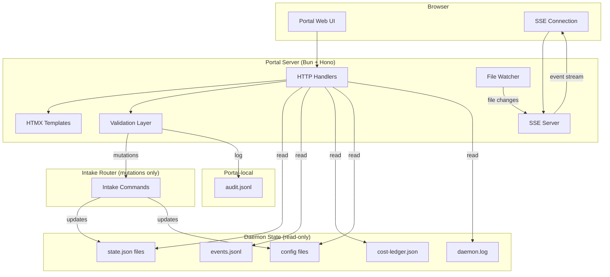

# PRD-009: Web Control Plane (autonomous-dev-portal)

| Field       | Value                                      |
|-------------|--------------------------------------------|
| **Title**   | Web Control Plane (autonomous-dev-portal)  |
| **PRD ID**  | PRD-009                                    |
| **Version** | 1.0                                        |
| **Date**    | 2026-04-17                                 |
| **Author**  | Patrick Watson                             |
| **Status**  | Draft                                      |
| **Plugin**  | autonomous-dev-portal (new)                |

---

## 1. Problem Statement

The autonomous-dev system provides sophisticated AI-powered development capabilities, but operators interact with it primarily through chat channels (Claude App, Discord, Slack) and CLI commands. While these interfaces work well for single-request interactions, they fail to provide the holistic view and control surface that operators need as the system scales.

**Today's operational pain points:**

1. **Portfolio blindness**: With 5+ repositories and 20+ concurrent requests, operators lose situational awareness. Chat channels show individual request updates but provide no cross-repo dashboard to understand overall system health, queue depth, or resource consumption.

2. **Approval gate friction**: Human review gates require operators to approve PRDs, TDDs, and code changes. In chat, this means juggling multiple conversations, losing context between artifacts, and approving complex technical decisions through limited text interfaces without side-by-side comparison views.

3. **Configuration complexity**: Trust levels, cost caps, allowlists, and notification settings are managed via JSON configuration files. Operators who want to adjust a cost cap or modify trust settings must edit JSON by hand, with no validation feedback until the next daemon restart.

4. **Cost observability gaps**: Daily and monthly spending is tracked in ledger files, but operators have no time-series visualization to understand spending patterns, identify cost spikes, or project month-end totals against budgets.

5. **Operational health monitoring**: The daemon exposes heartbeat files and state directories, but there's no unified view of circuit breaker status, kill-switch state, active request counts, or error patterns across the fleet.

### Reversal of PRD-006 NG-01

PRD-006 Non-Goal NG-01 explicitly stated: "Building a web dashboard or GUI. Status is consumed through existing chat interfaces and CLI." This PRD **deliberately reverses** that decision based on six months of operational experience.

**Reversal rationale:**

- Chat channels excel at event-driven notifications but are inherently poor at displaying tabular data, time-series visualizations, and complex approval workflows. Operators report significant cognitive overhead when managing multi-repo operations through fragmented chat conversations.

- Approval gates benefit from structured artifact rendering (side-by-side PRD and diff comparison) with form-based feedback collection. Chat-based approvals lack the interface fidelity to present complex technical decisions clearly.

- Configuration management through manual JSON editing introduces operational risk. Multiple operators have reported misconfigurations that broke the daemon due to syntax errors or invalid values that could have been prevented by form validation.

- Cost tracking requires time-series visualization to identify trends, spikes, and projections. Text-based cost reports in chat cannot surface the patterns that operators need for budget planning.

- The web portal is **strictly additive**. Chat channels and CLI interfaces remain fully functional and continue to be the primary interaction model for single-request workflows. The portal serves the complementary use case of fleet-wide operations and complex decision-making.

**Commitment**: Upon completion of this PRD, PRD-006 will be updated with a revision note: "NG-01 superseded by PRD-009" acknowledging this architectural evolution.

---

## 2. Goals

| ID   | Goal                                                                                           |
|------|------------------------------------------------------------------------------------------------|
| G-01 | Provide a portfolio dashboard that gives operators instant visibility into cross-repo system health, active request counts, cost burn rates, and attention-requiring gates in a single view. |
| G-02 | Enable structured approval workflows that present artifacts (PRD, TDD, code diffs) with side-by-side rendering, inline commenting, and one-click approve/reject/request-changes actions. |
| G-03 | Deliver validated configuration management where operators can edit trust levels, cost caps, and allowlists through forms with real-time validation, avoiding JSON syntax errors and invalid configurations. |
| G-04 | Surface cost observability through time-series charts (daily/monthly spend trends) with budget projections and per-repo/per-phase breakdowns that are impossible to render in chat. |
| G-05 | Centralize operational health monitoring with circuit breaker status, daemon heartbeat visualization, kill-switch state, and error pattern analysis. |
| G-06 | Implement real-time updates via Server-Sent Events (SSE) so operators see live phase transitions, cost updates, and queue changes without manual refresh. |
| G-07 | Support opt-in deployment: the portal runs alongside existing interfaces without replacing them, allowing gradual adoption and fallback to CLI/chat during portal outages. |
| G-08 | Provide audit trails showing all portal-initiated actions (approvals, config changes, kill-switch activations) with operator attribution for governance compliance. |

## 3. Non-Goals

| ID    | Non-Goal                                                                                     |
|-------|----------------------------------------------------------------------------------------------|
| NG-01 | Not multi-tenant / SaaS. The portal serves a single operator organization and reads from local daemon state, not a centralized database. |
| NG-02 | Not replacing chat channels. Discord, Slack, and Claude App remain the primary interaction methods for most operations. The portal complements them for complex workflows. |
| NG-03 | Not a mobile app. The portal targets desktop/laptop operators in development environments. Responsive web design supports tablet viewing but mobile-first design is out of scope. |
| NG-04 | Not a SPA or framework-heavy UI. The portal uses server-rendered HTMX with progressive enhancement, avoiding React, Vue, or client-side build chains that would increase maintenance overhead. |
| NG-05 | Not a write-path to state.json. All mutations (approvals, config changes) flow through the existing intake router to maintain single-source-of-truth data consistency. |
| NG-06 | Not accessible from the public internet without operator-configured authentication. Default deployment binds to localhost and assumes a trusted local environment. |

---

## 4. User Stories

### Portfolio Dashboard

| ID    | Story                                                                                                                                                                                      | Priority |
|-------|--------------------------------------------------------------------------------------------------------------------------------------------------------------------------------------------|----------|
| US-01 | As a system operator, I want to see all allowlisted repositories on a card-based dashboard showing active request count, highest-priority phase, last activity, and cost-this-month so I can understand portfolio health at a glance. | P0       |
| US-02 | As a system operator, I want to see global metrics (daily spend vs cap, monthly spend vs cap, daemon status, kill-switch state) prominently displayed so I can quickly identify system-level issues. | P0       |
| US-03 | As a system operator, I want the dashboard to auto-update every 5 seconds via SSE so I see live progress without manual refresh during active development periods. | P0       |
| US-04 | As a system operator, I want to sort repositories by activity, alphabetical, or "needs attention" (approval gates pending) so I can prioritize my focus during busy periods. | P1       |

### Request Detail View

| ID    | Story                                                                                                                                                                                      | Priority |
|-------|--------------------------------------------------------------------------------------------------------------------------------------------------------------------------------------------|----------|
| US-05 | As a system operator, I want to view a detailed timeline of any request showing phase history, costs, and turn counts so I can understand the progression and resource consumption. | P0       |
| US-06 | As a system operator, I want to see live phase transitions in the request detail view via SSE so I can watch long-running code generation in real-time. | P1       |
| US-07 | As a system operator, I want to see current artifacts (PRD.md, TDD.md, code diffs) rendered with syntax highlighting so I can review technical content in context. | P0       |
| US-08 | As a system operator, I want to see cost breakdowns and review agent scores for each phase so I can understand quality gates and resource utilization patterns. | P1       |

### Approval Queue

| ID    | Story                                                                                                                                                                                      | Priority |
|-------|--------------------------------------------------------------------------------------------------------------------------------------------------------------------------------------------|----------|
| US-09 | As a system operator, I want to see all requests currently blocked on human approval gates across all repositories in a unified queue so I can batch my review work efficiently. | P0       |
| US-10 | As a system operator, I want to sort the approval queue by waiting time, repo, or phase so I can prioritize urgent decisions first. | P0       |
| US-11 | As a system operator, I want one-click approve/reject/request-changes buttons for quick decisions, with optional comment fields for feedback. | P0       |
| US-12 | As a system operator, I want to open the full request detail view for complex approvals that require side-by-side artifact comparison. | P1       |

### Configuration Management

| ID    | Story                                                                                                                                                                                      | Priority |
|-------|--------------------------------------------------------------------------------------------------------------------------------------------------------------------------------------------|----------|
| US-13 | As a system operator, I want to view the current effective configuration (global + per-repo merged) in a read-only display so I understand the active settings. | P0       |
| US-14 | As a system operator, I want to edit trust levels, cost caps, and allowlists through validated forms so I avoid JSON syntax errors that break the daemon. | P0       |
| US-15 | As a system operator, I want real-time validation feedback when I enter invalid values (negative costs, malformed paths) so I can correct errors before saving. | P0       |
| US-16 | As a system operator, I want configuration changes to trigger daemon reload automatically when they affect active behavior, with clear indication of which settings require restart. | P1       |

### Cost Analysis

| ID    | Story                                                                                                                                                                                      | Priority |
|-------|--------------------------------------------------------------------------------------------------------------------------------------------------------------------------------------------|----------|
| US-17 | As a system operator, I want to see daily and monthly cost time series charts so I can identify spending trends and spikes. | P0       |
| US-18 | As a system operator, I want per-repo cost breakdowns so I can understand which repositories are consuming the most resources. | P1       |
| US-19 | As a system operator, I want per-phase cost analysis (PRD vs code vs review) so I can optimize resource allocation across pipeline stages. | P1       |
| US-20 | As a system operator, I want to see the top-10 most expensive requests with drill-down links so I can investigate high-cost outliers. | P1       |

### Operations & Health

| ID    | Story                                                                                                                                                                                      | Priority |
|-------|--------------------------------------------------------------------------------------------------------------------------------------------------------------------------------------------|----------|
| US-21 | As a system operator, I want to see daemon heartbeat freshness and circuit breaker state so I can quickly assess system health. | P0       |
| US-22 | As a system operator, I want to activate the kill-switch or reset circuit breakers through the portal with confirmation modals to prevent accidental activation. | P0       |
| US-23 | As a system operator, I want to tail daemon logs with live append and filtering by log level or request ID so I can debug issues in real-time. | P1       |
| US-24 | As a system operator, I want to see per-intake-channel metrics (submissions/min, error rate) when available so I can monitor channel health. | P2       |

### Audit & Governance

| ID    | Story                                                                                                                                                                                      | Priority |
|-------|--------------------------------------------------------------------------------------------------------------------------------------------------------------------------------------------|----------|
| US-25 | As a compliance officer, I want to see all portal-initiated mutations (approvals, config changes, kill-switch events) with operator attribution and timestamps so I can audit operational decisions. | P1       |
| US-26 | As a system operator, I want the audit log to be read-only and append-only so I can trust its integrity for governance purposes. | P1       |

---

## 5. Functional Requirements

### 5.1 Portfolio Dashboard

| ID     | Requirement                                                                                                                                                                                     | Priority |
|--------|-------------------------------------------------------------------------------------------------------------------------------------------------------------------------------------------------|----------|
| FR-901 | The homepage SHALL display a card grid of all allowlisted repositories from the effective configuration, with each card showing: repo name, active request count, highest-priority current phase, last activity timestamp, and cost-this-month. | P0       |
| FR-902 | The homepage SHALL display global summary metrics: daily spend vs daily cap (as progress bar), monthly spend vs monthly cap (as progress bar), total active request count, daemon status indicator (green/yellow/red), and kill-switch engaged indicator. | P0       |
| FR-903 | The homepage SHALL auto-update via Server-Sent Events every 5 seconds (configurable), updating both repository cards and global metrics without full page reload. | P0       |
| FR-904 | The homepage SHALL support three sorting modes: alphabetical (default), last activity descending, and needs-attention-first (repos with pending approval gates at top). | P1       |
| FR-905 | Repository cards showing "needs attention" (approval gates awaiting human decision) SHALL be visually highlighted with a distinct border color and attention badge. | P0       |

### 5.2 Request Detail View

| ID     | Requirement                                                                                                                                                                                     | Priority |
|--------|-------------------------------------------------------------------------------------------------------------------------------------------------------------------------------------------------|----------|
| FR-906 | The request detail page `/repo/{repo}/request/{id}` SHALL display a vertical timeline of phase history with entered_at/exited_at timestamps, turn count, and cost for each completed phase. | P0       |
| FR-907 | The request detail page SHALL stream live phase transitions via SSE, updating the timeline and current phase status in real-time. | P1       |
| FR-908 | The request detail page SHALL render the current artifact (PRD.md, TDD.md, Plan.md, Spec.md) as formatted Markdown with syntax-highlighted code blocks when the request is in a generation phase. | P0       |
| FR-909 | When the request is in the CODE phase, the request detail page SHALL display syntax-highlighted code diffs for changed files, with expand/collapse functionality for large changes. | P0       |
| FR-910 | The request detail page SHALL show a cost breakdown section with: total cost accrued, cost per phase, and current phase projected cost (if available). | P1       |
| FR-911 | The request detail page SHALL display review agent feedback including scores, comments, and rubric assessments for phases that have completed review. | P1       |

### 5.3 Approval Gate Actions

| ID     | Requirement                                                                                                                                                                                     | Priority |
|--------|-------------------------------------------------------------------------------------------------------------------------------------------------------------------------------------------------|----------|
| FR-912 | When a request is at a human-approval gate, the request detail page SHALL display a gate action panel with three buttons: Approve, Request Changes, and Reject. | P0       |
| FR-913 | Each gate action button SHALL include a free-text comment field for optional feedback to be included in the audit trail. | P0       |
| FR-914 | The gate action panel SHALL show the estimated cost for the next phase and the current trust level indicator for context. | P1       |
| FR-915 | Gate action submissions SHALL write to the portal audit log and issue the corresponding intake router command (`approve`, `request-changes`, `reject` — see PRD-008 FR-820). The portal SHALL NOT modify state.json directly. Every intake call originating from the portal SHALL carry `source: 'portal'` (per PRD-008 §10.1) and the authenticated operator identity (per FR-S05 when network-mode) or `"localhost"` (default mode). | P0       |
| FR-916 | After a gate action submission, the page SHALL show a confirmation message and automatically redirect to the approval queue after 3 seconds. | P1       |

### 5.4 Approval Queue

| ID     | Requirement                                                                                                                                                                                     | Priority |
|--------|-------------------------------------------------------------------------------------------------------------------------------------------------------------------------------------------------|----------|
| FR-917 | The approval queue page `/approvals` SHALL display all requests currently in a human-approval gate state across all repositories. | P0       |
| FR-918 | The approval queue SHALL be sortable by waiting time descending (default), repository name, phase type, and requester. | P0       |
| FR-919 | The approval queue SHALL be filterable by repository and phase type using dropdown controls. | P1       |
| FR-920 | Each approval queue entry SHALL include: request ID (linked to detail view), title, repository, phase, waiting time, requester, and inline approve button for quick decisions. | P0       |
| FR-921 | The approval queue SHALL auto-update via SSE when requests enter or leave approval gates. | P1       |

### 5.5 Configuration Management

| ID     | Requirement                                                                                                                                                                                     | Priority |
|--------|-------------------------------------------------------------------------------------------------------------------------------------------------------------------------------------------------|----------|
| FR-922 | The settings page `/settings` SHALL display the current effective configuration as read-only JSON, showing the merged result of global + per-repo layered configuration. | P0       |
| FR-923 | The settings page SHALL provide editable forms for: trust level per repository (dropdown), cost caps (currency input with validation), allowlist add/remove (file path input with git repository validation), and notification settings. | P0       |
| FR-924 | All configuration form fields SHALL include real-time client-side validation: positive numeric values for cost caps, absolute paths for allowlist entries, and valid email format for notification addresses. | P0       |
| FR-925 | All configuration mutations SHALL go through the intake router (a `config-set` command) which validates server-side before write, returning HTTP 422 with human-readable error messages for invalid submissions. The portal SHALL NOT write configuration files directly. | P0       |
| FR-926 | Every configuration change SHALL be appended to the portal audit log with operator attribution, timestamp, field changed, old value hash, and new value hash. | P1       |
| FR-927 | Configuration changes that modify active daemon behavior (cost caps, trust levels) SHALL trigger an automatic daemon reload signal. Configuration that only affects new requests SHALL not trigger reload. | P1       |

### 5.6 Cost Analysis

| ID     | Requirement                                                                                                                                                                                     | Priority |
|--------|-------------------------------------------------------------------------------------------------------------------------------------------------------------------------------------------------|----------|
| FR-928 | The cost analysis page `/costs` SHALL display daily spend time series for the last 30 days as an SVG line chart (server-rendered, no JavaScript charting library). | P0       |
| FR-929 | The cost analysis page SHALL display monthly spend time series for the last 12 months as an SVG bar chart. | P0       |
| FR-930 | The cost analysis page SHALL show per-repository cost breakdown for the current month as a table with: repository name, total spend, request count, and average cost per request. | P1       |
| FR-931 | The cost analysis page SHALL show per-phase cost breakdown (PRD authoring, TDD authoring, code generation, review) for the current month. | P1       |
| FR-932 | The cost analysis page SHALL display the top-10 most expensive requests of all time with: request ID (linked to detail), title, total cost, completion date, and repository. | P1       |
| FR-933 | The cost analysis page SHALL show current cost cap status: current daily spend / cap, current monthly spend / cap, and projected month-end spend based on a simple trailing 7-day average rate. Predictive analytics beyond the trailing-average projection are out of scope (OQ-3 resolved: descriptive + simple projection, no ML). | P0       |

### 5.7 Operations Dashboard

| ID     | Requirement                                                                                                                                                                                     | Priority |
|--------|-------------------------------------------------------------------------------------------------------------------------------------------------------------------------------------------------|----------|
| FR-934 | The operations page `/ops` SHALL display daemon heartbeat status: last heartbeat timestamp, heartbeat age, and status indicator (fresh < 2x poll interval, stale > 2x poll interval, dead > 5x poll interval). | P0       |
| FR-935 | The operations page SHALL show circuit breaker state and provide a reset button with confirmation modal requiring operator to type "CONFIRM" to proceed. | P0       |
| FR-936 | The operations page SHALL show kill-switch status (active/inactive) with toggle button and reset button, both requiring confirmation modals to prevent accidental activation. | P0       |
| FR-937 | The operations page SHALL display per-intake-channel metrics when available from the intake layer: submissions per minute, error rate, and latency percentiles. | P2       |
| FR-938 | The operations page SHALL show production intelligence cycle status: last observation run timestamp, next scheduled run, and observation count from the last cycle. | P1       |

### 5.8 Logs Interface

| ID     | Requirement                                                                                                                                                                                     | Priority |
|--------|-------------------------------------------------------------------------------------------------------------------------------------------------------------------------------------------------|----------|
| FR-939 | The logs page `/logs` SHALL display the last 500 lines of daemon.log with line numbers and timestamps. | P1       |
| FR-940 | The logs page SHALL support live log tailing via SSE, automatically appending new log lines as they are written. | P1       |
| FR-941 | The logs page SHALL provide filter controls for: log level (ERROR, WARN, INFO, DEBUG), request ID (exact match), and time range (last 1h, 4h, 24h). | P1       |
| FR-942 | The logs page SHALL provide a download button to retrieve the last 24 hours of logs as a gzipped text file. | P2       |

### 5.9 Audit Trail

| ID     | Requirement                                                                                                                                                                                     | Priority |
|--------|-------------------------------------------------------------------------------------------------------------------------------------------------------------------------------------------------|----------|
| FR-943 | The audit page `/audit` SHALL display all portal-initiated mutations from the audit log: timestamp, operator (from auth or "localhost"), action type, and action description. | P1       |
| FR-944 | The audit log SHALL be read-only through the portal interface; no mutation or deletion capabilities SHALL be provided. | P1       |
| FR-945 | Audit entries SHALL include old-value hash and new-value hash for configuration changes to enable change detection without exposing sensitive configuration values in the UI. | P1       |
| FR-946 | The audit page SHALL support pagination with 50 entries per page and navigation controls. | P1       |

---

## 6. Non-Functional Requirements

| ID     | Requirement                                                                                                                                                                                     | Priority |
|--------|-------------------------------------------------------------------------------------------------------------------------------------------------------------------------------------------------|----------|
| NFR-01 | SSE event delivery SHALL have p95 latency under 1 second from state file change to browser update. | P0       |
| NFR-02 | Page load times SHALL be under 500ms p95 for all portal pages with typical repository portfolio (up to 20 repos, 100 active requests). | P1       |
| NFR-03 | The portal server SHALL consume less than 150 MB of resident memory during normal operation. | P1       |
| NFR-04 | When the daemon is stopped, the portal SHALL display a prominent "stale data" banner and disable all mutation actions until daemon connectivity is restored. | P0       |
| NFR-05 | All mutation endpoints SHALL implement CSRF protection via Origin header validation. | P0       |
| NFR-06 | The portal SHALL support graceful degradation: if SSE connection fails, pages SHALL continue to function with manual refresh, and an indicator SHALL show the live update status. | P1       |
| NFR-07 | Form submissions SHALL include client-side validation with immediate feedback and server-side validation with comprehensive error messages. | P0       |
| NFR-08 | The portal SHALL support concurrent usage by a single operator across multiple browser tabs without data conflicts or race conditions. | P1       |
| NFR-09 | All portal pages SHALL meet WCAG 2.2 AA accessibility standards for contrast, keyboard navigation, and screen reader compatibility. | P1       |
| NFR-10 | The portal server SHALL start up within 10 seconds and be ready to serve requests when Claude Code starts the plugin. | P1       |

---

## 7. Architecture



**Key architectural decisions:**

1. **Read-only state access**: The portal never directly modifies state.json, events.jsonl, or config files. All mutations flow through the intake router to maintain data consistency with PRD-008's intake handoff contract.

2. **File-based reactivity**: A file watcher monitors daemon state directories and streams changes via SSE to connected browsers for real-time updates.

3. **Server-rendered HTMX**: No client-side JavaScript framework. Server renders complete HTML with HTMX attributes for dynamic behavior.

4. **Validation sandwich**: Client-side validation provides immediate feedback; server-side validation provides security and correctness before any mutation reaches the intake router.

5. **Plugin lifecycle integration**: The portal registers as an MCP server so Claude Code manages its lifecycle (start/stop with sessions).

---

## 8. Security

### 8.1 Authentication & Authorization

**Default mode: Localhost-only**
- Portal binds to `127.0.0.1:19280` by default
- No authentication required in localhost mode
- Assumes trusted local development environment

**Optional mode: Network-accessible (FR-level requirements)**

| ID     | Requirement                                                                                                                                                                                                         | Priority |
|--------|---------------------------------------------------------------------------------------------------------------------------------------------------------------------------------------------------------------------|----------|
| FR-S01 | When `auth_mode` is not `localhost`, the server SHALL bind only after authentication is configured and a startup self-check confirms the provider is reachable. Startup SHALL fail closed on misconfiguration.    | P0       |
| FR-S02 | `auth_mode: "tailscale"` SHALL resolve operator identity via Tailscale's identity headers (`Tailscale-User-Login`, `Tailscale-User-Name`) on requests arriving via the tailnet. Requests from non-tailnet sources SHALL be rejected with HTTP 403. | P0       |
| FR-S03 | `auth_mode: "oauth"` SHALL implement OAuth 2.0 Authorization Code + PKCE against the configured provider (GitHub or Google). Sessions SHALL be cookie-based, httpOnly, SameSite=Strict, Secure, with a 24-hour idle timeout and 30-day absolute timeout. | P0       |
| FR-S04 | When `auth_mode` is not `localhost`, TLS termination SHALL be required (either via the Tailscale Funnel / reverse proxy, or by the portal itself if a certificate path is configured). The server SHALL refuse to listen on `0.0.0.0` without TLS. | P0       |
| FR-S05 | All authenticated identities SHALL be carried as the `source_user_id` on intake router calls made by the portal, and SHALL appear in the portal's audit log for every mutating action.                           | P0       |

mTLS, passkeys, and single-sign-on providers beyond GitHub/Google are explicitly future work and out of scope for this PRD.

### 8.2 Cross-Site Request Forgery (CSRF)

| ID     | Requirement                                                                                                                                                                                                         | Priority |
|--------|---------------------------------------------------------------------------------------------------------------------------------------------------------------------------------------------------------------------|----------|
| FR-S10 | All mutating endpoints (`POST`, `PUT`, `DELETE`, `PATCH`) SHALL validate the `Origin` header against the configured expected origin(s). Requests with absent or non-matching Origin SHALL be rejected with HTTP 403. | P0       |
| FR-S11 | All mutating endpoints SHALL additionally require a per-session CSRF token, delivered via a `hx-headers` attribute and validated server-side with a timing-safe comparison. A missing or invalid token SHALL be rejected with HTTP 403. Origin validation alone is NOT sufficient for destructive operations. | P0       |
| FR-S12 | Destructive operations — kill-switch engage/reset, circuit-breaker reset, allowlist removal, trust level reduction — SHALL require a second confirmation token obtained from a typed-"CONFIRM" modal (one-time, 60s TTL). This defends against both CSRF and click-hijacking. | P0       |
| FR-S13 | HTMX's `HX-Request: true` header MAY be checked for observability but SHALL NOT be relied on as CSRF defense.                                                                                                    | P1       |

### 8.3 Secret Handling

- Configuration values containing secrets (webhook URLs, API keys, bot tokens) display only last-4 characters in UI
- Audit log stores hashes of old/new configuration values, not plaintext
- Environment variables for sensitive config are redacted in settings display
- The portal never echoes a secret back to the browser once it has been saved; "change" operations require re-entering the full value

### 8.4 Input Validation

| ID     | Requirement                                                                                                                                                                                                         | Priority |
|--------|---------------------------------------------------------------------------------------------------------------------------------------------------------------------------------------------------------------------|----------|
| FR-S20 | Allowlist path inputs SHALL be canonicalized via `realpath()` and SHALL reject paths that resolve outside the operator's home directory tree (configurable via `portal.path_policy.allowed_roots`). Symlink escapes SHALL be rejected. | P0       |
| FR-S21 | Each allowlisted path SHALL be verified as a git repository via `git -C <path> rev-parse --git-dir` in a subprocess with a 2-second timeout before the path is accepted.                                          | P0       |
| FR-S22 | Regular expressions supplied via configuration SHALL be test-compiled in a sandboxed evaluator with a 100 ms execution timeout and a 1000-character input limit. Compilation failure or timeout SHALL reject the input. This defends against ReDoS. | P0       |
| FR-S23 | The portal SHALL NOT execute shell commands. `git rev-parse` in FR-S21 is the sole exception and runs with `execFile` (no shell) and an explicit argv array.                                                     | P0       |
| FR-S24 | All form inputs SHALL be validated client-side for UX feedback AND server-side for security. Server-side validation is authoritative; client-side validation is convenience only.                                 | P0       |

### 8.5 Content Security (XSS Prevention)

| ID     | Requirement                                                                                                                                                                                                         | Priority |
|--------|---------------------------------------------------------------------------------------------------------------------------------------------------------------------------------------------------------------------|----------|
| FR-S30 | Markdown content (PRDs, TDDs, plans, specs, review comments, operator comments) SHALL be rendered via a fixed pipeline: parse with `marked` (v5.1.x pinned) → sanitize with `DOMPurify` (v3.x pinned) using its strict HTML5 profile → return serialized HTML. No step may be skipped. | P0       |
| FR-S31 | Code diffs SHALL be rendered with HTML-entity-encoded text only; no raw insertion of diff content into the DOM.                                                                                                  | P0       |
| FR-S32 | Content Security Policy headers SHALL be set on all HTML responses: `default-src 'self'; script-src 'self'; style-src 'self' 'unsafe-inline'; img-src 'self' data:; font-src 'self'; object-src 'none'; frame-ancestors 'none'; base-uri 'self'; form-action 'self'`. | P0       |
| FR-S33 | The portal SHALL set `X-Content-Type-Options: nosniff`, `X-Frame-Options: DENY`, and `Referrer-Policy: same-origin` on all responses.                                                                            | P0       |
| FR-S34 | The portal SHALL NOT use `innerHTML`, `dangerouslySetInnerHTML`, or equivalent unsafe DOM APIs. All dynamic DOM content flows through HTMX swaps of server-sanitized HTML.                                      | P0       |

### 8.6 Data Integrity

| ID     | Requirement                                                                                                                                                                                                         | Priority |
|--------|---------------------------------------------------------------------------------------------------------------------------------------------------------------------------------------------------------------------|----------|
| FR-S40 | The audit log SHALL be an append-only JSONL file at `${CLAUDE_PLUGIN_DATA}/audit.jsonl`. The portal process SHALL open it with `O_APPEND | O_WRONLY | O_CREAT` and SHALL NOT seek, truncate, or rewrite. | P0       |
| FR-S41 | Audit entries SHALL include a monotonically increasing sequence number and a HMAC-SHA256 chain hash (each entry's HMAC is over its contents plus the previous entry's HMAC) using a key rotated per portal-install. Tampering detection SHALL be verifiable via a `autonomous-dev-portal audit verify` CLI tool. | P1       |
| FR-S42 | Configuration changes SHALL be atomic (validate → write temp → rename). Failures SHALL leave the existing config unchanged.                                                                                      | P0       |
| FR-S43 | The file watcher SHALL open daemon state files with read-only handles.                                                                                                                                             | P0       |

---

## 9. Plugin Packaging

### 9.1 Directory Structure

```
plugins/autonomous-dev-portal/
├── .claude-plugin/
│   └── plugin.json                   # Plugin metadata and dependencies
├── server/
│   ├── server.ts                     # Main Hono application
│   ├── routes/                       # HTTP route handlers
│   ├── templates/                    # HTMX fragments and page layouts
│   ├── lib/                          # Utilities (validation, file watching)
│   └── types/                        # TypeScript type definitions
├── static/
│   ├── htmx.min.js                   # HTMX library
│   ├── portal.css                    # CSS styles
│   └── icons/                        # SVG icons
├── config/
│   └── portal-defaults.json          # Default portal configuration
└── README.md                         # Installation and usage guide
```

### 9.2 Plugin Dependencies

- Declares dependency on `autonomous-dev` plugin in plugin.json (the portal reads state files written by PRD-008's handoff mechanism)
- Requires Bun runtime (documented install path for operators)
- Version pins: Hono 3.12.x, HTMX 1.9.x, marked 5.1.x for Markdown rendering

### 9.3 MCP Server Integration

- Portal server registers as an MCP server in `.mcp.json`
- Claude Code starts/stops portal server with plugin sessions
- SessionStart hook runs `bun install` to ensure dependencies (only if `package.json` changed since last install)
- Supports standalone mode via `bun run server.ts` for portal-only operation outside a Claude Code session

### 9.4 Configuration

**Plugin-level userConfig keys:**
- `port` (default: 19280)
- `auth_mode` (default: "localhost", options: "tailscale", "oauth")
- `tailscale_tailnet` (when auth_mode = "tailscale")
- `oauth_provider` (when auth_mode = "oauth")
- `sse_update_interval_seconds` (default: 5)

**Data paths:**
- `${CLAUDE_PLUGIN_ROOT}/config/` for server configuration
- `${CLAUDE_PLUGIN_DATA}/audit.jsonl` for portal audit log
- Read access to `../autonomous-dev/` for daemon state files

---

## 10. Data Contract

### 10.1 Read-Only Data Sources

**State files** (`../autonomous-dev/.autonomous-dev/requests/{id}/state.json`)
- Schema: state_v1.json from autonomous-dev plugin (see `tests/fixtures/state_v1_intake.json`)
- Purpose: Request status, phase history, costs, metadata, source channel (via PRD-008 FR-829)

**Event logs** (`../autonomous-dev/.autonomous-dev/requests/{id}/events.jsonl`)
- Schema: event_v1.json from autonomous-dev plugin
- Purpose: Audit trail, phase transitions, decision history

**Cost ledger** (`../autonomous-dev/.autonomous-dev/cost-ledger.json`)
- Purpose: Daily/monthly spend totals, request-level cost tracking

**Configuration** (`~/.claude/autonomous-dev.json` + per-repo `.claude/autonomous-dev.json`)
- Purpose: Effective config (global + per-repo merged)
- Trust levels, cost caps, allowlists, notification settings

**Daemon logs** (`../autonomous-dev/.autonomous-dev/logs/daemon.log`)
- Purpose: Operational debugging, error investigation

### 10.2 Write-Only Data Sinks

**Portal audit log** (`${CLAUDE_PLUGIN_DATA}/audit.jsonl`)
- Schema: Portal-specific, append-only
- Purpose: Track all portal mutations with operator attribution

**Intake router commands** (via HTTP API from PRD-008)
- approve, request-changes, reject for gate actions
- config validation and write for settings changes
- kill-switch and circuit-breaker commands

### 10.3 File Watcher Scope

Monitor for changes:
- `../autonomous-dev/.autonomous-dev/requests/*/state.json`
- `../autonomous-dev/.autonomous-dev/cost-ledger.json`
- `../autonomous-dev/.autonomous-dev/heartbeat.json`
- `../autonomous-dev/.autonomous-dev/logs/daemon.log`

Stream updates via SSE to connected browsers for real-time UI updates.

---

## 11. Dependency Additions

### 11.1 Runtime Requirements

**Bun** (primary runtime)
- Version: Latest stable (1.0+)
- Justification: Native TypeScript execution, sub-100ms cold start, no build step required
- Installation: Download from bun.sh, add to PATH
- Alternative: Document Node.js 18+ compatibility for environments where Bun is unavailable

**HTTP Framework: Hono**
- Version: 3.12.x (pinned)
- Justification: 14KB framework, native SSE support, JSX-based HTML templating
- TypeScript-first design matches project conventions

**UI Framework: HTMX**
- Version: 1.9.x (pinned)
- Justification: Server-rendered UI with progressive enhancement, no client build chain
- Delivery: Bundled in static/ directory, served locally (no CDN dependency)

### 11.2 Libraries

**Markdown Rendering: marked + DOMPurify**
- Version: marked 5.1.x, DOMPurify 3.x (pinned)
- Purpose: Render PRD, TDD, and artifact content with syntax highlighting
- Sanitization: DOMPurify for XSS protection on all user-generated content

**SVG Chart Generation**
- Option 1: Server-render SVG charts using d3-node (if needed)
- Option 2: Simple SVG generation functions for basic line/bar charts
- Decision: Start with simple SVG, add d3-node if complexity increases

**File System Watching**
- Use Bun's built-in `fs.watch()` API for file change detection
- Cross-platform support (macOS FSEvents, Linux inotify)

---

## 12. Assist Plugin Updates

### 12.1 New Skills

**portal-setup**
- Purpose: Guide operators through initial portal installation
- Includes: Bun installation, port configuration, first startup, auth-mode selection (localhost/Tailscale/OAuth), TLS setup when network-exposed
- Troubleshooting: Port conflicts (R-12), Bun not on PATH, `SessionStart` hook `bun install` failures, permission problems on `${CLAUDE_PLUGIN_DATA}`

**portal-admin-troubleshoot**
- Purpose: Diagnose portal-specific operational runtime issues
- Covers: SSE disconnection debugging, CSRF token rejection, Origin header mismatch, settings validation failures, audit log verification (`audit verify` CLI), file watcher descriptor exhaustion, daemon-unreachable banner behavior (NFR-04, OQ-6)

**portal-approval-workflow**
- Purpose: Explain the portal's human-approval gate UX — distinct from chat approvals
- Covers: how to review an artifact (PRD/TDD/diff) side-by-side, how the three actions (Approve / Request Changes / Reject) route to the intake router (FR-915), what the operator sees after submission, how to find prior decisions via the audit page
- Includes: keyboard shortcuts for fast approval, guidance on when to use chat vs portal approval

**portal-config-editor**
- Purpose: Clarify the boundary with the `config-guide` skill
- Covers: which settings the portal form supports (trust level, cost caps, allowlist, notification method), which settings still require CLI/editor (everything else), what "daemon reload" means, what errors to expect (422 validation, path-not-a-repo, regex timeout per FR-S22)
- Scope separator: `config-guide` teaches the config *model*; `portal-config-editor` teaches the portal *form*

### 12.2 New Agent

**portal-operator** (agent)
- Persona: fleet-level operator, not per-request developer
- Triggers: "what should I approve first", "is my spend on track", "anything unhealthy in the fleet", "walk me through my approval queue"
- Tools: Read-only access to daemon state via portal APIs; suggests actions but does not execute them
- Relationship to existing agents: `onboarding` handles first-time setup; `troubleshooter` handles failures; `portal-operator` handles day-to-day fleet operations

### 12.3 Enhanced Existing Skills

- **setup-wizard** — See PRD-008 §13.4 for the combined phase sequence. Portal install is **Phase 11 (optional)**: verifies Bun, starts the portal in localhost mode, opens the browser to `http://127.0.0.1:19280`, prints the security notice (network exposure requires FR-S01 through FR-S05 setup), points at `portal-setup` for deeper config.
- **help** — Add Q&A: what is the portal, when to use portal vs chat vs CLI, the nine portal pages (dashboard/request-detail/approvals/settings/costs/logs/ops/audit + their URLs), the portal's read-only-to-daemon model, the `source: 'portal'` source value.
- **troubleshoot** — Add scenarios: portal won't start (port conflict, Bun missing, MCP server error), portal shows "stale data" banner (daemon down — how to recover), SSE disconnecting frequently (file watcher OS limits, connection limit), CSRF error on approve (cookie missing, Origin mismatch), "Configuration validation failed" messages (path not a git repo, regex timed out, trust level out of range).
- **config-guide** — Add the portal's new userConfig keys: `port`, `auth_mode`, `tailscale_tailnet`, `oauth_provider`, `sse_update_interval_seconds`, `portal.path_policy.allowed_roots`. Document the read-only-to-daemon-config model and that the portal's settings form is just a UI over the same intake-router config mutation path.

### 12.4 New Evaluation Suites

Split what was previously a single 15-case suite into three focused 10-case suites for a total of 30 cases:

| Suite Name | Case Count | Focus |
|------------|------------|-------|
| `portal-setup` | 10 | Install, port config, auth modes (localhost/Tailscale/OAuth), first-run, TLS decisions, Bun/MCP lifecycle |
| `portal-ops` | 10 | SSE disconnect/reconnect, CSRF + Origin errors, daemon-down banner (NFR-04), kill-switch modal, path-policy errors, file watcher scale |
| `portal-admin` | 10 | Config editor validation errors, audit trail queries, cost chart interpretation, allowlist add/remove failure modes, secret redaction behavior, accessibility smoke |

Cases SHALL explicitly cover the security surface (CSRF, XSS, path traversal, ReDoS) for regression resistance.

### 12.5 Migration note for existing operators

Operators have never used a portal before. The `setup-wizard` Phase 11 SHALL be presented as opt-in with a short explainer; existing CLI/chat workflows remain authoritative. No data migration is required; the portal is purely additive.

---

## 13. Testing Strategy

### 13.1 Unit Tests (server/lib/ functions)

- Configuration validation functions
- File watcher event processing
- Template rendering with mock data
- Cost calculation and aggregation logic
- Audit log formatting and validation

### 13.2 Route-Level Integration Tests

- Use Hono's test client for HTTP endpoint testing
- Mock file system for state.json and cost-ledger.json
- Test authentication modes (localhost, Tailscale identity)
- Validate CSRF protection on mutation endpoints
- Error handling for malformed requests

### 13.3 SSE Stream Testing

- Mock file watcher events
- Verify SSE message formatting
- Test SSE reconnection and failover
- Load testing with multiple concurrent SSE connections

### 13.4 Security Testing Matrix

- CSRF rejection with invalid Origin headers
- Configuration validation with malicious inputs (path traversal, script injection)
- Settings form validation with boundary conditions (negative numbers, excessive string length)
- Audit log tamper resistance (verify append-only enforcement)
- XSS injection attempts via markdown artifact content
- Regex denial-of-service via user-supplied patterns

### 13.5 Plugin Lifecycle Testing

- MCP server registration and startup
- SessionStart hook execution (bun install)
- Graceful shutdown on Claude Code session end
- Standalone mode operation (portal running independently)

### 13.6 Browser End-to-End Testing

**Framework**: Playwright (preferred for reliability); Puppeteer as lighter alternative
- Smoke test: Dashboard loads, shows repositories, displays global metrics
- Approval workflow: Navigate to approval queue, approve a request, verify audit trail
- Configuration change: Modify trust level, verify real-time validation and success message
- Live updates: Open dashboard in two tabs, trigger phase transition, verify both tabs update via SSE
- Accessibility: Tab navigation, screen reader compatibility, color contrast validation

### 13.7 Assist Eval Regression Gate

Before every portal release, the `autonomous-dev-assist` eval suites (including the three new portal suites from §12.4) SHALL run and pass at ≥80% overall and ≥60% per case, matching the existing harness thresholds. A release is blocked if any portal suite regresses more than 5 percentage points from the previous tagged release. The portal's security cases (CSRF/XSS/path-traversal/ReDoS) SHALL pass at 100% — security regressions block release unconditionally.

---

## 14. Performance Targets

### 14.1 Scalability

**Concurrent users**: 1 operator (primary use case)
- System designed for single-operator organizations
- Multiple browser tabs supported for the same operator
- No multi-user session management required

**SSE fan-out limit**: Up to 10 concurrent SSE connections
- Multiple browser tabs/windows from same operator
- File watcher batches changes to avoid event storms

**File system scale**: 20 repositories × 50 requests each
- 1,000 state.json files monitored
- File watcher uses efficient platform-specific APIs (inotify, FSEvents)
- State aggregation caches results for 5-second intervals

### 14.2 Response Times

**Page load**: < 500ms p95 for typical loads
- Server-rendered HTML with minimal JavaScript
- CSS and HTMX served from local static directory
- Database-free architecture (file system only)

**SSE latency**: < 1s p95 from file change to browser update
- File watcher detects changes within 100ms
- SSE broadcast within 200ms
- Browser receives and renders within 500ms

**Form submission**: < 200ms p95 for configuration changes
- Client-side validation provides immediate feedback
- Server-side validation and intake router call under 200ms
- Success/error feedback rendered server-side

---

## 15. Accessibility

### 15.1 WCAG 2.2 AA Compliance

**Visual Design**
- Minimum 4.5:1 contrast ratio for normal text
- Minimum 3:1 contrast ratio for large text and interactive elements
- Color is not the only indicator of status (icons and text labels included)

**Keyboard Navigation**
- All interactive elements reachable via Tab key
- Skip links for main content areas
- Focus indicators visible and high contrast
- Modal dialogs trap focus and provide escape mechanism

**Screen Reader Support**
- Semantic HTML elements (nav, main, section, article)
- ARIA labels for complex interactions (approval buttons, status indicators)
- Table headers properly associated with data cells
- Form labels explicitly linked to inputs

**Interactive Elements**
- Button vs. link semantics correctly applied
- Form validation errors announced to screen readers
- Dynamic content updates (SSE) announced via ARIA live regions
- Time-sensitive content (approval deadlines) includes accessible alternatives

### 15.2 Testing Approach

- Automated accessibility scanning with axe-core
- Manual keyboard navigation testing
- Screen reader testing with NVDA/JAWS (Windows) and VoiceOver (macOS)
- High contrast mode validation

---

## 16. Migration & Rollout

### 16.1 Installation Path

**Phase 1: Side-by-side deployment**
- Portal installs alongside existing autonomous-dev plugin
- No data migration required (portal reads existing daemon state)
- Existing CLI and chat workflows remain unchanged
- Operators can test portal features without risk

**Phase 2: Gradual feature adoption**
- Start with read-only features (dashboard, request detail, cost analysis)
- Gradually adopt approval workflows as comfort increases
- CLI/chat remain available as fallback during portal issues

**Phase 3: Full operational integration**
- Portal becomes primary interface for complex operations
- Chat channels continue for notifications and simple commands
- CLI remains for automation and scripting scenarios

### 16.2 Rollout Phases

**Phase A: Portfolio + Request Detail (Read-Only)**
- Dashboard showing repository status and global metrics
- Request detail pages with timeline and artifact rendering
- Cost analysis with time series charts
- Operations health monitoring
- Target: 2-week rollout, operator feedback collection

**Phase B: Approval Gate Actions**
- Gate action panel for approve/reject/request-changes
- Approval queue with filtering and sorting
- Audit trail for all portal decisions
- Target: 2-week rollout, workflow optimization based on usage

**Phase C: Configuration Editor**
- Settings forms for trust levels, cost caps, allowlists
- Real-time validation and error feedback
- Daemon reload integration for live configuration changes
- Target: 1-week rollout, configuration management validation

**Phase D: Advanced Features**
- Logs interface with live tailing and filtering
- Operations dashboard with circuit breaker and kill-switch controls
- Enhanced audit trails with detailed attribution
- Target: 1-week rollout, full feature validation

### 16.3 Rollback Plan

- Portal operates independently of daemon core functionality
- Operators can disable portal and continue with CLI/chat at any time
- Configuration changes via portal are validated through same intake router as CLI
- No portal-specific state that would be lost on rollback

### 16.4 PRD-006 Revision

Upon PRD-009 approval, PRD-006 SHALL receive a revision note on NG-01: "Superseded by PRD-009 based on operational experience."

---

## 17. Risks & Mitigations

| ID   | Risk                                                                                                                       | Likelihood | Impact | Mitigation                                                                                                                                                          |
|------|---------------------------------------------------------------------------------------------------------------------------|------------|--------|---------------------------------------------------------------------------------------------------------------------------------------------------------------------|
| R-01 | **Portal configuration change breaks daemon.** Operator enters invalid settings that cause daemon startup failure or incorrect behavior. | Medium     | High   | Client-side and server-side validation for all configuration fields. Test-compile regex patterns before save. Rollback capability for configuration changes. All changes through intake router with same validation as CLI. |
| R-02 | **SSE connection race conditions.** Multiple browser tabs connected simultaneously cause duplicate or out-of-order updates. | Medium     | Medium | SSE event deduplication based on sequence numbers. File watcher batching to prevent event storms. Browser-side connection management to prevent duplicate subscriptions. |
| R-03 | **Portal leaks sensitive information.** Configuration display, audit logs, or error messages expose API keys, secrets, or private repository content. | Medium     | High   | Last-4-character redaction for secrets. Configuration value hashing in audit logs. Input sanitization for all displayed content. No raw error message exposure. |
| R-04 | **Portal resource exhaustion.** File watching 1000+ state files causes high CPU/memory usage or overwhelms the system. | Medium     | Medium | File watcher uses efficient OS APIs (inotify/FSEvents). Result caching with 5-second expiry. Graceful degradation when file system is under pressure. Memory usage monitoring and limits. |
| R-05 | **Authentication bypass.** In network-accessible mode, authentication can be circumvented, allowing unauthorized access to operational controls. | Low        | High   | Default to localhost-only mode. Explicit opt-in for network exposure. Documentation emphasizes security implications. Consider rate limiting and IP allowlists for network mode. |
| R-06 | **Portal becomes single point of failure.** Over-reliance on portal causes operational disruption when it's unavailable. | Medium     | Medium | CLI and chat channels remain fully functional. Portal is additive, not replacement. Documentation emphasizes portal as convenience layer. Graceful degradation when portal is down. |
| R-07 | **XSS via malicious artifact content.** User-generated PRDs, TDDs, or code contain script injection that executes in portal context. | Medium     | High   | Markdown sanitization with DOMPurify. Content Security Policy headers. Server-side rendering minimizes client-side script execution. Regular security scanning of rendered content. |
| R-08 | **CSRF from browser extension.** Malicious browser extension uses portal's authentication to perform unauthorized actions. | Low        | Medium | Origin header validation on all mutation endpoints. CSRF tokens for sensitive operations (kill-switch, config changes). Confirmation modals for destructive actions. |
| R-09 | **Portal process memory leak.** Long-running portal server accumulates memory over days/weeks of operation. | Medium     | Low    | Portal restart capability through MCP server lifecycle. Memory usage monitoring and alerting. Periodic garbage collection testing. Resource cleanup on SSE connection close. |
| R-10 | **Operator accidentally triggers kill-switch.** UI makes it too easy to halt all development work accidentally. | Medium     | Medium | Confirmation modal requiring typed "CONFIRM" for kill-switch activation. Visual distinction (red warning styling) for destructive actions. Audit log tracks all kill-switch events. |
| R-11 | **MCP server start failure.** Portal fails to start when Claude Code initializes the plugin. | Low        | Medium | Detailed error logging on startup. Fallback documentation for standalone mode. Health-check endpoint. |
| R-12 | **Port conflict with another plugin.** 19280 already bound by another local service. | Low        | Low    | User-configurable port via userConfig. Clear error message on bind failure indicating conflict. |

---

## 18. Success Metrics

| Metric                                    | Target                                 | Measurement Method                                                                                      |
|-------------------------------------------|----------------------------------------|---------------------------------------------------------------------------------------------------------|
| **Approval decision time**                | 40% reduction vs Slack/Discord         | Time from approval gate entry to human decision, before/after portal adoption                           |
| **Configuration editing accuracy**        | Near-zero invalid config submissions   | Count of daemon startup failures or errors due to portal-generated configuration changes                |
| **Portal uptime**                         | >99.5% over 30-day periods             | Portal server availability monitoring, excluding planned maintenance windows                            |
| **Security incident rate**                | Zero XSS, CSRF, or unauthorized access | Security audit results, penetration testing findings, operator-reported security issues                 |
| **Accessibility compliance**              | WCAG 2.2 AA audit pass                 | Automated accessibility scanning results plus manual testing with screen readers                        |
| **SSE reliability**                       | <1% connection failures                | SSE disconnect rate excluding network issues, measured over 7-day periods                               |
| **Operator adoption rate**                | 75% of approval gates processed via portal by 60 days | Percentage of human approval decisions made through portal vs chat channels         |
| **Page load performance**                 | <500ms p95 load time                   | Browser timing API measurements across all portal pages                                                 |
| **Cost visibility improvement**           | 3+ cost optimization actions per month | Operator-initiated cost cap adjustments or resource optimizations based on portal cost analysis         |
| **False positive alert rate**             | <5% of portal alerts are invalid       | Percentage of portal-generated status warnings that are later determined to be false                    |

---

## 19. Open Questions

| ID   | Question                                                                                                                                                        | Priority | Reviewer         |
|------|-----------------------------------------------------------------------------------------------------------------------------------------------------------------|----------|------------------|
| OQ-1 | Should the portal support multi-operator authentication for organizations with multiple people managing the autonomous-dev system, or maintain single-operator focus? | Medium   | PM Lead          |
| OQ-2 | How should the portal handle very large code diffs (>10,000 lines) in the request detail view? Pagination, lazy loading, or summary-only display?                  | Low      | UX Lead          |
| OQ-4 | What is the right default SSE update interval? 5 seconds provides real-time feel but may be excessive for stable deployments with few changes.                     | Low      | System Operator  |
| OQ-5 | Should the portal include a dark mode theme, given that it targets developers who often prefer dark interfaces?                                                     | Low      | UX Lead          |

**Resolved during PRD review:**
- ~~OQ-3 (cost predictive analytics)~~ — Resolved in FR-933: trailing 7-day average projection is included; no ML or advanced predictive analytics.
- ~~OQ-6 (portal behavior when autonomous-dev plugin unavailable)~~ — Resolved: the portal SHALL detect plugin unavailability via missing `autonomous-dev` plugin metadata or inaccessible state directory, SHALL display a prominent red banner "autonomous-dev plugin not available — portal is in offline/read-only mode", and SHALL disable all mutating endpoints (FR-S10 through FR-S43 remain enforced but mutations return HTTP 503). Read-only pages (dashboard, request detail, audit) continue to work with stale data if cached, else show a neutral "no data" state.

---

## 20. References

- [PRD-001: System Core & Daemon Engine](./PRD-001-system-core.md) — Core daemon and state machine architecture
- [PRD-002: Document Pipeline](./PRD-002-document-pipeline.md) — PRD, TDD, and document generation phases
- [PRD-004: Parallel Execution Engine](./PRD-004-parallel-execution.md) — Worktree lifecycle that the portal visualizes
- [PRD-005: Production Intelligence Loop](./PRD-005-production-intelligence.md) — Production monitoring and observation reporting
- [PRD-006: Intake & Communication Layer](./PRD-006-intake-communication.md) — Intake layer and chat channel integration. **NG-01 is superseded by this PRD.**
- [PRD-007: Escalation & Trust Framework](./PRD-007-escalation-trust.md) — Trust levels and escalation framework
- [PRD-008: Unified Request Submission Packaging](./PRD-008-unified-request-submission.md) — Intake → state.json handoff that the portal consumes; the portal is the fifth surface alongside CLI/Claude App/Discord/Slack.

---

**END PRD-009**
