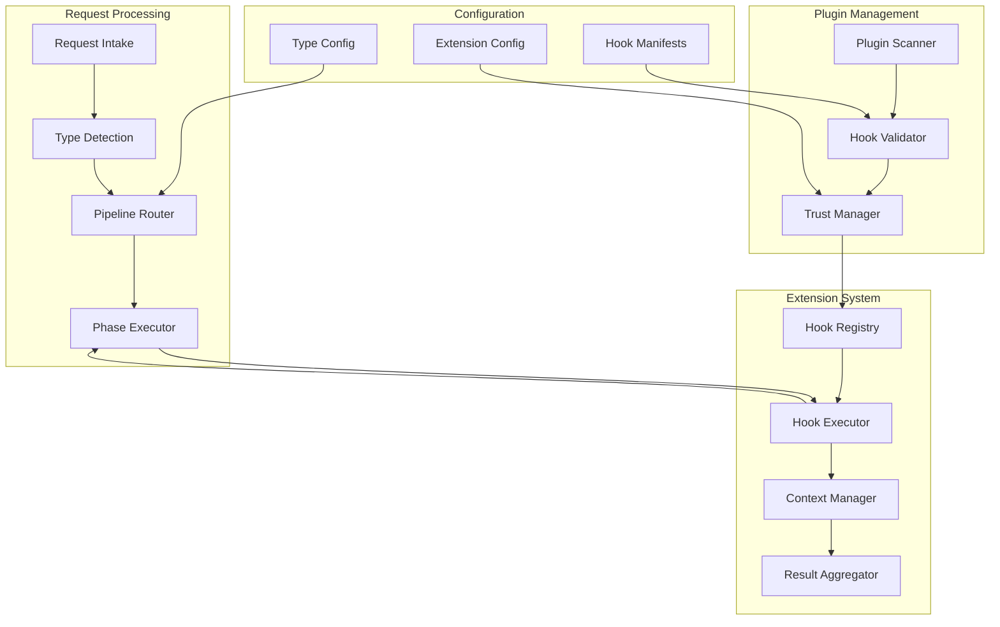
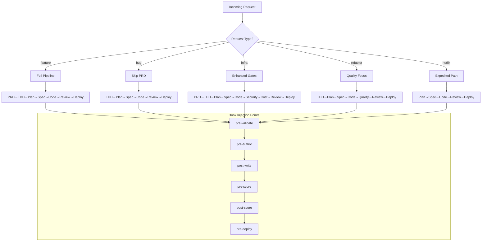
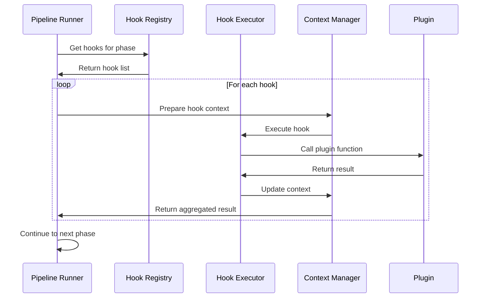

# PRD-011: Pipeline Variants & Extension Hooks

| Field       | Value                                      |
|-------------|--------------------------------------------|
| **Title**   | Pipeline Variants & Extension Hooks         |
| **PRD ID**  | PRD-011                                    |
| **Version** | 1.0                                        |
| **Date**    | 2026-04-28                                 |
| **Author**  | Patrick Watson                             |
| **Status**  | Draft                                      |
| **Plugin**  | autonomous-dev                             |

## 1. Problem Statement

The autonomous-dev system currently enforces a single, monolithic pipeline shape (PRD→TDD→Plan→Spec→Code→Review→Deploy) regardless of the nature of the incoming request. This one-size-fits-all approach creates several critical inefficiencies:

**Pipeline Mismatch**: Bug fixes require immediate action and don't benefit from lengthy PRD authoring. Infrastructure changes need enhanced security gates and cost analysis. Hotfixes demand expedited paths that bypass non-critical phases. Refactoring tasks focus on code quality rather than new feature specification. Each request type has distinct requirements, risk profiles, and success criteria that the current uniform pipeline cannot accommodate.

**Inflexible Extension Model**: Organizations need to inject custom reviewers, enforce business-specific rules, integrate with proprietary validation systems, and apply domain-specific transformations. The current architecture provides no mechanism for plugins to register extension points without modifying core system code. This forces users to either abandon customization or fork the entire codebase.

**Workflow Bottlenecks**: Development teams report that 40% of their requests are bug fixes or infrastructure changes that get delayed by inappropriate pipeline phases. A critical production issue requiring a one-line fix should not wait for PRD authoring and full design review. Similarly, infrastructure provisioning requests need additional security checkpoints that the current pipeline cannot enforce.

**Integration Barriers**: Enterprise environments require integration with existing approval workflows, security scanners, compliance checkers, and deployment orchestrators. The rigid pipeline structure prevents seamless integration with these external systems, forcing manual intervention and breaking automation chains.

Based on analysis of the existing codebase at `/Users/pwatson/codebase/autonomous-dev`, the current `RequestProcessor` implements a hardcoded phase sequence with no variance capability. The state management system in `state_v1_intake.json` shows uniform structure regardless of request characteristics. This fundamental architectural limitation blocks adoption in diverse operational environments.

## 2. Goals

**G-1101: Request Type Differentiation**  
Enable the system to recognize and route different types of development requests (feature, bug, infra, refactor, hotfix) through appropriately tailored pipeline variants, reducing average completion time by 60% for non-feature requests.

**G-1102: Extensible Hook Architecture**  
Provide a comprehensive extension point system allowing plugins to register custom logic at 10+ pipeline phases without modifying core system code, enabling seamless integration with existing organizational tools and processes.

**G-1103: Plugin Trust and Security**  
Implement operator-controlled allowlist mechanisms and trust boundaries ensuring that extension hooks cannot compromise system integrity or escalate privileges beyond their declared scope.

**G-1104: Backward Compatibility Preservation**  
Maintain full compatibility with existing request flows and state schemas, allowing zero-downtime migration to the new variant system while preserving all historical data and configurations.

**G-1105: Performance and Reliability**  
Ensure extension hooks execute within defined time boundaries (30-60s) with fail-safe mechanisms preventing any single extension from blocking pipeline progress, maintaining 99.5% system availability.

**G-1106: Developer Experience Enhancement**  
Provide clear plugin development APIs, comprehensive documentation, and debugging tools enabling third-party developers to create extensions without deep system knowledge.

**G-1107: Operational Visibility**  
Deliver detailed logging, metrics, and audit trails for all extension hook executions, enabling operators to monitor performance, troubleshoot issues, and maintain security compliance.

**G-1108: Scalable Extension Discovery**  
Implement automatic plugin scanning and hook registration at daemon startup with dynamic reload capabilities, supporting environments with 50+ installed plugins without performance degradation.

**G-1109: Business Logic Integration Foundation**  
Establish adapter interfaces enabling transformation of request descriptions through organization-specific business logic before pipeline execution, laying groundwork for future rule-based systems.

**G-1110: Flexible Reviewer Assignment**  
Enable plugins to register custom reviewer agents at specific pipeline gates with configurable thresholds and blocking behavior, supporting complex approval hierarchies and specialized domain expertise.

## 3. Non-Goals

**NG-1101: New Agent Development**  
This PRD does not include creation of new specialized agents beyond extension hooks. Custom reviewer agents, business rule interpreters, and domain-specific processors are covered in PRD-012 and remain out of scope.

**NG-1102: Rule-Set DSL Implementation**  
While establishing injection points for rule-set evaluation, this PRD does not define the domain-specific language or rule engine implementation planned for PRD-013.

**NG-1103: Deployment Backend Extensions**  
New deployment targets, orchestration systems, and infrastructure providers are addressed in PRD-014. This PRD focuses on pipeline structure, not deployment destinations.

**NG-1104: Default Feature Pipeline Modification**  
The existing PRD→TDD→Plan→Spec→Code→Review→Deploy flow for feature requests remains unchanged. Optimizations to this pipeline are addressed in separate performance-focused PRDs.

**NG-1105: Legacy State Migration**  
Automatic migration of existing request states to new schema versions is not included. Operators must manage migration manually or through separate tooling.

**NG-1106: Extension Security Sandboxing**  
While implementing basic trust mechanisms, full security sandboxing with process isolation and resource limits is deferred to future security-focused PRDs.

**NG-1107: Real-time Hook Configuration**  
Dynamic reconfiguration of extension hooks without daemon restart is not supported. Configuration changes require daemon reload for security and stability reasons.

**NG-1108: Cross-Request Extension State**  
Extensions operate independently per request. Persistent state management across multiple requests requires external storage solutions and is not provided by the hook system.

## 4. User Stories

### Operator Personas

**US-1101**: As a **platform operator**, I want to configure which request types are enabled in my environment so that I can control workflow complexity and ensure only approved processes are available to development teams.

*Acceptance Criteria*:
- Given I have operator privileges
- When I edit the autonomous-dev configuration file
- Then I can enable/disable specific request types (feature, bug, infra, refactor, hotfix)
- And disabled types are hidden from the request submission interface
- And existing requests of disabled types continue processing

**US-1102**: As a **platform operator**, I want to set organizational policies for each request type so that infrastructure changes require security review while bug fixes can bypass PRD authoring.

*Acceptance Criteria*:
- Given I have operator privileges
- When I configure request type policies
- Then I can specify which phases are required/optional/skipped for each type
- And I can set custom timeout values per phase per type
- And policy violations prevent request advancement

**US-1103**: As a **security operator**, I want to maintain an allowlist of trusted extension plugins so that only approved custom logic can execute within our pipeline automation.

*Acceptance Criteria*:
- Given I have security operator privileges
- When I configure the extension allowlist
- Then only explicitly approved plugins can register hooks
- And unauthorized plugins are blocked at startup with clear error messages
- And I receive audit logs of all extension hook executions

### Developer Personas

**US-1104**: As a **software developer**, I want to submit bug reports that skip PRD authoring and go directly to technical design so that critical issues can be resolved without administrative overhead.

*Acceptance Criteria*:
- Given I have a bug to report
- When I select "bug" as the request type
- Then I provide structured bug information (reproduction steps, environment, error messages)
- And the system generates a TDD directly from this information
- And the pipeline proceeds to Plan→Spec→Code→Review→Deploy

**US-1105**: As an **infrastructure engineer**, I want infrastructure requests to include additional security and cost review gates so that changes undergo appropriate governance before deployment.

*Acceptance Criteria*:
- Given I submit an infrastructure change request
- When the request type is "infra"
- Then the pipeline includes mandatory security review and cost analysis phases
- And deployment requires approval from both technical and financial reviewers
- And failed reviews provide specific remediation guidance

**US-1106**: As a **frontend developer**, I want to submit refactoring requests that focus on code quality without requiring business justification documents so that technical debt can be addressed efficiently.

*Acceptance Criteria*:
- Given I need to refactor existing code
- When I select "refactor" as the request type
- Then I provide technical context about code quality issues
- And the system generates a TDD focused on maintainability and performance
- And review phases emphasize code quality metrics over feature completeness

### Plugin Developer Personas

**US-1107**: As a **plugin developer**, I want to register custom validation logic at the intake phase so that requests are checked against organizational standards before pipeline execution begins.

*Acceptance Criteria*:
- Given I develop a validation plugin
- When I register an "intake-pre-validate" hook
- Then my validation function receives the full request context
- And I can return success/failure with specific error messages
- And failed validation blocks pipeline progression

**US-1108**: As a **plugin developer**, I want to inject custom reviewers at specific pipeline gates so that domain experts can provide specialized approval for relevant changes.

*Acceptance Criteria*:
- Given I develop a reviewer injection plugin
- When I register a "review-pre-score" hook
- Then I can add additional reviewers with specific criteria
- And my reviewers receive appropriate context and scoring guidelines
- And reviewer results integrate with the standard review aggregation process

**US-1109**: As a **plugin developer**, I want comprehensive debugging information when my extension hooks encounter errors so that I can quickly identify and resolve integration issues.

*Acceptance Criteria*:
- Given my extension hook encounters an error
- When I examine the logs
- Then I see detailed execution context, input parameters, and error traces
- And I have access to pipeline state at hook execution time
- And error messages include suggested troubleshooting steps

### Business User Personas

**US-1110**: As a **product manager**, I want business logic transformations to enrich request descriptions with organizational context so that generated requirements align with company standards and processes.

*Acceptance Criteria*:
- Given I submit a feature request
- When business logic extensions are configured
- Then my request description is automatically enhanced with relevant templates, guidelines, and requirements
- And the generated PRD reflects organizational standards and terminology
- And transformation logs show what enhancements were applied

**US-1111**: As a **compliance officer**, I want audit trails for all extension hook executions so that I can demonstrate governance controls for regulatory requirements.

*Acceptance Criteria*:
- Given extension hooks execute during request processing
- When I generate compliance reports
- Then I have complete audit logs showing which hooks executed, when, and with what results
- And logs include user context, input/output data, and success/failure status
- And audit data is tamper-evident and exportable

**US-1112**: As a **release manager**, I want to configure expedited hotfix pipelines that bypass non-critical phases so that production issues can be resolved within defined SLA timeframes.

*Acceptance Criteria*:
- Given I need to deploy a production hotfix
- When I select "hotfix" as the request type
- Then the pipeline skips PRD and TDD phases
- And proceeds directly to Plan→Spec→Code with strict scope enforcement
- And includes additional verification that changes are minimal and targeted

## 5. Functional Requirements

### 5.1 Request Type Taxonomy

**FR-1101: Request Type Enumeration**  
The system shall support five distinct request types: `feature` (default), `bug`, `infra`, `refactor`, and `hotfix`. Each type shall have a defined pipeline variant with specific phase configurations.

**FR-1102: Phase Override Matrix**  
The system shall maintain a configuration matrix mapping request types to pipeline phase requirements:
- `feature`: All phases required (PRD→TDD→Plan→Spec→Code→Review→Deploy)
- `bug`: Skip PRD, start from TDD with bug context (TDD→Plan→Spec→Code→Review→Deploy)
- `infra`: All phases required plus additional security and cost gates
- `refactor`: Skip PRD, code-quality focused TDD (TDD→Plan→Spec→Code→Review→Deploy)
- `hotfix`: Skip PRD and TDD, strict scope checking (Plan→Spec→Code→Review→Deploy)

**FR-1103: Request Type Selection Interface**  
The request submission interface shall present request type options with clear descriptions of each type's purpose, pipeline phases, and typical use cases.

**FR-1104: Type-Specific Validation**  
Each request type shall enforce type-appropriate validation rules:
- Bug requests require reproduction steps, error messages, and environment details
- Infrastructure requests require impact assessment and rollback procedures
- Refactor requests require technical justification and quality metrics
- Hotfix requests require production incident reference and scope limitation

### 5.2 Bug Report Intake

**FR-1105: Bug Report Schema**  
The system shall define a structured bug report schema with required fields:

```json
{
  "bug_report": {
    "title": "string (required)",
    "description": "string (required)",
    "reproduction_steps": ["string"] (required),
    "expected_behavior": "string (required)", 
    "actual_behavior": "string (required)",
    "error_messages": ["string"] (optional),
    "environment": {
      "os": "string",
      "browser": "string", 
      "version": "string",
      "affected_commit": "string"
    } (required),
    "severity": "enum[critical,high,medium,low]" (required),
    "affected_components": ["string"] (optional),
    "attachments": ["file_path"] (optional)
  }
}
```

**FR-1106: Bug-to-TDD Transformation**  
The TDD author agent shall accept bug report context instead of PRD context when processing bug-type requests. The generated TDD shall focus on reproducing the issue, identifying root causes, and defining fix validation criteria.

**FR-1107: Bug Report Validation**  
The system shall validate bug reports for completeness, rejecting submissions that lack required reproduction steps or environment information. Validation errors shall provide specific guidance on missing information.

### 5.3 Extension Hook Registry

**FR-1108: Hook Point Definition**  
The system shall provide standardized hook points throughout the pipeline:
- `intake-pre-validate`: Before request validation
- `prd-pre-author`: Before PRD generation
- `tdd-pre-author`: Before TDD generation  
- `plan-pre-author`: Before plan generation
- `spec-pre-author`: Before specification generation
- `code-pre-write`: Before code generation
- `code-post-write`: After code generation
- `review-pre-score`: Before review scoring
- `review-post-score`: After review scoring
- `deploy-pre`: Before deployment execution
- `deploy-post`: After deployment completion

**FR-1109: Hook Registration Interface**  
Plugins shall register hooks through a `hooks.json` manifest file with schema:

```json
{
  "hooks": [
    {
      "id": "unique-hook-identifier",
      "name": "Human-readable hook name",
      "hook_point": "intake-pre-validate",
      "entry_point": "module.function",
      "timeout_seconds": 30,
      "failure_mode": "warn|block",
      "required_permissions": ["read_request", "write_context"],
      "description": "Hook purpose and behavior"
    }
  ]
}
```

**FR-1110: Hook Context Interface**  
Each hook shall receive structured context appropriate to its execution phase:

```typescript
interface HookContext {
  request_id: string;
  request_type: RequestType;
  phase: PipelinePhase;
  user_context: UserContext;
  pipeline_state: PipelineState;
  previous_outputs: Record<string, any>;
  configuration: Record<string, any>;
}

interface HookResult {
  success: boolean;
  message?: string;
  data?: Record<string, any>;
  next_phase_context?: Record<string, any>;
}
```

### 5.4 Plugin Trust & Allowlist

**FR-1111: Extension Allowlist Configuration**  
Operators shall control extension execution through `~/.claude/autonomous-dev.json` configuration:

```json
{
  "extensions": {
    "allowlist": [
      "org.company.security-scanner",
      "org.company.cost-analyzer", 
      "org.company.compliance-checker"
    ],
    "trust_mode": "allowlist|permissive|strict",
    "audit_logging": true,
    "default_timeout": 30
  }
}
```

**FR-1112: Plugin Trust Validation**  
The system shall verify plugin identity through cryptographic signatures or organizational registry lookup before allowing hook registration. Unsigned or untrusted plugins shall be rejected with clear security warnings.

**FR-1113: Privilege Escalation Prevention**  
Extension hooks shall execute with limited privileges based on their declared requirements. Hooks cannot access filesystem paths, network resources, or system APIs beyond their declared scope.

### 5.5 Hook Execution Model

**FR-1114: Sequential Execution Order**  
Hooks registered for the same hook point shall execute sequentially in registration order. The output of each hook shall be available to subsequent hooks in the same phase.

**FR-1115: Timeout Enforcement**  
Each hook shall have a configurable timeout (default 30s, maximum 60s). Hooks exceeding their timeout shall be terminated and treated according to their failure mode setting.

**FR-1116: Failure Mode Handling**  
Hooks shall declare failure behavior as either "warn" (log error and continue) or "block" (halt pipeline execution). Critical security and compliance hooks should use "block" mode.

**FR-1117: Hook Output Propagation**  
Hook outputs shall flow as structured context to subsequent pipeline phases. The system shall maintain a hook execution log showing inputs, outputs, and execution times for each hook.

### 5.6 Rule-Set Injection Point

**FR-1118: Rule-Set Evaluator Interface**  
The system shall provide a specialized hook interface for rule-set evaluation:

```typescript
interface RuleSetHook {
  hook_point: "rule-evaluation";
  rule_set_id: string;
  evaluation_context: EvaluationContext;
  rule_inputs: Record<string, any>;
}

interface RuleSetResult {
  rules_evaluated: string[];
  violations: RuleViolation[];
  recommendations: string[];
  compliance_score: number;
}
```

**FR-1119: Rule Injection Points**  
Rule-set evaluation hooks shall be available at intake, pre-TDD, pre-spec, and pre-deploy phases, enabling policy enforcement at multiple pipeline stages.

### 5.7 Business-Logic Adapter

**FR-1120: Request Transformation Interface**  
The system shall provide hooks for transforming request descriptions before PRD or TDD authoring:

```typescript
interface BusinessLogicHook {
  hook_point: "business-transform";
  transform_type: "enrich|standardize|validate";
  organization_context: OrganizationContext;
  request_raw: string;
}

interface TransformResult {
  request_enhanced: string;
  applied_templates: string[];
  added_requirements: string[];
  transformation_log: string[];
}
```

**FR-1121: Template Application**  
Business logic adapters shall apply organizational templates, standard requirements, and terminology transformations to ensure generated documents align with company standards.

### 5.8 Backward Compatibility

**FR-1122: Default Request Type**  
Existing requests without explicit type specification shall default to `request_type: feature` and follow the current pipeline behavior unchanged.

**FR-1123: State Schema Extension**  
The `state.json` schema shall be extended with optional `request_type` field while maintaining compatibility with existing state files:

```json
{
  "request_id": "existing-field",
  "request_type": "feature",
  "variant_config": {
    "phases_skipped": [],
    "additional_gates": [],
    "timeout_overrides": {}
  }
}
```

**FR-1124: Migration Support**  
The daemon shall automatically populate `request_type: feature` for existing state files during startup, ensuring seamless operation of in-progress requests.

### 5.9 Reviewer-Slot Extension Hooks

**FR-1125: Custom Reviewer Registration**  
Plugins shall register custom reviewer agents at specific pipeline gates:

```json
{
  "reviewer_hooks": [
    {
      "agent_name": "security-reviewer",
      "gate": "code-review",
      "threshold": 0.8,
      "blocking": true,
      "expertise_domains": ["security", "authentication"],
      "review_criteria": "security-focused-rubric.json"
    }
  ]
}
```

**FR-1126: Review Aggregation**  
Custom reviewers shall integrate with the existing review scoring system. Review scores from extension reviewers shall be weighted according to their configuration and combined with standard reviewer scores.

### 5.10 Hook Discovery and Loading

**FR-1127: Plugin Scanning**  
At daemon startup, the system shall scan all installed plugins for `hooks.json` manifests and register discovered hooks against the in-memory hook registry.

**FR-1128: Dynamic Reload**  
The daemon shall support reloading extension hooks when plugins are added, removed, or updated. Hook reload shall be triggered by SIGUSR1 signal or daemon API call.

**FR-1129: Hook Registry Validation**  
All discovered hooks shall be validated against the hook schema before registration. Invalid hooks shall be rejected with detailed error messages indicating the validation failure.

## 6. Non-Functional Requirements

**NFR-1101: Performance**  
Extension hook execution shall not increase total pipeline duration by more than 20%. Hook timeouts shall be strictly enforced to prevent runaway extensions from blocking request processing.

**NFR-1102: Reliability**  
The extension system shall maintain 99.9% uptime. Hook execution failures shall not crash the daemon or corrupt request state. Failed hooks shall be logged and reported but not halt other pipeline operations.

**NFR-1103: Scalability**  
The system shall support 100+ registered hooks across 50+ installed plugins without degrading daemon startup time beyond 10 seconds or increasing memory usage beyond 500MB.

**NFR-1104: Security**  
Extension hooks shall execute in isolated contexts preventing access to sensitive system resources. All hook inputs and outputs shall be logged for security audit purposes. Hook registration requires explicit operator approval.

**NFR-1105: Observability**  
All hook executions shall be traced with unique identifiers. Metrics shall be collected for hook execution times, success rates, and failure patterns. Operators shall have dashboards showing extension performance and health.

**NFR-1106: Maintainability**  
The extension system shall be designed for independent testing and deployment. Hook interfaces shall be versioned to support backward compatibility. Plugin developers shall have comprehensive documentation and examples.

## 7. Architecture

### 7.1 System Architecture



### 7.2 Pipeline Variant Routing



### 7.3 Hook Execution Sequence



## 8. Configuration Additions

### 8.1 Extension Allowlist Configuration

```json
{
  "extensions": {
    "allowlist": [
      "org.company.security-scanner@1.2.0",
      "org.company.cost-analyzer@2.1.0",
      "org.company.compliance-checker@1.0.5"
    ],
    "trust_mode": "allowlist",
    "audit_logging": true,
    "audit_retention_days": 90,
    "default_timeout": 30,
    "max_timeout": 60,
    "concurrent_hooks": 5,
    "hook_memory_limit": "256MB"
  },
  "request_types": {
    "enabled": ["feature", "bug", "infra", "refactor", "hotfix"],
    "default": "feature",
    "type_configs": {
      "feature": {
        "phases": ["prd", "tdd", "plan", "spec", "code", "review", "deploy"],
        "timeouts": {"prd": 300, "tdd": 240, "plan": 180, "spec": 300, "code": 600, "review": 240, "deploy": 180}
      },
      "bug": {
        "phases": ["tdd", "plan", "spec", "code", "review", "deploy"],
        "timeouts": {"tdd": 120, "plan": 90, "spec": 180, "code": 300, "review": 120, "deploy": 120},
        "required_fields": ["reproduction_steps", "expected_behavior", "actual_behavior", "environment"]
      },
      "infra": {
        "phases": ["prd", "tdd", "plan", "spec", "code", "security", "cost", "review", "deploy"],
        "timeouts": {"security": 300, "cost": 180},
        "required_approvals": ["security", "finance"],
        "deployment_restrictions": ["requires_maintenance_window", "requires_rollback_plan"]
      },
      "refactor": {
        "phases": ["tdd", "plan", "spec", "code", "quality", "review", "deploy"],
        "timeouts": {"quality": 180},
        "focus_areas": ["maintainability", "performance", "test_coverage"]
      },
      "hotfix": {
        "phases": ["plan", "spec", "code", "review", "deploy"],
        "timeouts": {"plan": 60, "spec": 90, "code": 180, "review": 60, "deploy": 60},
        "scope_limits": ["single_file_max", "no_schema_changes", "no_new_dependencies"]
      }
    }
  }
}
```

### 8.2 Hook Configuration

```json
{
  "hook_configuration": {
    "global_settings": {
      "execution_mode": "sequential",
      "failure_strategy": "fail_fast",
      "logging_level": "info",
      "context_preservation": true
    },
    "phase_hooks": {
      "intake-pre-validate": {
        "enabled": true,
        "timeout": 30,
        "required_hooks": ["security-scan", "compliance-check"]
      },
      "code-post-write": {
        "enabled": true,
        "timeout": 60,
        "optional_hooks": ["code-quality", "security-analysis", "dependency-check"]
      },
      "deploy-pre": {
        "enabled": true,
        "timeout": 45,
        "blocking_hooks": ["security-approval", "change-approval"]
      }
    }
  }
}
```

## 9. Plugin Manifest Extensions

### 9.1 hooks.json Schema Definition

```json
{
  "$schema": "https://autonomous-dev.org/schemas/hooks-v1.json",
  "plugin_id": "org.company.security-scanner",
  "plugin_version": "1.2.0",
  "hooks": [
    {
      "id": "security-intake-validator",
      "name": "Security Intake Validation",
      "description": "Validates incoming requests against security policies",
      "hook_point": "intake-pre-validate",
      "entry_point": "security_scanner.intake.validate",
      "timeout_seconds": 30,
      "failure_mode": "block",
      "required_permissions": [
        "read_request",
        "read_user_context",
        "write_validation_result"
      ],
      "configuration_schema": {
        "type": "object",
        "properties": {
          "security_level": {
            "type": "string",
            "enum": ["low", "medium", "high", "critical"]
          },
          "scan_components": {
            "type": "array",
            "items": {"type": "string"}
          }
        }
      }
    },
    {
      "id": "security-code-reviewer",
      "name": "Security Code Reviewer",
      "description": "Performs security-focused code review",
      "hook_point": "review-pre-score",
      "entry_point": "security_scanner.review.analyze",
      "timeout_seconds": 60,
      "failure_mode": "warn",
      "required_permissions": [
        "read_code",
        "read_spec",
        "write_review_result",
        "access_vulnerability_db"
      ],
      "expertise_domains": ["security", "authentication", "authorization", "cryptography"],
      "review_criteria": {
        "security_patterns": "security_patterns.json",
        "vulnerability_checks": "vuln_checks.json",
        "compliance_rules": "compliance.json"
      }
    }
  ],
  "business_logic_adapters": [
    {
      "id": "company-standards-adapter",
      "name": "Company Standards Adapter", 
      "description": "Applies company-specific templates and requirements",
      "hook_point": "business-transform",
      "transform_type": "enrich",
      "entry_point": "standards_adapter.transform.enrich",
      "timeout_seconds": 20,
      "templates": [
        "templates/feature_template.md",
        "templates/infrastructure_template.md",
        "templates/security_requirements.md"
      ]
    }
  ],
  "rule_set_evaluators": [
    {
      "id": "compliance-rule-evaluator",
      "name": "Compliance Rule Evaluator",
      "description": "Evaluates requests against compliance rule sets",
      "hook_point": "rule-evaluation", 
      "entry_point": "compliance.rules.evaluate",
      "timeout_seconds": 45,
      "supported_rule_sets": ["SOX", "GDPR", "HIPAA", "PCI-DSS"],
      "evaluation_phases": ["intake", "pre-deploy"]
    }
  ]
}
```

### 9.2 Complete Hook Manifest Example

```json
{
  "$schema": "https://autonomous-dev.org/schemas/hooks-v1.json",
  "plugin_id": "org.enterprise.full-governance",
  "plugin_name": "Enterprise Governance Plugin",
  "plugin_version": "2.1.0",
  "plugin_author": "Enterprise Platform Team",
  "plugin_description": "Comprehensive governance and compliance hooks for enterprise environments",
  
  "hooks": [
    {
      "id": "intake-validator",
      "name": "Enterprise Intake Validator",
      "description": "Validates requests against enterprise policies and standards",
      "hook_point": "intake-pre-validate",
      "entry_point": "governance.intake.validate_request",
      "timeout_seconds": 45,
      "failure_mode": "block",
      "required_permissions": [
        "read_request",
        "read_user_context", 
        "access_policy_db",
        "write_validation_result"
      ],
      "configuration_schema": {
        "type": "object",
        "properties": {
          "validation_level": {"type": "string", "enum": ["standard", "strict", "audit"]},
          "policy_sets": {"type": "array", "items": {"type": "string"}},
          "exemption_codes": {"type": "array", "items": {"type": "string"}}
        },
        "required": ["validation_level"]
      }
    },
    
    {
      "id": "cost-analyzer", 
      "name": "Infrastructure Cost Analyzer",
      "description": "Analyzes infrastructure changes for cost impact",
      "hook_point": "spec-post-author",
      "entry_point": "governance.cost.analyze_spec",
      "timeout_seconds": 60,
      "failure_mode": "warn", 
      "required_permissions": [
        "read_spec",
        "read_plan",
        "access_cost_db",
        "write_analysis_result"
      ],
      "applies_to_types": ["infra"],
      "configuration_schema": {
        "type": "object",
        "properties": {
          "cost_threshold": {"type": "number"},
          "approval_required_above": {"type": "number"},
          "cost_categories": {"type": "array", "items": {"type": "string"}}
        }
      }
    },

    {
      "id": "security-reviewer",
      "name": "Automated Security Reviewer",
      "description": "AI-powered security review with threat modeling",
      "hook_point": "review-pre-score",
      "entry_point": "governance.security.review_code",
      "timeout_seconds": 90,
      "failure_mode": "block",
      "required_permissions": [
        "read_code",
        "read_spec",
        "read_plan",
        "access_threat_db",
        "access_vuln_db",
        "write_review_result"
      ],
      "expertise_domains": [
        "security",
        "authentication", 
        "authorization",
        "cryptography",
        "data_protection",
        "network_security"
      ],
      "review_criteria": {
        "security_patterns": "config/security_patterns.yaml",
        "threat_models": "config/threat_models.yaml",
        "compliance_checks": "config/compliance_checks.yaml"
      }
    },

    {
      "id": "deployment-gatekeeper",
      "name": "Deployment Gatekeeper",
      "description": "Final deployment approval gate with compliance checks",
      "hook_point": "deploy-pre",
      "entry_point": "governance.deploy.validate_deployment",
      "timeout_seconds": 120,
      "failure_mode": "block",
      "required_permissions": [
        "read_deployment_plan",
        "read_all_artifacts", 
        "access_approval_db",
        "write_deployment_approval"
      ],
      "configuration_schema": {
        "type": "object",
        "properties": {
          "required_approvals": {"type": "array", "items": {"type": "string"}},
          "maintenance_window_required": {"type": "boolean"},
          "rollback_plan_required": {"type": "boolean"},
          "notification_channels": {"type": "array", "items": {"type": "string"}}
        }
      }
    }
  ],

  "business_logic_adapters": [
    {
      "id": "enterprise-enricher",
      "name": "Enterprise Standards Enricher",
      "description": "Enriches requests with enterprise templates and standards",
      "hook_point": "business-transform",
      "transform_type": "enrich",
      "entry_point": "governance.transform.enrich_request",
      "timeout_seconds": 30,
      "templates": [
        "templates/enterprise_feature.md",
        "templates/infrastructure_standards.md", 
        "templates/security_requirements.md",
        "templates/compliance_checklist.md"
      ],
      "configuration_schema": {
        "type": "object",
        "properties": {
          "template_set": {"type": "string", "enum": ["standard", "regulatory", "high_security"]},
          "auto_apply_requirements": {"type": "boolean"},
          "organization_context": {"type": "object"}
        }
      }
    }
  ],

  "rule_set_evaluators": [
    {
      "id": "compliance-evaluator",
      "name": "Multi-Standard Compliance Evaluator", 
      "description": "Evaluates compliance across multiple regulatory frameworks",
      "hook_point": "rule-evaluation",
      "entry_point": "governance.compliance.evaluate_rules",
      "timeout_seconds": 60,
      "supported_rule_sets": [
        "SOX",
        "GDPR", 
        "HIPAA",
        "PCI-DSS",
        "SOC2",
        "ISO27001",
        "NIST"
      ],
      "evaluation_phases": ["intake", "pre-spec", "pre-deploy"],
      "configuration_schema": {
        "type": "object",
        "properties": {
          "active_frameworks": {"type": "array", "items": {"type": "string"}},
          "evaluation_mode": {"type": "string", "enum": ["advisory", "enforcing"]},
          "exemption_process": {"type": "string"}
        }
      }
    }
  ],

  "custom_reviewers": [
    {
      "id": "architecture-reviewer",
      "name": "Enterprise Architecture Reviewer",
      "description": "Reviews changes for architectural consistency and standards compliance",
      "agent_name": "enterprise-architecture-reviewer",
      "gate": "spec-review",
      "threshold": 0.85,
      "blocking": true,
      "expertise_domains": [
        "system_architecture",
        "enterprise_patterns", 
        "integration_standards",
        "data_architecture"
      ],
      "review_criteria": "config/architecture_review_criteria.yaml",
      "configuration_schema": {
        "type": "object",
        "properties": {
          "architecture_standards": {"type": "string"},
          "integration_patterns": {"type": "array"},
          "review_scope": {"type": "string", "enum": ["component", "system", "enterprise"]}
        }
      }
    }
  ],

  "dependencies": [
    "autonomous-dev-core@>=1.0.0",
    "enterprise-policy-db@>=2.1.0",
    "compliance-framework@>=1.5.0"
  ],

  "permissions": [
    "read_all_phases",
    "access_enterprise_databases", 
    "write_governance_decisions",
    "send_notifications"
  ]
}
```

## 10. Data Model

### 10.1 Core Type Definitions

```typescript
enum RequestType {
  FEATURE = "feature",
  BUG = "bug", 
  INFRA = "infra",
  REFACTOR = "refactor",
  HOTFIX = "hotfix"
}

enum HookPoint {
  INTAKE_PRE_VALIDATE = "intake-pre-validate",
  PRD_PRE_AUTHOR = "prd-pre-author",
  TDD_PRE_AUTHOR = "tdd-pre-author",
  PLAN_PRE_AUTHOR = "plan-pre-author", 
  SPEC_PRE_AUTHOR = "spec-pre-author",
  CODE_PRE_WRITE = "code-pre-write",
  CODE_POST_WRITE = "code-post-write",
  REVIEW_PRE_SCORE = "review-pre-score",
  REVIEW_POST_SCORE = "review-post-score",
  DEPLOY_PRE = "deploy-pre",
  DEPLOY_POST = "deploy-post"
}

enum FailureMode {
  WARN = "warn",
  BLOCK = "block"
}

interface RequestVariantConfig {
  phases: PipelinePhase[];
  timeouts: Record<string, number>;
  required_fields?: string[];
  additional_gates?: string[];
  scope_limits?: string[];
  required_approvals?: string[];
  deployment_restrictions?: string[];
}
```

### 10.2 Hook Registration Model

```typescript
interface HookRegistration {
  id: string;
  name: string;
  description: string;
  hook_point: HookPoint;
  entry_point: string;
  timeout_seconds: number;
  failure_mode: FailureMode;
  required_permissions: string[];
  configuration_schema?: JSONSchema;
  applies_to_types?: RequestType[];
  expertise_domains?: string[];
  review_criteria?: string;
}

interface ExtensionDeclaration {
  plugin_id: string;
  plugin_version: string;
  hooks: HookRegistration[];
  business_logic_adapters: BusinessLogicAdapter[];
  rule_set_evaluators: RuleSetEvaluator[];
  custom_reviewers: CustomReviewer[];
  dependencies: string[];
  permissions: string[];
}

interface BusinessLogicAdapter {
  id: string;
  name: string;
  description: string;
  hook_point: "business-transform";
  transform_type: "enrich" | "standardize" | "validate";
  entry_point: string;
  timeout_seconds: number;
  templates?: string[];
  configuration_schema?: JSONSchema;
}
```

### 10.3 Bug Report Model

```typescript
interface BugReport {
  title: string;
  description: string;
  reproduction_steps: string[];
  expected_behavior: string;
  actual_behavior: string;
  error_messages?: string[];
  environment: {
    os: string;
    browser?: string;
    version: string;
    affected_commit?: string;
  };
  severity: "critical" | "high" | "medium" | "low";
  affected_components?: string[];
  attachments?: string[];
}

interface BugRequestContext extends RequestContext {
  request_type: RequestType.BUG;
  bug_report: BugReport;
}
```

### 10.4 State Schema Extensions

```typescript
interface PipelineState {
  request_id: string;
  request_type: RequestType;
  variant_config: RequestVariantConfig;
  current_phase: PipelinePhase;
  completed_phases: PipelinePhase[];
  hook_execution_log: HookExecution[];
  phase_outputs: Record<string, any>;
  user_context: UserContext;
  created_at: string;
  updated_at: string;
}

interface HookExecution {
  hook_id: string;
  hook_point: HookPoint;
  execution_start: string;
  execution_end?: string;
  success: boolean;
  message?: string;
  input_context: any;
  output_data?: any;
  error?: string;
}

interface HookContext {
  request_id: string;
  request_type: RequestType;
  phase: PipelinePhase;
  user_context: UserContext;
  pipeline_state: PipelineState;
  previous_outputs: Record<string, any>;
  hook_configuration: Record<string, any>;
}
```

### 10.5 Extension Configuration Model

```typescript
interface ExtensionConfig {
  allowlist: string[];
  trust_mode: "allowlist" | "permissive" | "strict";
  audit_logging: boolean;
  audit_retention_days: number;
  default_timeout: number;
  max_timeout: number;
  concurrent_hooks: number;
  hook_memory_limit: string;
}

interface RequestTypeConfig {
  enabled: RequestType[];
  default: RequestType;
  type_configs: Record<RequestType, RequestVariantConfig>;
}

interface HookConfiguration {
  global_settings: {
    execution_mode: "sequential" | "parallel";
    failure_strategy: "fail_fast" | "continue_on_error";
    logging_level: "debug" | "info" | "warn" | "error";
    context_preservation: boolean;
  };
  phase_hooks: Record<HookPoint, PhaseHookConfig>;
}

interface PhaseHookConfig {
  enabled: boolean;
  timeout: number;
  required_hooks?: string[];
  optional_hooks?: string[];
  blocking_hooks?: string[];
}
```

## 11. Assist Plugin Updates

### 11.1 New Skills

**Skill: pipeline-variants-guide**
```yaml
name: "pipeline-variants-guide"
description: "Guides users through selecting appropriate request types and understanding pipeline variants"
triggers: ["request type", "pipeline variant", "workflow selection"]
inputs:
  - request_description: "Brief description of what user wants to accomplish"
  - urgency: "critical|high|normal|low"
  - change_scope: "new_feature|bug_fix|infrastructure|refactoring|hotfix"
outputs:
  - recommended_type: "Recommended request type with justification"
  - pipeline_phases: "List of phases that will execute"
  - estimated_duration: "Expected completion timeframe"
  - requirements: "Required information for selected type"
```

**Skill: extension-hook-developer**
```yaml
name: "extension-hook-developer" 
description: "Assists plugin developers in creating and debugging extension hooks"
triggers: ["hook development", "plugin creation", "extension debugging"]
inputs:
  - hook_purpose: "What the hook should accomplish"
  - hook_point: "Where in pipeline to inject"
  - plugin_language: "Implementation language (Python, Go, etc)"
outputs:
  - hook_manifest: "Complete hooks.json configuration"
  - example_implementation: "Code skeleton for hook function"
  - testing_guide: "How to test the hook locally"
  - troubleshooting: "Common issues and solutions"
```

**Skill: hook-troubleshooting**
```yaml
name: "hook-troubleshooting"
description: "Diagnoses and resolves extension hook execution problems"
triggers: ["hook error", "extension failure", "timeout issues"]
inputs:
  - error_message: "Error text or log output"
  - hook_id: "Identifier of failing hook"
  - execution_context: "Phase and request details"
outputs:
  - root_cause: "Analysis of what went wrong"
  - solution_steps: "Specific remediation actions"
  - prevention_tips: "How to avoid similar issues"
  - escalation_path: "When to contact plugin author"
```

**Skill: request-type-selection**
```yaml
name: "request-type-selection"
description: "Interactive wizard for selecting optimal request type based on user needs"
triggers: ["new request", "request type help", "pipeline guidance"]
conversation_flow:
  - ask_change_nature: "What kind of change are you making?"
  - assess_urgency: "How urgent is this change?"
  - check_scope: "How extensive are the modifications?"
  - verify_requirements: "Do you have required documentation?"
outputs:
  - selected_type: "Optimal request type"
  - preparation_checklist: "What to gather before submitting"
  - timeline_estimate: "Expected completion timeline"
```

### 11.2 Evaluation Suites

**Suite: pipeline-variants (25 cases)**
1. Feature request with complete requirements → `feature` type, full pipeline
2. Critical production bug → `hotfix` type, expedited pipeline  
3. Infrastructure provisioning → `infra` type, enhanced gates
4. Code refactoring for performance → `refactor` type, quality focus
5. Security vulnerability fix → `bug` type, security review emphasis
6. Database schema migration → `infra` type, data migration gates
7. UI component refactor → `refactor` type, design review
8. API endpoint addition → `feature` type, documentation required
9. Configuration change → `infra` type, approval workflow
10. Test coverage improvement → `refactor` type, quality metrics
11. Emergency hotfix rollback → `hotfix` type, minimal validation
12. New integration feature → `feature` type, external review
13. Performance optimization → `refactor` type, benchmark validation
14. Security policy update → `infra` type, compliance review
15. Bug fix with breaking change → `feature` type, impact assessment
16. Dependency version update → `infra` type, compatibility check
17. Documentation improvement → `refactor` type, content review
18. Monitoring enhancement → `infra` type, operational review
19. A/B test implementation → `feature` type, analytics setup
20. Legacy code modernization → `refactor` type, migration plan
21. Disaster recovery procedure → `infra` type, business continuity
22. User interface bug → `bug` type, accessibility check
23. Data processing optimization → `refactor` type, performance validation
24. Compliance requirement → `infra` type, audit trail
25. Multi-service coordination → `feature` type, integration testing

**Suite: extension-hooks (20 cases)**
1. Security scanner registration → intake validation hook
2. Cost analyzer for infrastructure → spec analysis hook
3. Compliance checker → rule evaluation hook  
4. Custom reviewer addition → review injection hook
5. Business logic enricher → transform hook
6. Deployment approval gate → pre-deploy hook
7. Quality metrics collector → post-code hook
8. Notification sender → post-deploy hook
9. External API validator → pre-validate hook
10. Template applier → business transform hook
11. Dependency checker → code analysis hook
12. Performance monitor → deploy monitoring hook
13. Audit logger → multi-phase hook
14. Risk assessor → pre-TDD hook
15. Change tracker → post-phase hook
16. Resource estimator → infra analysis hook
17. Test coverage enforcer → code quality hook
18. Documentation generator → post-spec hook
19. Approval workflow → review gate hook
20. Rollback coordinator → deploy safety hook

**Suite: plugin-development (15 cases)**
1. Hook manifest validation → schema compliance
2. Permission boundary enforcement → security testing
3. Timeout handling → execution limits
4. Error propagation → failure modes
5. Context data flow → phase integration
6. Multi-hook coordination → execution order
7. Configuration validation → schema checking
8. Trust verification → allowlist enforcement
9. Performance impact → system load testing
10. Backward compatibility → version migration
11. Hook discovery → plugin scanning
12. Dynamic reload → runtime updates
13. Audit logging → security compliance
14. Resource isolation → privilege separation
15. Extension debugging → troubleshooting tools

### 11.3 Setup Wizard Updates

```typescript
interface SetupWizardExtensions {
  request_type_configuration: {
    title: "Configure Request Types";
    description: "Select which request types to enable in your environment";
    steps: [
      {
        step: "select_types";
        prompt: "Which request types do you want to enable?";
        options: RequestType[];
        defaults: ["feature", "bug"];
        validation: "At least one type must be enabled";
      },
      {
        step: "configure_variants";
        prompt: "Configure pipeline phases for each type";
        dynamic_fields: true;
        validation: "Each type must have at least 3 phases";
      }
    ];
  };
  
  extension_configuration: {
    title: "Configure Extensions";
    description: "Set up plugin trust and extension policies";
    steps: [
      {
        step: "trust_mode";
        prompt: "How should extensions be handled?";
        options: ["allowlist", "permissive", "strict"];
        default: "allowlist";
        explanation: "Allowlist provides security while enabling customization";
      },
      {
        step: "initial_allowlist";
        prompt: "Add trusted plugins to allowlist";
        optional: true;
        validation: "Plugin IDs must include version constraints";
      }
    ];
  };
  
  hook_discovery: {
    title: "Discover Available Extensions";
    description: "Scan for and optionally enable available plugin hooks";
    steps: [
      {
        step: "scan_plugins";
        action: "auto_scan";
        prompt: "Scanning installed plugins for available hooks...";
      },
      {
        step: "review_hooks";
        prompt: "Review discovered hooks and select which to enable";
        dynamic_list: true;
        selection_mode: "multi_select";
      }
    ];
  };
}
```

### 11.4 Help System Updates

```markdown
# Request Type Selection Guide

## When to Use Each Type

### Feature (`feature`)
- **Use for**: New functionality, feature enhancements, major changes
- **Pipeline**: Full PRD→TDD→Plan→Spec→Code→Review→Deploy  
- **Timeline**: 3-7 days depending on complexity
- **Requirements**: Business justification, user stories, acceptance criteria

### Bug (`bug`)  
- **Use for**: Defect fixes, error corrections, behavioral issues
- **Pipeline**: TDD→Plan→Spec→Code→Review→Deploy (skips PRD)
- **Timeline**: 1-3 days depending on severity
- **Requirements**: Reproduction steps, environment details, expected vs actual behavior

### Infrastructure (`infra`)
- **Use for**: Server changes, database modifications, deployment pipeline updates  
- **Pipeline**: Enhanced with security and cost review gates
- **Timeline**: 2-5 days with additional approval steps
- **Requirements**: Impact assessment, rollback plan, resource estimates

### Refactor (`refactor`)
- **Use for**: Code quality improvements, technical debt reduction, performance optimization
- **Pipeline**: TDD→Plan→Spec→Code→Quality→Review→Deploy (skips PRD)
- **Timeline**: 2-4 days with quality focus
- **Requirements**: Technical justification, quality metrics, test coverage plan

### Hotfix (`hotfix`)
- **Use for**: Critical production issues, emergency fixes, security patches
- **Pipeline**: Plan→Spec→Code→Review→Deploy (skips PRD and TDD)
- **Timeline**: 2-6 hours with expedited review
- **Requirements**: Incident reference, minimal scope, emergency justification

## Selection Decision Tree

1. **Is this fixing a bug?** → Consider `bug` or `hotfix`
2. **Is this infrastructure related?** → Use `infra`  
3. **Is this improving existing code without new features?** → Use `refactor`
4. **Is this a critical production issue?** → Use `hotfix`
5. **Is this adding new functionality?** → Use `feature`
```

### 11.5 Configuration Guide Updates

```markdown
# Extension Configuration Reference

## Allowlist Configuration

Extensions are controlled through the `extensions.allowlist` configuration:

```json
{
  "extensions": {
    "allowlist": [
      "org.company.security-scanner@^1.2.0",
      "org.company.cost-analyzer@~2.1.0", 
      "org.company.compliance-checker@>=1.0.0"
    ],
    "trust_mode": "allowlist"
  }
}
```

### Trust Modes

- **allowlist**: Only explicitly listed plugins can register hooks (recommended)
- **permissive**: Any installed plugin can register hooks (development only)
- **strict**: Plugins require cryptographic signatures (high security)

## Request Type Configuration

Customize pipeline phases and timeouts per request type:

```json
{
  "request_types": {
    "enabled": ["feature", "bug", "infra"],
    "type_configs": {
      "bug": {
        "phases": ["tdd", "plan", "spec", "code", "review", "deploy"],
        "timeouts": {"tdd": 120, "code": 300},
        "required_fields": ["reproduction_steps", "environment"]
      }
    }
  }
}
```

## Hook Configuration

Control hook execution behavior globally and per phase:

```json
{
  "hook_configuration": {
    "global_settings": {
      "execution_mode": "sequential",
      "failure_strategy": "fail_fast",
      "default_timeout": 30
    },
    "phase_hooks": {
      "intake-pre-validate": {
        "enabled": true,
        "required_hooks": ["security-scan"]
      }
    }
  }
}
```
```

## 12. Testing Strategy

### 12.1 Unit Testing

**Request Type Detection Tests**
- Verify correct type inference from request content
- Test type-specific validation rules
- Validate phase configuration loading per type
- Check default type assignment for legacy requests

**Hook Registry Tests** 
- Test hook registration and deregistration
- Verify schema validation for hook manifests
- Check duplicate hook ID prevention
- Validate hook discovery from plugin directories

**Pipeline Routing Tests**
- Confirm correct phase sequence per request type
- Test phase skipping logic for expedited types
- Verify timeout inheritance and overrides
- Check additional gate injection for infrastructure types

### 12.2 Integration Testing

**End-to-End Pipeline Variants**
- Feature request full pipeline execution
- Bug report to deployment without PRD phase
- Infrastructure request with enhanced gates
- Refactor request with quality focus
- Hotfix expedited pipeline execution

**Extension Hook Integration**
- Multi-hook execution in sequence
- Hook context data flow between phases
- Hook failure handling and recovery
- Hook timeout enforcement and cleanup

**Plugin Lifecycle Integration**
- Plugin installation and hook discovery
- Dynamic plugin reload without daemon restart
- Plugin removal and hook cleanup
- Plugin version updates and compatibility

### 12.3 Extension-Specific Testing

**Hook Execution Environment**
- Isolated execution context verification
- Permission boundary enforcement
- Resource consumption monitoring
- Error propagation and handling

**Security Testing**
- Allowlist enforcement verification
- Privilege escalation prevention
- Audit logging completeness
- Malicious plugin protection

**Performance Testing**
- Hook execution time limits
- Concurrent hook handling
- Memory usage under load
- Scalability with many plugins

### 12.4 Backward Compatibility Testing

**Legacy Request Processing**
- Existing requests continue without modification
- State schema compatibility maintenance
- API endpoint backward compatibility
- Configuration file migration

**Gradual Migration Testing**
- Mixed environments with old and new features
- Partial plugin adoption scenarios
- Feature flag controlled rollout
- Zero-downtime migration verification

## 13. Migration & Rollout

### 13.1 Phase 1: Request Types Implementation (Weeks 1-2)

**Objectives**: Implement core request type taxonomy and pipeline routing
- Add RequestType enum and configuration schema
- Implement pipeline variant routing logic
- Create request type selection interface
- Deploy with feature flag for controlled testing

**Success Criteria**:
- All five request types available in development environment
- Pipeline routing correctly skips/includes phases per type
- Existing feature requests continue unchanged
- Type-specific validation rules enforce required fields

**Rollback Plan**: Disable feature flag to revert to single pipeline behavior

### 13.2 Phase 2: Extension Hook Framework (Weeks 3-4)

**Objectives**: Deploy hook registry and basic extension capabilities  
- Implement hook registration and discovery system
- Create plugin manifest validation
- Deploy allowlist security controls
- Enable basic intake and review hooks

**Success Criteria**:
- Plugins can register hooks via hooks.json manifests
- Hook execution respects timeout and failure mode settings
- Allowlist prevents unauthorized hook registration
- Audit logging captures all hook executions

**Rollback Plan**: Disable all hook execution while maintaining registry

### 13.3 Phase 3: Advanced Features (Weeks 5-6)

**Objectives**: Enable business logic adapters and custom reviewers
- Implement business logic transformation hooks
- Deploy custom reviewer injection capability
- Add rule-set evaluation framework
- Enable production hook deployment

**Success Criteria**:
- Business logic adapters enhance request descriptions
- Custom reviewers participate in review scoring
- Rule-set evaluators enforce organizational policies
- Production environment accepts approved plugins

**Rollback Plan**: Selectively disable advanced hook types

### 13.4 Phase 4: Production Hardening (Weeks 7-8)

**Objectives**: Optimize performance and enhance security
- Implement hook performance monitoring
- Add comprehensive error handling
- Deploy production security controls
- Enable full organizational rollout

**Success Criteria**:
- Hook execution adds <10% to pipeline duration
- Error handling prevents hook failures from blocking pipelines
- Security controls meet organizational compliance requirements
- All development teams can access appropriate request types

**Migration Tools**:
- Configuration migration scripts for existing deployments
- Plugin validation utilities for extension developers
- Performance monitoring dashboards for operators
- Security audit reports for compliance teams

## 14. Security Considerations

### 14.1 Plugin Trust and Sandboxing

**Trust Boundary Enforcement**: All plugins execute within controlled trust boundaries defined by their manifest declarations. The system validates plugin identity through cryptographic signatures or organizational registry lookup before allowing hook registration.

**Permission Model**: Plugins declare required permissions in their manifests (read_request, write_context, access_external_api). The system enforces these permissions at runtime, preventing hooks from accessing resources beyond their declared scope.

**Resource Isolation**: Extension hooks execute in isolated contexts with limited access to system resources. File system access is restricted to plugin-specific directories, and network access requires explicit permission grants.

### 14.2 Execution Security

**Timeout Enforcement**: All hooks execute with strict timeout limits (default 30s, maximum 60s) to prevent resource exhaustion attacks. Hooks exceeding their timeout are forcibly terminated and logged as security events.

**Input Validation**: All hook inputs undergo schema validation before execution. Malformed or suspicious input data is rejected and logged for security analysis.

**Output Sanitization**: Hook outputs are sanitized before propagation to subsequent phases to prevent injection attacks or data corruption.

### 14.3 Audit and Monitoring

**Comprehensive Logging**: Every hook execution is logged with complete context including user identity, input data, execution time, and results. Logs are tamper-evident and suitable for compliance auditing.

**Security Event Detection**: The system monitors for suspicious patterns including repeated hook failures, timeout violations, permission errors, and unusual resource usage.

**Privilege Escalation Prevention**: Hooks cannot modify their own permissions, register additional hooks, or access system configuration. All privilege changes require operator intervention.

### 14.4 Organizational Controls

**Allowlist Management**: Operators control which plugins can register hooks through centrally managed allowlists with version constraints. Unauthorized plugins are blocked at startup with security alerts.

**Code Review Requirements**: Plugins affecting code generation or deployment phases require review by designated security personnel before allowlist inclusion.

**Incident Response**: Security incidents involving extension hooks trigger automatic disabling of affected plugins and notification of security teams.

## 15. Risks & Mitigations

### 15.1 Performance Degradation Risk

**Risk**: Extension hooks could significantly slow pipeline execution, especially with many plugins or complex hook logic.

**Impact**: User experience degradation, SLA violations, reduced system adoption.

**Mitigation**: 
- Strict timeout enforcement (30-60s maximum per hook)
- Performance monitoring with alerting on execution time increases
- Hook execution optimization guidelines for plugin developers
- Ability to disable problematic hooks without system restart

**Contingency**: Emergency hook disable capability for immediate performance recovery.

### 15.2 Security Vulnerability Introduction

**Risk**: Malicious or poorly written plugins could compromise system security through privilege escalation or data exfiltration.

**Impact**: System compromise, data breach, compliance violations.

**Mitigation**:
- Mandatory allowlist with operator approval for all plugins
- Plugin code review requirements for high-privilege hooks
- Runtime permission enforcement and resource isolation
- Comprehensive audit logging of all hook activities

**Contingency**: Immediate plugin blacklisting and security incident response procedures.

### 15.3 Pipeline Reliability Issues

**Risk**: Hook failures could block pipeline progression, preventing legitimate development work.

**Impact**: Development team productivity loss, missed delivery deadlines.

**Mitigation**:
- Configurable failure modes (warn vs block) per hook
- Automatic hook bypass on repeated failures
- Comprehensive error reporting and troubleshooting guidance
- Rollback capability to pre-extension pipeline behavior

**Contingency**: Emergency extension bypass mode for critical production fixes.

### 15.4 Configuration Complexity Explosion

**Risk**: Multiple request types, hook configurations, and plugin settings could become unmanageably complex.

**Impact**: Operator errors, misconfiguration, reduced system reliability.

**Mitigation**:
- Configuration validation with clear error messages
- Setup wizard for guided initial configuration
- Configuration templates for common scenarios
- Documentation and training for operators

**Contingency**: Reset to default configuration capability with automated backup.

### 15.5 Extension Ecosystem Fragmentation

**Risk**: Incompatible plugin versions and dependencies could create integration conflicts and maintenance burdens.

**Impact**: Plugin ecosystem instability, increased support overhead.

**Mitigation**:
- Versioned plugin APIs with backward compatibility guarantees
- Dependency resolution and conflict detection
- Plugin compatibility testing framework
- Clear plugin development guidelines and standards

**Contingency**: Plugin compatibility enforcement with automatic conflict resolution.

### 15.6 Backward Compatibility Breakage

**Risk**: New extension features could inadvertently break existing workflows or configurations.

**Impact**: Existing user workflows disrupted, forced migration effort.

**Mitigation**:
- Comprehensive backward compatibility testing
- Feature flags for gradual rollout
- Legacy configuration support with automatic migration
- Clear migration paths and documentation

**Contingency**: Rollback capability to previous system version with data preservation.

## 16. Success Metrics

### 16.1 Pipeline Efficiency Metrics

**Request Completion Time Reduction**: Track average completion time per request type compared to the current uniform pipeline. Target: 60% reduction for bug fixes, 40% for refactoring, 20% for infrastructure changes.

**Pipeline Phase Utilization**: Measure percentage of requests using each pipeline phase. Target: <30% of requests require full PRD→Deploy pipeline, indicating effective type differentiation.

**Request Type Accuracy**: Monitor percentage of requests using appropriate type vs. defaulting to feature type. Target: >80% appropriate type selection after 3 months.

### 16.2 Extension Adoption Metrics

**Plugin Installation Rate**: Track number of organizations adopting extension plugins. Target: 40% of installations using at least one custom plugin within 6 months.

**Hook Execution Volume**: Measure total hook executions per day across all installations. Target: Steady growth indicating healthy extension ecosystem.

**Extension Developer Activity**: Monitor number of unique plugin developers and new plugins published. Target: 10+ active plugin developers within 12 months.

### 16.3 System Reliability Metrics

**Pipeline Success Rate**: Maintain >99.5% pipeline completion rate despite extension hook complexity. Monitor hook failure impact on overall system reliability.

**Extension Failure Rate**: Track percentage of hook executions resulting in failures. Target: <2% hook failure rate with graceful degradation.

**Performance Impact**: Measure extension hook execution time as percentage of total pipeline duration. Target: <20% overhead from extension hooks.

### 16.4 Security and Compliance Metrics

**Security Event Rate**: Monitor security-related events including unauthorized plugin attempts, permission violations, and suspicious hook behavior. Target: Zero unmitigated security incidents.

**Audit Compliance**: Track percentage of hook executions with complete audit trails meeting organizational compliance requirements. Target: 100% auditable execution.

**Allowlist Effectiveness**: Measure percentage of plugin registration attempts blocked by allowlist controls. Target: >95% effectiveness in preventing unauthorized plugins.

### 16.5 Developer Experience Metrics

**Plugin Development Time**: Track time from plugin concept to deployment for new extension developers. Target: <2 weeks for simple hooks, <4 weeks for complex integrations.

**Documentation Usage**: Monitor access patterns to extension development documentation. Target: Comprehensive coverage with <10% unanswered developer questions.

**Support Request Volume**: Track extension-related support requests per active plugin. Target: <0.5 support requests per plugin per month after initial deployment.

### 16.6 Business Impact Metrics

**Critical Issue Resolution Time**: Measure end-to-end time for hotfix deployments. Target: <4 hours for critical production issues using expedited hotfix pipeline.

**Development Team Satisfaction**: Survey teams on request type appropriateness and pipeline efficiency. Target: >85% satisfaction with pipeline variants matching workflow needs.

**Organizational Policy Compliance**: Track adherence to organizational standards through business logic adapters and rule-set evaluators. Target: >95% automatic compliance with reduced manual review overhead.

## 17. Open Questions

### 17.1 Cross-Plugin Communication

**Question**: Should extension hooks be able to communicate with each other within the same pipeline execution, and if so, how should shared state be managed?

**Context**: Some organizational workflows might benefit from hooks sharing information (e.g., security scanner results informing compliance checker), but this introduces complexity and potential coupling.

**Decision Required**: Define inter-hook communication model or explicitly prohibit it for initial implementation.

### 17.2 Dynamic Request Type Switching

**Question**: Should the system allow request type changes after initial submission, and what validation or approval processes would be required?

**Context**: Users might initially misclassify requests or circumstances might change during processing (e.g., bug fix reveals need for feature development).

**Decision Required**: Define type switching policies, required approvals, and impact on completed phases.

### 17.3 Multi-Organization Plugin Sharing

**Question**: How should plugin distribution and trust work across multiple organizations, and what metadata or certification processes are needed?

**Context**: Organizations may want to share useful plugins while maintaining security boundaries and avoiding dependency on external plugin authors.

**Decision Required**: Define plugin marketplace, certification, and cross-organization trust models.

### 17.4 Extension Hook Versioning Strategy

**Question**: How should plugin API versioning work to ensure backward compatibility while enabling evolution of hook capabilities?

**Context**: Hook interfaces may need to evolve to support new features, but existing plugins must continue working without modification.

**Decision Required**: Define versioning scheme, compatibility guarantees, and migration paths for hook APIs.

### 17.5 Resource Consumption Limits

**Question**: What specific resource limits (CPU, memory, network, storage) should be enforced for extension hooks, and how should these be configurable per organization?

**Context**: Different organizational environments have different resource constraints and security requirements for extension execution.

**Decision Required**: Define default resource limits, configuration mechanisms, and enforcement implementation.

### 17.6 Emergency Extension Disable

**Question**: What mechanisms should exist for emergency disabling of specific hooks or entire plugins when they cause system issues?

**Context**: Production incidents may require immediate disabling of problematic extensions without full system restart or configuration redeployment.

**Decision Required**: Define emergency disable APIs, authorization mechanisms, and automated failure detection thresholds.

### 17.7 Plugin Dependency Management

**Question**: How should plugin dependencies on external services, databases, or other plugins be declared and validated?

**Context**: Enterprise plugins often require integration with existing organizational systems, but dependency failures could impact pipeline reliability.

**Decision Required**: Define dependency declaration schema, runtime validation, and failure handling for missing dependencies.

### 17.8 Extension Performance SLAs

**Question**: Should different classes of hooks have different performance expectations, and how should SLA violations be handled?

**Context**: Security hooks might be allowed longer execution times than simple validation hooks, but clear expectations are needed.

**Decision Required**: Define performance tiers, SLA definitions, and violation response procedures.

## 18. References

### 18.1 Related PRDs

**[PRD-001: Multi-Agent System Architecture](../prd-001-multi-agent-architecture.md)**  
Defines the core agent architecture and communication patterns that extension hooks integrate with.

**[PRD-002: Request Intake & State Management](../prd-002-request-intake-state.md)**  
Describes the request processing pipeline and state management systems that pipeline variants extend.

**[PRD-003: Agent-Meta-Reviewer for Quality Gates](../prd-003-agent-meta-reviewer.md)**  
Defines the review system that custom reviewer hooks integrate with and extend.

**[PRD-008: Assist Plugin for Development Teams](../prd-008-assist-plugin.md)**  
Describes the user-facing plugin that will include new skills for pipeline variant guidance and extension development.

### 18.2 Forward References

**[PRD-012: Specialized Agent Marketplace](../prd-012-specialized-agents.md)**  
Will define the ecosystem for deploying custom reviewer agents that this PRD enables through reviewer-slot extension hooks.

**[PRD-013: Rule-Based Requirement Validation](../prd-013-rule-validation.md)**  
Will implement the rule-set DSL and evaluation engine that this PRD provides injection points for.

**[PRD-014: Multi-Cloud Deployment Adapters](../prd-014-deployment-adapters.md)**  
Will define deployment backends that can be integrated through deploy-phase extension hooks.

### 18.3 Technical Standards

**[Hook Manifest JSON Schema v1.0](https://autonomous-dev.org/schemas/hooks-v1.json)**  
Canonical schema definition for plugin hook registration manifests.

**[Extension Security Guidelines](https://docs.autonomous-dev.org/security/extensions)**  
Security requirements and best practices for extension plugin development.

**[Plugin Development SDK](https://github.com/autonomous-dev/plugin-sdk)**  
Software development kit and examples for creating extension plugins.

### 18.4 Industry Standards

**[OWASP Security by Design Principles](https://owasp.org/www-project-security-by-design-principles/)**  
Security framework informing extension sandbox and trust boundary design.

**[NIST Cybersecurity Framework](https://www.nist.gov/cyberframework)**  
Compliance framework requirements that inform audit logging and security controls.

**[JSON Schema Draft 2020-12](https://json-schema.org/draft/2020-12/schema)**  
Standard used for plugin manifest validation and configuration schema definition.

---

## 19. Review-Driven Design Updates (Post-Review Revision)

This section captures critical changes from the review pass.

### 19.1 Plugin Sandbox: Scope Resolved

**Issue (CRITICAL)**: NG-1106 deferred sandboxing as out-of-scope, while NFR-1104 required hooks to "execute in isolated contexts preventing access to sensitive system resources." Direct contradiction.

**Resolution**: Sandboxing is **IN scope** for this PRD. NG-1106 is removed. The sandbox model:
1. Each hook runs in a **Node.js Worker Thread** with a fresh V8 isolate. No shared global state with the daemon process.
2. Worker filesystem access is mediated via a per-hook **policy capability set** declared in `hooks.json` (`fs_read: [<paths>]`, `fs_write: [<paths>]`, `network: [<allowlisted hosts>]`). Default: read-only access to the request's working directory only.
3. Workers run with a CPU/memory budget enforced by the worker pool: 256 MB RSS, 30s CPU time (or hook-declared timeout, whichever is lower).
4. No access to environment variables containing secrets — the daemon strips secret env vars before spawning the worker.
5. On timeout or crash, the worker is terminated via `worker.terminate()` and the failure recorded in the audit log.

This addresses **SEC-001** (sandbox bypass).

### 19.2 Hook Output Schema Validation (SEC-002)

**Issue (HIGH)**: Hook outputs flow as structured context to subsequent phases. Without schema validation, a malicious hook can inject crafted data that exploits parsers downstream (path injection, command injection, SQL injection in stored audit logs).

**Resolution**: Every hook point has a declared **output schema** (JSON Schema). The hook executor validates each hook's output against the schema before propagating it. Validation failures are treated as `fail-hard` (block pipeline), regardless of the hook's `failure_mode`. Output schemas are versioned per hook point and pinned to a specific version in `hooks.json`.

Hook implementations SHALL emit only fields declared in the schema. Extra fields are stripped before propagation.

### 19.3 Reviewer-Slot Authorization (SEC-003)

**Issue (HIGH)**: A plugin registering a `reviewer-slot` hook can act as a reviewer at any review gate, including code-review and security-review. A malicious or buggy plugin could auto-approve any change.

**Resolution**: Reviewer-slot registrations are subject to:
1. **Mandatory `agent-meta-reviewer` audit** (PRD-003 FR-32) before the plugin can register at code-review or security-review gates. This is enforced at hook-registry load time, not at runtime.
2. **Multi-reviewer minimum threshold**: review gates that include any custom reviewer SHALL require at least one built-in reviewer to also run. A custom reviewer cannot be the sole approver.
3. **Org-admin allowlist**: registering a reviewer-slot for code-review or security-review requires the plugin to be explicitly named in `extensions.privileged_reviewers` (a separate allowlist from the general `extensions.allowlist`).
4. **Reviewer fingerprinting**: every reviewer's verdict carries the plugin name and version; audit log entries identify both the gate and the reviewer.

### 19.4 Canonical Hook Interface Schema (Architecture Review Fix)

PRD-012/013/014 register hooks with shapes that PRD-011 must canonicalize. The interface is:

```typescript
export interface HookContext {
  request_id: string;          // REQ-NNNNNN
  request_type: RequestType;
  phase: PipelinePhase;
  artifacts: Record<string, ArtifactRef>;  // immutable refs
  effective_standards?: StandardsResolved;  // populated when PRD-013 active
}

export interface HookResult {
  status: 'ok' | 'warn' | 'block';
  message?: string;
  payload?: unknown;           // schema-validated per hook point
  audit_metadata?: Record<string, unknown>;
}

export type HookHandler = (ctx: HookContext) => Promise<HookResult>;
```

The `rule-evaluation` hook point is added to the canonical enumeration alongside the existing nine: `intake-pre-validate`, `prd-pre-author`, `tdd-pre-author`, `code-pre-write`, `code-post-write`, `review-pre-score`, `review-post-score`, `deploy-pre`, `deploy-post`, **`rule-evaluation`** (new).

### 19.5 Plugin Chaining vs Hook Execution: Boundary Clarification

PRD-013 introduces plugin chains via `produces`/`consumes`. PRD-011 introduces hook execution within phases. These are **distinct mechanisms with non-overlapping use cases**:

- **Hooks** (this PRD) = synchronous, in-phase extension points. Single plugin per hook invocation. Operate on the current request's context. Cannot pass artifacts to other plugins.
- **Plugin chains** (PRD-013 §5.4) = asynchronous, cross-phase data flow. Multiple plugins in dependency order. Operate on artifacts produced by upstream plugins. Run between phases, not within them.

PRD-013's chain model does NOT require this PRD to expose artifact routing. Chains use file-based artifacts written to `<request>/.autonomous-dev/artifacts/` (PRD-013 §5.4 FR-1324). PRD-011 hooks can produce artifacts (a hook's `payload` can be persisted to that directory) but aren't responsible for chain orchestration.

### 19.6 Success Metrics — Baselines Required

**Issue (MAJOR)**: G-1101 promises "60% reduction in completion time for non-feature requests" with no baseline.

**Resolution**: Baseline measurement is a **Phase 0 prerequisite**. Before Phase 1 ships, the team SHALL collect 30 days of pipeline-completion-time data on existing requests, compute median time per `effective_request_type` (categorized post-hoc), and store the baseline at `~/.autonomous-dev/baselines/completion-times.v0.json`. The 60% target is then validated against this baseline. If 30 days of data is unavailable, the metric SHALL be downgraded to "directional improvement" with a 90-day measurement window after Phase 1 launches.

---
