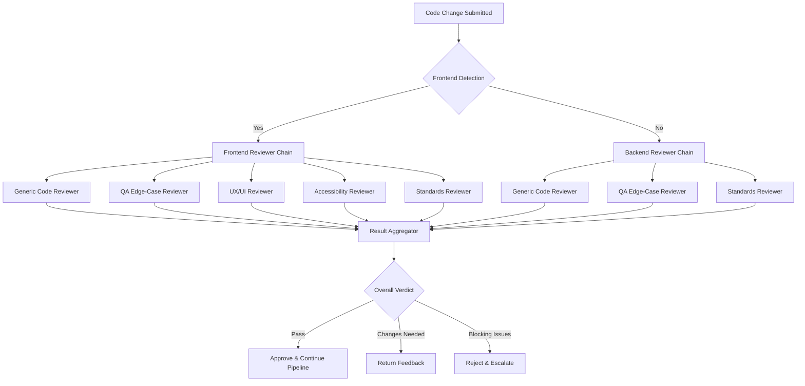
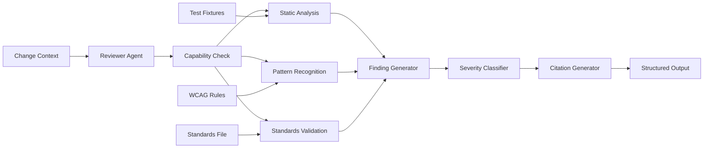

# PRD-012: Quality Reviewer Suite

| Field       | Value                                      |
|-------------|--------------------------------------------|
| **Title**   | Quality Reviewer Suite                      |
| **PRD ID**  | PRD-012                                    |
| **Version** | 1.0                                        |
| **Date**    | 2026-04-28                                 |
| **Author**  | Patrick Watson                             |
| **Status**  | Draft                                      |
| **Plugin**  | autonomous-dev                             |

---

## 1. Problem Statement

The autonomous-dev pipeline currently employs generic reviewers (prd-reviewer, tdd-reviewer, plan-reviewer, spec-reviewer, code-reviewer, security-reviewer) that provide broad coverage but systematically miss domain-specific quality issues that specialized reviewers would catch. Real-world quality assurance requires targeted expertise that looks for specific failure modes the generalists overlook.

**Concrete examples of reviewer gaps identified in production:**

1. **Edge case blind spots**: The code-reviewer passes code that handles happy paths correctly but fails on null inputs, boundary conditions (array index 0 or length-1), race conditions in concurrent operations, and error propagation paths. A QA engineer would immediately spot these gaps, but the generic code reviewer focuses on architectural patterns and misses input validation holes.

2. **UX friction invisible to non-frontend reviewers**: The spec-reviewer approves frontend specifications that meet functional requirements but create poor user experiences: forms without loading states, error messages that display technical stack traces to end users, information density that overwhelms on mobile screens, and color-only status indicators that fail accessibility standards. These issues require frontend domain knowledge to detect.

3. **Accessibility violations overlooked**: Frontend code passes review despite missing ARIA labels, insufficient color contrast, keyboard navigation traps, and missing semantic HTML structure. WCAG compliance requires specialized knowledge of assistive technologies and accessibility testing patterns that generic reviewers lack.

4. **Standards enforcement inconsistency**: Projects have engineering standards (Python services must use FastAPI, all APIs must expose `/health` endpoints, specific code formatting rules) but no systematic enforcement. The security-reviewer focuses on vulnerabilities, not organizational standards compliance. Teams report that standards violations slip through review and accumulate technical debt.

**The core architectural problem**: PRD-002 established a generic review gate model where each document type has one primary reviewer. This works for broad quality checks but fails for domain-specific expertise. A TDD touching both frontend and backend components needs both architectural review (current generic TDD reviewer) AND frontend-specific review (UX patterns, accessibility considerations) AND backend-specific review (API design, database patterns).

The pipeline needs **review chains** where multiple specialist reviewers can examine artifacts from their domain perspectives, with configurable thresholds and gate behaviors per reviewer type. This PRD specifies four critical specialist reviewers and the infrastructure to chain them with existing generic reviewers.

---

## 2. Goals

| ID     | Goal                                                                                                                                                                  |
|--------|-----------------------------------------------------------------------------------------------------------------------------------------------------------------------|
| G-01   | Implement QA edge-case reviewer agent that scans code and specs for missing input validation, boundary condition handling, error path coverage, and race condition susceptibility. |
| G-02   | Implement UX/UI reviewer agent that evaluates frontend changes for information density, loading states, error message clarity, mobile responsiveness, and user flow clarity. |
| G-03   | Implement accessibility reviewer agent that validates WCAG 2.2 AA compliance including contrast ratios, keyboard navigation, ARIA usage, and semantic HTML structure. |
| G-04   | Implement rule-set enforcement reviewer agent that verifies changes comply with project-specific engineering standards declared in `.autonomous-dev/standards.yaml`. |
| G-05   | Establish reviewer chain configuration model that allows operators to specify which reviewers run for each request type, in what order, with independent thresholds. |
| G-06   | Provide auto-detection of existing project standards by scanning for common configuration files and generating inferred standards as a starting point for operators. |
| G-07   | Integrate specialist reviewers with PRD-011 extension hooks so they register at appropriate review gates and can be extended by future plugins. |
| G-08   | Implement per-reviewer cost and latency budgets to prevent excessive resource consumption while ensuring quality coverage. |
| G-09   | Establish precision ≥80%, recall ≥70% requirements for specialist reviewers through fixture-based testing before promotion to required status checks. |

## 3. Non-Goals

| ID     | Non-Goal                                                                                                                                                             |
|--------|---------------------------------------------------------------------------------------------------------------------------------------------------------------------|
| NG-01  | **Rule-set DSL design**: The standards definition format and rule syntax is PRD-013's responsibility. This PRD consumes standards files, not designs their schema. |
| NG-02  | **Agent factory mechanics**: Agent registration, performance tracking, and improvement lifecycle are PRD-003's responsibility. This PRD defines new agents, not the factory infrastructure. |
| NG-03  | **Pipeline variants architecture**: The extension hook and variant selection system is PRD-011's responsibility. This PRD registers with those hooks, not designs them. |
| NG-04  | **Generic reviewer replacement**: Existing generic reviewers (code-reviewer, security-reviewer) remain unchanged. Specialist reviewers supplement, not replace, generic review. |
| NG-05  | **Cross-repository standards enforcement**: Standards enforcement is scoped to individual repositories. Org-wide policy enforcement across multiple repos is out of scope. |
| NG-06  | **Performance testing validation**: The specialist reviewers focus on code quality, UX, accessibility, and standards compliance. Performance benchmarking and load testing are separate concerns. |
| NG-07  | **Legal or compliance review**: While the accessibility reviewer checks WCAG technical requirements, broader legal compliance (GDPR, SOC2, etc.) is beyond scope. |

---

## 4. User Stories

### Frontend Developer Stories

| ID   | Story | Priority |
|------|-------|----------|
| US-01 | As a frontend developer, I want the UX/UI reviewer to flag when my component specs lack loading and error states so I don't ship forms that hang without user feedback. | P0 |
| US-02 | As a frontend developer, I want the accessibility reviewer to catch missing ARIA labels and insufficient color contrast in my code so users with assistive technologies can use my features. | P0 |
| US-03 | As a frontend developer, I want to see specific WCAG rule citations (e.g., "violates WCAG 1.4.3 contrast ratio") in review feedback so I know exactly what to fix. | P1 |
| US-04 | As a frontend developer, I want the UX reviewer to validate mobile responsiveness patterns so my components work well across screen sizes without manual testing on every device. | P1 |

### Backend Developer Stories

| ID   | Story | Priority |
|------|-------|----------|
| US-05 | As a backend developer, I want the QA edge-case reviewer to identify missing null checks and boundary condition handling in my code so I don't ship functions that crash on edge inputs. | P0 |
| US-06 | As a backend developer, I want the standards reviewer to verify my API endpoints follow team conventions (health checks, error codes, versioning) so I don't have to remember every standard manually. | P0 |
| US-07 | As a backend developer, I want edge-case review to flag potential race conditions in concurrent code so I can add proper synchronization before deployment. | P1 |

### QA Lead Stories

| ID   | Story | Priority |
|------|-------|----------|
| US-08 | As a QA lead, I want to configure edge-case review thresholds per project (stricter for payment systems, more lenient for internal tools) so critical systems get appropriate scrutiny. | P1 |
| US-09 | As a QA lead, I want to see aggregated findings across all specialist reviewers in a summary report so I can assess overall quality trends and identify training needs. | P1 |
| US-10 | As a QA lead, I want the QA reviewer to cite specific functions and line ranges when flagging edge cases so developers get actionable feedback, not vague warnings. | P0 |

### Accessibility Advocate Stories

| ID   | Story | Priority |
|------|-------|----------|
| US-11 | As an accessibility advocate, I want the accessibility reviewer to automatically trigger for any frontend code changes so accessibility isn't an afterthought. | P0 |
| US-12 | As an accessibility advocate, I want prioritized findings that distinguish between blocking violations (no alt text on images) and enhancement opportunities (heading structure improvements). | P1 |
| US-13 | As an accessibility advocate, I want the reviewer to suggest specific ARIA patterns and semantic HTML alternatives, not just flag violations. | P1 |

### Platform Team Stories

| ID   | Story | Priority |
|------|-------|----------|
| US-14 | As a platform team member, I want to define engineering standards in `.autonomous-dev/standards.yaml` and have them automatically enforced in reviews so teams follow architectural conventions. | P0 |
| US-15 | As a platform team member, I want auto-detected standards from existing project configuration (eslint, prettier, pyproject.toml) so I don't start from a blank slate. | P1 |
| US-16 | As a platform team member, I want standards violations to be blocking or advisory per rule so critical standards (security) block PRs while style preferences generate warnings. | P1 |

### Plugin Author Stories

| ID   | Story | Priority |
|------|-------|----------|
| US-17 | As a plugin author, I want to register additional specialist reviewers using the same extension hook mechanism so I can add domain-specific review capabilities. | P1 |
| US-18 | As a plugin author, I want access to the reviewer chain configuration format so I can integrate my reviewers with existing review workflows. | P1 |

---

## 5. Functional Requirements

### 5.1 QA Edge-Case Reviewer Agent

| ID | Priority | Requirement |
|----|----------|-------------|
| FR-1201 | P0 | The system SHALL implement a `qa-edge-case-reviewer` agent that scans code and specifications for common quality gaps: missing input validation (null checks, type validation, range bounds), boundary condition handling (empty arrays, index 0/length-1, min/max values), error path coverage (exception handling, error propagation), unhandled edge cases (concurrent access, race conditions), off-by-one errors in loops and indexing. |
| FR-1202 | P0 | The QA reviewer SHALL cite specific file paths and line ranges for each finding (e.g., `src/api/users.ts:45-52: Missing null check on user.email before string operations`) to provide actionable feedback. |
| FR-1203 | P0 | The QA reviewer SHALL classify findings by severity: `critical` (null pointer exceptions, array bounds violations), `major` (missing error handling, race condition susceptibility), `minor` (edge case handling improvements), `suggestion` (defensive programming opportunities). |
| FR-1204 | P1 | The QA reviewer SHALL validate that test specifications include edge case coverage, flagging when tests only cover happy paths without boundary conditions, error scenarios, or concurrent access patterns. |
| FR-1205 | P1 | The QA reviewer SHALL use static analysis patterns to detect common vulnerability classes: SQL injection vectors, cross-site scripting possibilities, path traversal risks, and buffer overflow potential in file operations. |

### 5.2 UX/UI Reviewer Agent

| ID | Priority | Requirement |
|----|----------|-------------|
| FR-1211 | P0 | The system SHALL implement a `ux-ui-reviewer` agent that activates ONLY when frontend code is detected through heuristics: changes under `**/components/`, `**/views/`, `**/pages/`, or files matching `*.tsx`, `*.vue`, `*.svelte`, `*.jsx` patterns. |
| FR-1212 | P0 | The UX reviewer SHALL evaluate frontend changes for user experience quality: information density (excessive data per screen), loading states (missing spinners, progress indicators), error message clarity (technical stack traces vs user-friendly messages), empty states (missing content when no data exists), mobile responsiveness patterns, form field labeling and validation feedback. |
| FR-1213 | P0 | The UX reviewer SHALL output prioritized findings with specific improvement recommendations: `critical` (broken user flows, missing error handling), `major` (poor mobile experience, unclear labels), `minor` (information density, loading state polish), `suggestion` (UX enhancement opportunities). |
| FR-1214 | P1 | The UX reviewer SHALL validate button and link text clarity, flagging ambiguous labels ("Click here", "Submit") and suggesting action-specific alternatives ("Save Changes", "Delete User Account"). |
| FR-1215 | P1 | The UX reviewer SHALL check for consistent design patterns within the component, flagging when spacing, colors, or typography deviate from established patterns without justification. |

### 5.3 Accessibility Reviewer Agent

| ID | Priority | Requirement |
|----|----------|-------------|
| FR-1221 | P0 | The system SHALL implement an `accessibility-reviewer` agent that activates with the same frontend detection heuristics as the UX reviewer and validates WCAG 2.2 AA compliance. |
| FR-1222 | P0 | The accessibility reviewer SHALL check: color contrast ratios (minimum 4.5:1 for normal text, 3:1 for large text), keyboard navigation support (tab order, focus indicators, escape key handling), ARIA correctness (labels, roles, states), semantic HTML structure (headings hierarchy, list markup, form associations), image alt text presence and quality, screen reader compatibility patterns. |
| FR-1223 | P0 | The accessibility reviewer SHALL cite specific WCAG guidelines for each violation (e.g., "Violates WCAG 1.4.3: Contrast ratio 2.1:1 below required 4.5:1 for normal text") to enable precise remediation. |
| FR-1224 | P1 | The accessibility reviewer SHALL prioritize findings: `blocking` (complete inaccessibility for assistive technology users), `major` (significant barriers), `minor` (enhancement opportunities), `suggestion` (best practice improvements). |
| FR-1225 | P1 | The accessibility reviewer SHALL suggest specific ARIA patterns and semantic HTML alternatives, not just flag violations (e.g., "Replace `<div onclick>` with `<button>` for semantic button behavior"). |

### 5.4 Rule-Set Enforcement Reviewer Agent

| ID | Priority | Requirement |
|----|----------|-------------|
| FR-1231 | P0 | The system SHALL implement a `rule-set-enforcement-reviewer` agent that validates changes comply with standards declared in `<repo>/.autonomous-dev/standards.yaml` file format defined in PRD-013. |
| FR-1232 | P0 | The standards reviewer SHALL support rule categories: technology choices (required frameworks, forbidden libraries), API standards (endpoint patterns, authentication requirements, response schemas), code organization (directory structure, naming conventions), documentation requirements (README sections, API doc coverage), testing standards (coverage thresholds, test patterns), security requirements (dependency scanning, secret management). |
| FR-1233 | P0 | The standards reviewer SHALL output violations with rule references (e.g., "Violates TECH-001: Python services must use FastAPI, found Flask usage in src/api/main.py") linking to the specific standard that was violated. |
| FR-1234 | P1 | The standards reviewer SHALL respect rule severity levels defined in the standards file: `blocking` (fails status check), `warning` (comment + label), `advisory` (logged only), allowing gradual standards adoption. |
| FR-1235 | P1 | The standards reviewer SHALL validate that required files exist (health check endpoints, security.md, API documentation) and have required content sections per project standards. |

### 5.5 Reviewer Chain Configuration

| ID | Priority | Requirement |
|----|----------|-------------|
| FR-1241 | P0 | The system SHALL support reviewer chain configuration that specifies which reviewers run for each request type (PRD, TDD, Plan, Spec, Code), in what order, with independent score thresholds and gate behaviors per reviewer. |
| FR-1242 | P0 | The reviewer chain configuration SHALL define default chains per request type: Code requests run `[code-reviewer, qa-edge-case-reviewer]` + frontend-conditional `[ux-ui-reviewer, accessibility-reviewer]` + optional `[rule-set-enforcement-reviewer]`; Spec requests run `[spec-reviewer]` + frontend-conditional `[ux-ui-reviewer]`; TDD/Plan/PRD requests run existing generic reviewers only. |
| FR-1243 | P0 | Each reviewer in a chain SHALL have independent configuration: score threshold (0-100), gate behavior (`advisory`, `warning`, `blocking`), timeout (default 8 minutes), cost cap (default $1.50), enabled/disabled flag. |
| FR-1244 | P1 | The system SHALL support per-repository reviewer chain overrides via `.autonomous-dev/review-chains.yaml`, allowing projects to customize which specialist reviewers run and with what thresholds. |
| FR-1245 | P1 | Reviewer chain execution SHALL be parallel where possible: frontend reviewers (UX + accessibility) run concurrently, backend reviewers run concurrently, with final aggregation of all results. |
| FR-1246 | P1 | The system SHALL aggregate reviewer results into a unified review verdict: overall score (weighted average), blocking findings count, warning findings count, per-reviewer breakdown, overall recommendation (approve/changes-needed/reject). |

### 5.6 Standards Auto-Detection

| ID | Priority | Requirement |
|----|----------|-------------|
| FR-1251 | P0 | The system SHALL implement standards auto-detection that scans repositories on first run for common configuration files: `.eslintrc.*`, `.prettierrc.*`, `pyproject.toml`, `tsconfig.json`, `package.json`, `.gitignore` patterns, test file patterns (`*.test.*`, `*_test.*`, `__tests__/**`), CI configuration files. |
| FR-1252 | P0 | Auto-detection SHALL generate `.autonomous-dev/standards.inferred.yaml` containing standards derived from discovered configuration: technology stack (detected from package.json, requirements.txt, go.mod), linting rules (extracted from ESLint/Prettier config), testing patterns (test file locations, naming conventions), directory structure (common patterns like src/, tests/, docs/). |
| FR-1253 | P0 | The inferred standards file SHALL be marked as `status: inferred` with a header comment: `# Auto-generated from repository analysis. Review and modify, then rename to standards.yaml to activate enforcement.` |
| FR-1254 | P1 | Auto-detection SHALL identify common architectural patterns: REST API structure, database migration patterns, frontend component organization, and suggest corresponding standards rules. |
| FR-1255 | P1 | The system SHALL support `autonomous-dev standards detect --update` to re-run detection and merge new findings with existing `.autonomous-dev/standards.yaml`, preserving manual customizations. |

### 5.7 Extension Hook Integration

| ID | Priority | Requirement |
|----|----------|-------------|
| FR-1261 | P0 | All four specialist reviewers SHALL register with PRD-011 extension hooks at the appropriate review gate: `qa-edge-case-reviewer` and `rule-set-enforcement-reviewer` register for Code and Spec gates; `ux-ui-reviewer` and `accessibility-reviewer` register for Code and Spec gates with frontend detection. |
| FR-1262 | P0 | Reviewer registration SHALL declare capabilities: supported file types, triggering conditions, resource requirements (timeout, cost), output schema compatibility with existing review aggregation. |
| FR-1263 | P1 | The extension hook system SHALL support plugin-provided specialist reviewers, allowing third-party plugins to register domain-specific reviewers (database design reviewer, API security reviewer, performance reviewer). |
| FR-1264 | P1 | Reviewer hooks SHALL provide access to change context: modified files, change type (new feature, bug fix, refactoring), request metadata, and upstream artifacts (parent PRD, TDD, Plan). |

### 5.8 Cost and Performance Controls

| ID | Priority | Requirement |
|----|----------|-------------|
| FR-1271 | P0 | Each specialist reviewer SHALL have per-invocation resource limits: timeout (default 8 minutes), cost cap (default $1.50), token limit (input + output, default 50K tokens) to prevent runaway consumption. |
| FR-1272 | P0 | The system SHALL track and report reviewer resource usage: total cost per reviewer per day/month, average response time, timeout rate, success rate, enabling cost optimization and performance monitoring. |
| FR-1273 | P1 | Reviewer scheduling SHALL implement efficiency optimizations: frontend reviewers (UX + accessibility) share change detection logic and run concurrently, repeated static analysis results are cached for 1 hour, similar code patterns trigger cached analysis results. |
| FR-1274 | P1 | The system SHALL support reviewer budget allocation: daily/monthly spending caps per reviewer type, automatic throttling when approaching limits, escalation to human operator when budgets are exceeded. |

### 5.9 Quality Validation and Testing

| ID | Priority | Requirement |
|----|----------|-------------|
| FR-1281 | P0 | Each specialist reviewer SHALL meet quality thresholds through fixture-based testing: precision ≥80% (true positives / all positives), recall ≥70% (true positives / all actual issues), before promotion to required status check. |
| FR-1282 | P0 | The system SHALL maintain test fixture corpora for each reviewer: known-good code samples (should pass), known-bad code samples with specific issues (should flag), edge cases and boundary conditions, real-world code samples with verified ground truth. |
| FR-1283 | P1 | Specialist reviewers SHALL undergo A/B comparison testing against generic reviewers on historical code changes to demonstrate incremental value and justify additional cost. |
| FR-1284 | P1 | The system SHALL implement reviewer regression testing: monthly validation of all specialist reviewers against fixed test suites, alerting when performance degrades below thresholds, automatic rollback for significant quality drops. |

---

## 6. Non-Functional Requirements

| ID | Priority | Requirement |
|----|----------|-------------|
| NFR-1201 | P0 | **Review latency**: Specialist reviewer chains SHALL complete within 10 minutes for typical code changes (under 2000 lines), including parallel execution of frontend reviewers and sequential execution of backend analysis. |
| NFR-1202 | P0 | **Cost predictability**: Total specialist reviewer cost per code review SHALL not exceed $5.00 under normal conditions, with hard caps preventing runaway spending from complex changes. |
| NFR-1203 | P0 | **False positive rate**: Each specialist reviewer SHALL maintain false positive rate ≤20% (human review confirms ≥80% of flagged issues are valid), measured through monthly sampling of 50+ review results. |
| NFR-1204 | P1 | **Concurrent review support**: The reviewer chain system SHALL support 5+ concurrent reviews without performance degradation, with resource isolation preventing one complex review from blocking others. |
| NFR-1205 | P1 | **Configuration reload**: Changes to reviewer chain configuration SHALL take effect within 30 seconds without restarting the daemon or interrupting in-progress reviews. |
| NFR-1206 | P1 | **Standards change propagation**: Updates to `.autonomous-dev/standards.yaml` SHALL be detected and applied to new reviews within 60 seconds, with in-progress reviews using the standards version from when they started. |
| NFR-1207 | P2 | **Offline capability**: Specialist reviewers SHALL degrade gracefully when network access is limited, using cached standards and configuration, with clear notifications about reduced functionality. |

---

## 7. Architecture

### 7.1 Review Gate Flow with Specialist Reviewers



### 7.2 Specialist Reviewer Agent Architecture



### 7.3 Review Chain Configuration Model

```yaml
review_chains:
  code:
    reviewers:
      - name: code-reviewer
        threshold: 85
        behavior: blocking
        timeout: 300
        cost_cap: 2.00
      - name: qa-edge-case-reviewer  
        threshold: 80
        behavior: blocking
        timeout: 480
        cost_cap: 1.50
      - name: ux-ui-reviewer
        threshold: 75
        behavior: warning
        timeout: 300
        cost_cap: 1.00
        condition: frontend_detected
      - name: accessibility-reviewer
        threshold: 85
        behavior: blocking
        timeout: 360
        cost_cap: 1.25
        condition: frontend_detected
      - name: rule-set-enforcement-reviewer
        threshold: 90
        behavior: warning
        timeout: 240
        cost_cap: 0.75
        condition: standards_file_exists
```

---

## 8. Reviewer Agent Specifications

### 8.1 QA Edge-Case Reviewer

**Input Contract:**
- Changed files with file paths and content
- Language/framework detection results  
- Test files associated with changed code
- Request type (new feature, bug fix, refactoring)

**Output Schema:**
```yaml
findings:
  - id: "QA-001"
    severity: critical | major | minor | suggestion
    category: input_validation | boundary_conditions | error_handling | race_conditions
    file: "src/api/users.ts"
    line_range: "45-52"
    description: "Missing null check on user.email before string operations"
    suggestion: "Add null check: if (!user.email) return { error: 'Email required' }"
    code_snippet: "user.email.toLowerCase()"
```

**Capabilities Required:** `Read`, `Glob`, `Grep` (read-only analysis)

**Prompt Skeleton (High-Level):**
- Analyze code for edge case vulnerabilities
- Focus on input validation, boundary conditions, error paths
- Cite specific functions and line ranges
- Classify by severity and provide remediation suggestions

### 8.2 UX/UI Reviewer  

**Input Contract:**
- Frontend file changes (detected via file patterns)
- Component specifications or design artifacts
- User flow context from parent documents
- Mobile/responsive design requirements

**Output Schema:**
```yaml
findings:
  - id: "UX-001"
    severity: critical | major | minor | suggestion
    category: loading_states | error_messaging | mobile_responsive | information_density
    component: "UserProfile.tsx"
    description: "Form submit button lacks loading state during API call"
    user_impact: "Users may click submit multiple times, causing duplicate requests"
    suggestion: "Add loading prop and disable button during submission"
```

**Capabilities Required:** `Read`, `Glob`, `Grep`, `WebFetch` (for design system references)

**Prompt Skeleton (High-Level):**
- Evaluate user experience quality in frontend changes
- Check loading states, error messages, mobile patterns
- Prioritize findings by user impact
- Suggest specific UX improvements

### 8.3 Accessibility Reviewer

**Input Contract:**
- Frontend file changes with HTML/JSX content
- CSS/styling changes affecting visual presentation  
- Interactive component definitions
- Existing ARIA patterns in codebase

**Output Schema:**
```yaml
findings:
  - id: "A11Y-001"
    severity: blocking | major | minor | suggestion
    wcag_rule: "1.4.3"
    wcag_description: "Contrast (Minimum)"
    element: "button.primary"
    description: "Contrast ratio 2.1:1 below required 4.5:1 for normal text"
    remediation: "Increase text color darkness or background lightness"
    testing_note: "Test with color contrast analyzer"
```

**Capabilities Required:** `Read`, `Glob`, `Grep`, `WebFetch` (for WCAG reference lookup)

**Prompt Skeleton (High-Level):**
- Validate WCAG 2.2 AA compliance in frontend code
- Check contrast, keyboard navigation, ARIA usage, semantic HTML
- Cite specific WCAG guidelines for violations
- Suggest remediation with testing guidance

### 8.4 Rule-Set Enforcement Reviewer

**Input Contract:**
- All changed files across the repository
- Standards file (`.autonomous-dev/standards.yaml`)
- Project metadata (package.json, etc.)
- Architectural context from parent documents

**Output Schema:**
```yaml
findings:
  - id: "STD-001"
    severity: blocking | warning | advisory  
    rule_id: "TECH-001"
    rule_description: "Python services must use FastAPI"
    violation: "Found Flask usage in src/api/main.py"
    file: "src/api/main.py"
    line_range: "1-10"
    remediation: "Replace Flask imports with FastAPI equivalents"
```

**Capabilities Required:** `Read`, `Glob`, `Grep` (read-only analysis)

**Prompt Skeleton (High-Level):**
- Validate compliance with project engineering standards
- Check technology choices, API patterns, code organization
- Reference specific standards rules by ID
- Suggest compliance path for violations

---

## 9. Configuration Model

### 9.1 Reviewer Chain Configuration Schema

```json
{
  "review_chains": {
    "prd": {
      "reviewers": [
        {
          "name": "prd-reviewer",
          "threshold": 85,
          "behavior": "blocking",
          "timeout": 300,
          "cost_cap": 2.0
        }
      ]
    },
    "code": {
      "reviewers": [
        {
          "name": "code-reviewer",
          "threshold": 85,
          "behavior": "blocking",
          "timeout": 300,
          "cost_cap": 2.0
        },
        {
          "name": "qa-edge-case-reviewer",
          "threshold": 80,
          "behavior": "blocking", 
          "timeout": 480,
          "cost_cap": 1.5
        },
        {
          "name": "ux-ui-reviewer",
          "threshold": 75,
          "behavior": "warning",
          "timeout": 300,
          "cost_cap": 1.0,
          "condition": "frontend_detected"
        },
        {
          "name": "accessibility-reviewer", 
          "threshold": 85,
          "behavior": "blocking",
          "timeout": 360,
          "cost_cap": 1.25,
          "condition": "frontend_detected"
        },
        {
          "name": "rule-set-enforcement-reviewer",
          "threshold": 90,
          "behavior": "warning",
          "timeout": 240,
          "cost_cap": 0.75,
          "condition": "standards_file_exists"
        }
      ]
    }
  },
  "conditions": {
    "frontend_detected": {
      "file_patterns": ["**/{components,views,pages}/**", "**/*.{tsx,jsx,vue,svelte}"],
      "exclude_patterns": ["**/*.test.*"]
    },
    "standards_file_exists": {
      "required_files": [".autonomous-dev/standards.yaml"]
    }
  },
  "global_settings": {
    "max_parallel_reviewers": 4,
    "total_cost_cap": 10.0,
    "total_timeout": 900
  }
}
```

### 9.2 Per-Repository Override

Projects can override default reviewer chains via `.autonomous-dev/review-chains.yaml`:

```yaml
# Override defaults for this repository
overrides:
  code:
    reviewers:
      # Disable UX reviewer for backend-only service
      - name: ux-ui-reviewer
        enabled: false
      # Make standards reviewer blocking for this critical service  
      - name: rule-set-enforcement-reviewer
        behavior: blocking
        threshold: 95
```

---

## 10. Auto-Detection Algorithm

### 10.1 Standards Detection Heuristics

The auto-detection process scans for common configuration patterns:

**Technology Stack Detection:**
- `package.json` → Node.js/TypeScript project
- `requirements.txt` or `pyproject.toml` → Python project  
- `go.mod` → Go project
- `Cargo.toml` → Rust project

**Standards Extraction:**
- ESLint config → Code style and quality rules
- Prettier config → Formatting standards
- TypeScript config → Type checking requirements
- Test patterns → Testing conventions
- Directory structure → Organizational standards

**Output Format (`.autonomous-dev/standards.inferred.yaml`):**

```yaml
# Auto-generated from repository analysis on 2026-04-28
# Review and modify, then rename to standards.yaml to activate enforcement
status: inferred
generated_at: 2026-04-28T14:30:00Z
detected_stack:
  primary: typescript
  frameworks: [react, fastapi]
  tools: [eslint, prettier, jest]

standards:
  technology:
    TECH-001:
      description: "Frontend uses React with TypeScript"
      pattern: "**/*.{tsx,ts}"
      requirement: "React functional components with TypeScript"
      severity: warning
  
  formatting:  
    FMT-001:
      description: "Code formatted with Prettier"
      files: "**/*.{ts,tsx,js,jsx}"
      requirement: "prettier --check"
      severity: advisory

  testing:
    TEST-001:
      description: "Unit tests use Jest framework"
      pattern: "**/*.test.{ts,tsx}"
      requirement: "Jest test files adjacent to source"
      severity: warning
```

---

## 11. Assist Plugin Updates

### 11.1 New Skills

The autonomous-dev-assist plugin gains four new skills:

**`qa-reviewer-guide`** (3000+ words):
- Edge case detection patterns for common languages
- Input validation checklist templates
- Boundary condition testing strategies
- Race condition identification techniques
- Error handling best practices

**`ux-reviewer-guide`** (2500+ words):
- Frontend review criteria and patterns
- Loading state implementation examples
- Error message guidelines and templates
- Mobile responsiveness check procedures
- Information architecture principles

**`a11y-reviewer-guide`** (4000+ words):
- WCAG 2.2 AA compliance reference
- Common accessibility violations and fixes
- ARIA patterns and semantic HTML guidelines
- Color contrast calculation methods
- Keyboard navigation testing procedures

**`standards-detection-guide`** (2000+ words):
- Repository analysis techniques
- Configuration file parsing patterns
- Standards inference algorithms
- Rule definition best practices

### 11.2 New Eval Suite

**`reviewer-suite`** (~20 test cases):
- Known-good code samples (should pass all reviewers)
- Known-bad code samples with specific defects
- Edge case scenarios for each reviewer type
- Real-world examples with ground truth labels
- Performance regression detection cases

Test case structure follows existing eval framework:

```yaml
suite: reviewer-suite
description: "Validates specialist reviewer agents catch intended issues"

cases:
  - id: qa-edge-001
    category: edge-case-detection
    reviewer: qa-edge-case-reviewer
    input: |
      function processUser(user) {
        return user.email.toLowerCase(); // Missing null check
      }
    expected_findings:
      - category: input_validation
        severity: critical
        description_contains: "null check"
    must_cite:
      - line_number: 2
      - function_name: "processUser"
```

---

## 12. Testing Strategy

### 12.1 Fixture-Based Validation

Each specialist reviewer undergoes rigorous testing before promotion:

**QA Edge-Case Reviewer Fixtures:**
- 25+ code samples with known edge case vulnerabilities
- Boundary condition examples (array bounds, null inputs)
- Race condition patterns in concurrent code
- Error handling gaps and anti-patterns

**UX/UI Reviewer Fixtures:**  
- 20+ frontend component examples
- Loading state and error handling patterns
- Mobile responsiveness test cases
- Information density and clarity examples

**Accessibility Reviewer Fixtures:**
- 30+ WCAG compliance test cases
- Common accessibility violations
- ARIA pattern examples (correct and incorrect)
- Color contrast and keyboard navigation scenarios

**Standards Reviewer Fixtures:**
- 15+ repository configurations
- Various technology stacks and conventions
- Standards compliance and violation examples

### 12.2 Quality Thresholds

**Precision Requirement (≥80%):**
- True positives / (true positives + false positives) ≥ 0.8
- Human review confirms 80%+ of flagged issues are legitimate

**Recall Requirement (≥70%):**  
- True positives / (true positives + false negatives) ≥ 0.7
- Reviewer catches 70%+ of actual issues in test corpus

**A/B Comparison Testing:**
- Specialist reviewers vs generic reviewers on same code samples
- Incremental value measurement: issues caught by specialists vs generic
- Cost-benefit analysis: additional cost vs additional quality

### 12.3 Continuous Validation

**Monthly Regression Testing:**
- All specialist reviewers run against fixed test suites
- Performance tracking over time
- Alert on degradation below quality thresholds
- Automatic rollback for significant quality drops

**Human Calibration:**
- Quarterly sampling of 50+ real review results
- Human experts validate automated findings
- Bias detection and correction procedures
- Threshold tuning based on operational feedback

---

## 13. Migration & Rollout

### 13.1 Phase 1: Advisory Mode (Weeks 1-2)

**Goal:** Deploy all specialist reviewers in advisory mode only.

**Deliverables:**
- Four specialist reviewer agents implemented and tested
- Reviewer chain configuration system
- Standards auto-detection capability
- All reviewers report findings but don't block reviews

**Success Criteria:**
- All reviewers successfully analyze code without crashes
- Finding quality validated through manual review of 25+ samples
- No performance impact on existing review pipeline

### 13.2 Phase 2: Graduated Promotion (Weeks 3-6)

**Goal:** Promote individual reviewers to warning/blocking status based on performance.

**Promotion Criteria Per Reviewer:**
- Precision ≥80% and recall ≥70% maintained for 2+ weeks
- False positive rate ≤20% confirmed through human sampling  
- No timeout or cost cap violations
- Positive feedback from development teams

**Promotion Order (Risk-Based):**
1. QA edge-case reviewer (high value, clear criteria)
2. Standards enforcement reviewer (clear rules, objective evaluation)
3. UX/UI reviewer (subjective but valuable feedback)  
4. Accessibility reviewer (objective criteria but specialized knowledge)

### 13.3 Phase 3: Integration & Optimization (Weeks 7-8)

**Goal:** Full integration with existing pipeline, optimization based on usage data.

**Activities:**
- Enable all promoted reviewers as required status checks
- Optimize reviewer chains based on performance data
- Implement cost and performance improvements
- Document operational procedures and troubleshooting

**Success Metrics:**
- 90%+ of reviews complete within SLA timeouts
- Total specialist reviewer cost under budget projections
- Zero false positive alerts from quality monitoring
- Development team satisfaction score ≥80%

---

## 14. Security & Cost

### 14.1 Security Controls

**Privilege Isolation:**
- All specialist reviewers run with read-only permissions (`Read`, `Glob`, `Grep` only)
- No file modification, shell execution, or network access (except WebFetch for standards lookup)
- Reviewer processes isolated from daemon core with resource limits

**Input Validation:**
- All reviewer inputs sanitized against prompt injection attacks
- File content size limits prevent resource exhaustion
- Malicious code patterns detected and quarantined before analysis

**Audit Trail:**
- All reviewer invocations logged with input hashes, outputs, costs, timings
- Review decisions traceable to specific reviewer versions and configurations
- Configuration changes logged with operator identity and justification

### 14.2 Cost Controls

**Per-Reviewer Budgets:**
- Default cost caps: $1.50 per review for QA/UX/A11Y, $0.75 for standards
- Hard timeout limits prevent runaway LLM calls
- Daily/monthly aggregate spending caps with auto-throttling

**Resource Optimization:**
- Caching of static analysis results for similar code patterns
- Parallel execution of independent reviewers
- Early termination for obvious passes/fails to conserve resources

**Budget Monitoring:**
- Real-time cost tracking per reviewer type
- Alerts at 80% of daily/monthly budgets  
- Automatic degradation to advisory mode when budgets exceeded
- Management reporting on ROI: cost per issue found vs remediation savings

---

## 15. Risks & Mitigations

| # | Risk | Likelihood | Impact | Mitigation |
|---|------|-----------|--------|------------|
| R1 | **False positive avalanche**: Specialist reviewers generate too many false positive findings, leading to alert fatigue and eventual dismissal of legitimate issues. | Medium | High | Rigorous fixture testing with 80% precision requirement. Monthly human sampling to validate finding quality. Tunable thresholds per project. Graduated rollout starting in advisory mode. |
| R2 | **Cost overrun from complex reviews**: Large code changes trigger multiple specialist reviewers with deep analysis, exceeding cost budgets and slowing pipeline. | Medium | Medium | Hard cost caps per reviewer ($1.50) and total caps per review ($5.00). Early termination for obvious outcomes. Caching of repeated analysis patterns. Progressive timeout enforcement. |
| R3 | **Frontend detection false negatives**: Code that affects frontend UX doesn't trigger UX/accessibility reviewers due to file pattern limitations, missing critical issues. | Medium | High | Multiple detection heuristics: file patterns, content analysis, import scanning. Manual reviewer chain overrides per repository. Monitoring of missed issues through retrospective analysis. |
| R4 | **Standards enforcement becomes outdated**: Project standards evolve but `.autonomous-dev/standards.yaml` isn't updated, leading to enforcement of obsolete rules. | High | Medium | Quarterly standards review reminders. Auto-detection of configuration drift. Standards file versioning with update prompts. Clear documentation on standards maintenance responsibilities. |
| R5 | **Accessibility reviewer knowledge gaps**: WCAG guidelines evolve and new patterns emerge faster than the reviewer can be updated, missing current best practices. | Medium | Medium | Regular reviewer retraining on updated WCAG materials. Integration with WebFetch for real-time guideline lookup. Quarterly human expert review of accessibility findings. Version control of WCAG reference materials. |
| R6 | **Review chain complexity explosion**: As more specialist reviewers are added, configuration becomes unwieldy and unpredictable interaction effects emerge. | Medium | Medium | Maximum 5 reviewers per chain enforced by system. Clear documentation of reviewer interactions. Simplified configuration with opinionated defaults. Regular simplification reviews to eliminate redundancy. |
| R7 | **Gaming of specialist reviewers**: Developers learn to write code that passes specialist reviewers without actually improving quality ("teaching to the test"). | Low | High | Diverse test fixtures updated quarterly. Human spot-checking of edge cases. Focus on principles, not patterns in reviewer training. Regular reviewer retraining on new gaming patterns. |

---

## 16. Success Metrics

| Metric | Target | Measurement Method |
|--------|--------|--------------------|
| Defect prevention rate | 40%+ reduction in post-merge defects caught by QA/production | Compare defect rates in repositories with specialist reviewers enabled vs disabled, 3-month comparison periods |
| Review quality improvement | 85%+ of specialist reviewer findings validated as legitimate by human review | Monthly sampling of 50+ findings across all specialist reviewers, expert validation |
| False positive rate | ≤20% of specialist reviewer findings are false positives | Human validation during monthly sampling, classification of false vs true positives |
| Cost efficiency | Total specialist reviewer cost <$2.00 per code review on average | Track LLM costs per review, calculate monthly averages across all repositories |
| Time to review completion | 90%+ of reviews complete within 10 minutes including specialist analysis | Measure end-to-end time from code submission to final review verdict |
| Developer satisfaction | 80%+ of developers rate specialist review feedback as helpful | Quarterly survey of developers using the system, 5-point helpfulness scale |
| Standards compliance improvement | 60%+ increase in standards adherence in repositories with enforcement enabled | Before/after analysis of standards violations, 6-month comparison periods |
| Accessibility compliance | 50%+ reduction in WCAG violations reaching production | Track accessibility issues found in production vs caught by reviewer |

---

## 17. Open Questions

| # | Question | Context | Owner | Target Date |
|---|----------|---------|-------|-------------|
| OQ-01 | Should the UX/UI reviewer have access to design artifacts (Figma files, design systems) for more informed review, or rely only on code analysis? | Integration with external design tools adds complexity but could significantly improve review quality. | Product + Engineering | TBD |
| OQ-02 | How should the system handle conflicting findings between different specialist reviewers (e.g., UX reviewer wants shorter labels but accessibility reviewer wants more descriptive labels)? | Need conflict resolution protocol and prioritization framework. | Product | TBD |
| OQ-03 | What's the right granularity for standards enforcement - should it be file-level, function-level, or line-level checking? | More granular checking is more precise but computationally expensive. | Engineering | TBD |
| OQ-04 | Should specialist reviewers be able to suggest specific code changes or only flag issues? | Code suggestions are more helpful but introduce risk of incorrect generated fixes. | Product + Security | TBD |
| OQ-05 | How do we handle legacy code that doesn't meet current standards - should enforcement be limited to changed lines only? | Full enforcement may overwhelm teams with legacy debt that's not practical to fix. | Product | TBD |
| OQ-06 | Should the accessibility reviewer integrate with automated testing tools (axe, Pa11y) or rely purely on static analysis? | Tool integration provides more comprehensive coverage but adds infrastructure complexity. | Engineering | TBD |
| OQ-07 | What's the appropriate escalation path when specialist reviewers consistently disagree with human judgment? | Need mechanism to tune reviewer behavior based on human feedback without undermining automation value. | Product + Engineering | TBD |
| OQ-08 | How should the system handle domain-specific accessibility requirements (e.g., medical device interfaces with FDA requirements)? | Standard WCAG may not cover specialized compliance needs. | Product | TBD |
| OQ-09 | Should reviewer chains support conditional logic beyond simple file pattern matching (e.g., based on code complexity, change size, author experience)? | More sophisticated triggering could improve relevance but complicates configuration. | Engineering | TBD |
| OQ-10 | What's the right balance between reviewer specialization and generalization - should we have sub-specialists (React reviewer, Vue reviewer) or keep broader frontend coverage? | More specialization improves accuracy but multiplies maintenance overhead. | Architecture | TBD |

---

## 18. References

- **PRD-002: Document Pipeline & Review Gates** — Current generic reviewer architecture and review gate mechanics that specialist reviewers integrate with
- **PRD-003: Agent Factory & Self-Improvement** — Agent registration system and performance tracking infrastructure that new reviewers leverage  
- **PRD-011: Pipeline Variants & Extension Hooks** — Extension hook system for reviewer registration (forward reference)
- **PRD-013: Engineering Standards DSL** — Standards file format and rule syntax consumed by rule-set-enforcement-reviewer (forward reference)
- **WCAG 2.2 Guidelines** — Web Content Accessibility Guidelines that accessibility-reviewer enforces
- **Autonomous-dev-assist eval harness** — Existing evaluation framework extended with reviewer-suite test cases
- **Static Analysis Research** — Academic papers on automated code quality assessment and edge case detection
- **UX Review Methodologies** — Industry standards for user experience evaluation and frontend code review practices

---

*End of PRD-012*

---

## 19. Review-Driven Design Updates (Post-Review Revision)

### 19.1 Skill Naming Collision Resolved

**Issue**: `standards-detection-guide` was proposed in both PRD-012 and PRD-013.

**Resolution**: Per the boundary established in PRD-013 §3 NG-01 (PRD-013 owns the standards DSL), `standards-detection-guide` ships exclusively in **PRD-013**. PRD-012's assist updates remove this skill from §11.1. PRD-012's rule-set-enforcement reviewer documentation refers operators to PRD-013's skill for standards authoring/detection.

### 19.2 Setup-Wizard Phase Coordination

PRD-012 originally omitted a setup-wizard section. **Updated**: PRD-012 contributes Phase 15 in the unified phase registry (see PRD-011 §19 cross-ref or the coordinating amendment). Phase 15 walks operators through:
- Enabling specialist reviewers (advisory mode default)
- Configuring per-request-type reviewer chains
- Reviewing precision/recall for the 20-PR fixture corpus before promotion to required-status-check

### 19.3 Eval Suite Sizing

**Issue**: §11.2 single suite of 20 cases is undersized vs the four reviewer fixture corpora (25+20+30+15 = 90 fixtures referenced in §12).

**Resolution**: Split `reviewer-suite` into four sub-suites mirroring the fixture corpora:
- `qa-reviewer-eval` (25 cases)
- `ux-reviewer-eval` (20 cases)
- `a11y-reviewer-eval` (30 cases)
- `standards-reviewer-eval` (15 cases)

Total 90 cases. Security-critical cases (XSS in markdown render, accessibility-blocking violations like keyboard-trap, standards-blocking rules like SQL injection) SHALL pass at 100% per the PRD-008 §12.8 / PRD-009 §13.7 precedent.

### 19.4 Help/Troubleshoot Updates

PRD-012 originally did not specify help/troubleshoot additions. **Updated**:
- `help` skill: Q&A for "what does the QA reviewer flag?", "why did the UX reviewer block my PR?", "how do I tune accessibility thresholds?", "how do reviewer chains aggregate scores?"
- `troubleshoot` skill: scenarios for false-positive triage, override workflows, reviewer cost spikes, fixture corpus drift

---
