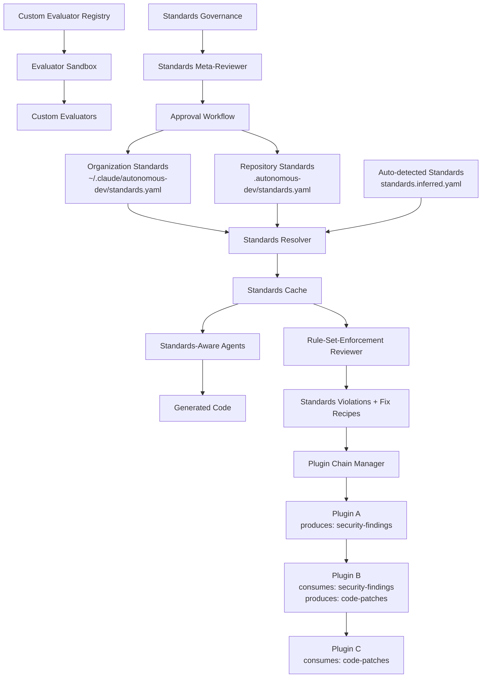

# PRD-013: Engineering Standards & Plugin Chaining

| Field       | Value                                      |
|-------------|--------------------------------------------|
| **Title**   | Engineering Standards & Plugin Chaining     |
| **PRD ID**  | PRD-013                                    |
| **Version** | 1.0                                        |
| **Date**    | 2026-04-28                                 |
| **Author**  | Patrick Watson                             |
| **Status**  | Draft                                      |
| **Plugin**  | autonomous-dev                             |

## 1. Problem Statement

Engineering teams operate under implicit standards that accumulate organically over time. These standards encompass language choices, mandatory framework components, security requirements, operational conventions, and quality gates. Currently, these standards exist as:

- **Tribal knowledge** shared through code reviews and team discussions
- **Stale documentation** that quickly becomes outdated or incomplete
- **Ad-hoc tooling configurations** scattered across repositories
- **Inconsistent enforcement** dependent on reviewer attention and experience

When autonomous-dev generates code, it operates without awareness of these engineering standards, producing technically correct but organizationally non-compliant code. Examples of violations include:

- **Security violations**: Generating direct SQL queries instead of parameterized statements required by security policy
- **Framework violations**: Using deprecated authentication patterns when teams have standardized on OAuth2 + JWT
- **Operational violations**: Missing mandatory health endpoints, metrics endpoints, or logging patterns required for production deployment
- **Quality violations**: Omitting required test patterns, documentation standards, or code organization conventions

The current autonomous-dev architecture lacks mechanisms for:

1. **Declarative standards definition** that can be version-controlled and reviewed
2. **Hierarchical standards inheritance** from organization to repository level
3. **Plugin chaining** where one agent's findings feed another's transformations
4. **Auto-detection of existing standards** from repository signals and patterns
5. **Standards-aware code generation** that respects organizational requirements from the start

This leads to significant downstream costs: code review cycles, security remediation, operational incidents from non-compliant deployments, and reduced developer velocity due to repeated corrections.

## 2. Goals

- **G-1301**: Enable declarative engineering standards definition through version-controlled YAML artifacts
- **G-1302**: Implement hierarchical standards inheritance from organization to repository level
- **G-1303**: Auto-detect existing engineering standards from repository signals and synthesize starter configurations
- **G-1304**: Integrate standards awareness into all autonomous-dev code generation agents
- **G-1305**: Establish formal plugin chaining model where agent outputs feed subsequent agent inputs
- **G-1306**: Provide structured violation reporting with actionable fix recommendations
- **G-1307**: Enable custom evaluator registration for organization-specific standards validation
- **G-1308**: Implement standards governance workflow for reviewing and approving standards changes
- **G-1309**: Support standards versioning and diff-based change tracking through git integration
- **G-1310**: Ensure standards enforcement integrates seamlessly with existing rule-set-enforcement reviewer (PRD-012)
- **G-1311**: Provide performance controls preventing standards evaluation from blocking development velocity
- **G-1312**: Enable plugin chain cycle detection and error propagation for robust execution

## 3. Non-Goals

- **NG-1301**: Replace existing linting tools like ESLint, Prettier, or SonarQube - standards complement rather than replace these tools
- **NG-1302**: Provide real-time standards enforcement during typing or editing - enforcement happens at generation and review time
- **NG-1303**: Implement a configuration management product - standards focus on code generation rules, not infrastructure configuration
- **NG-1304**: Auto-apply standards fixes without human approval - all changes require explicit approval through normal review processes
- **NG-1305**: Support multi-tenant SaaS standards management - design targets single-organization, self-hosted deployments
- **NG-1306**: Provide standards analytics or compliance dashboards - focus on point-in-time enforcement rather than historical analysis
- **NG-1307**: Implement runtime standards monitoring - standards apply to code generation, not production system behavior

## 4. User Stories

### Engineering Manager Stories

**As an engineering manager**, I want to define organization-wide engineering standards in a version-controlled format, so that all autonomous-dev generated code follows our established patterns without requiring manual intervention in every code review.

**Acceptance Criteria:**
- Given I create an organization-level standards.yaml file
- When autonomous-dev generates code in any repository
- Then the generated code respects all applicable organization standards
- And standards violations are flagged before code reaches human review

**As an engineering manager**, I want to see when engineering standards change through normal git diff processes, so that I can review the impact of standards updates before they affect code generation.

**Acceptance Criteria:**
- Given someone proposes changes to standards.yaml
- When they submit a pull request
- Then I can see exactly which rules changed, were added, or were removed
- And I can understand the impact on existing and future code generation

### Individual Contributor Stories

**As a software engineer**, I want autonomous-dev to generate code that passes our team's standards checks on the first attempt, so that I can focus on business logic rather than fixing style and convention violations.

**Acceptance Criteria:**
- Given I request code generation for a feature
- When autonomous-dev generates the implementation
- Then the code follows all applicable language, framework, and security standards
- And the code passes automated standards validation without manual fixes

**As a software engineer**, I want to understand why certain patterns are required when autonomous-dev enforces them, so that I can learn our engineering standards and apply them in manual coding.

**Acceptance Criteria:**
- Given autonomous-dev applies a standards rule to generated code
- When I review the generated code
- Then I can see which rule was applied and why it was necessary
- And I have access to documentation explaining the rule's purpose

### Plugin Author Stories

**As a plugin developer**, I want to chain my security analysis plugin with the code generation plugin, so that security findings automatically trigger code fixes without manual coordination.

**Acceptance Criteria:**
- Given my security analyzer plugin detects SQL injection vulnerabilities
- When it outputs structured findings
- Then the code-fixer plugin automatically receives these findings
- And generates parameterized query patches for review

**As a plugin developer**, I want to register custom evaluators for organization-specific standards, so that teams can enforce proprietary patterns and conventions through the standards system.

**Acceptance Criteria:**
- Given I implement a custom evaluator following the evaluator interface
- When I register it with the standards system
- Then teams can reference it in their standards.yaml rules
- And the evaluator runs in a secure sandbox environment

### Security Engineer Stories

**As a security engineer**, I want to define mandatory security patterns that autonomous-dev must follow, so that generated code meets our security requirements without requiring security review of every change.

**Acceptance Criteria:**
- Given I define security standards for SQL queries, authentication, and data validation
- When autonomous-dev generates code touching these areas
- Then the code follows required security patterns
- And violations are blocked rather than warned

## 5. Functional Requirements

### 5.1 Standards Artifact Schema

**FR-1301**: The system SHALL support engineering standards definition through a `standards.yaml` file located at `<repo>/.autonomous-dev/standards.yaml` with optional organization-level inheritance from `~/.claude/autonomous-dev/standards.yaml`.

**FR-1302**: The standards file SHALL follow a JSON schema-validated structure including metadata fields: `version`, `last_updated`, `maintainer`, and `description`.

**FR-1303**: Each engineering standard rule SHALL include the following required fields:
- `id`: Unique identifier within the standards file
- `severity`: One of `advisory`, `warn`, or `blocking`
- `description`: Human-readable explanation of the rule purpose
- `applies_to`: Predicate defining when the rule applies
- `requires`: Assertion defining what the rule validates
- `evaluator`: Method for validating the assertion

**FR-1304**: The system SHALL support the following predicate types in `applies_to`:
- `language`: Matches files by programming language
- `service_type`: Matches projects by service classification (web, api, worker, library)
- `framework`: Matches projects using specific frameworks
- `implements`: Matches code implementing specific interfaces or patterns
- `path_pattern`: Matches files by glob pattern

**FR-1305**: The system SHALL support the following assertion types in `requires`:
- `framework_match`: Validates framework usage patterns
- `exposes_endpoint`: Validates presence of required endpoints
- `uses_pattern`: Validates presence of required code patterns
- `excludes_pattern`: Validates absence of prohibited patterns
- `dependency_present`: Validates presence of required dependencies
- `custom_evaluator`: Delegates to registered custom evaluator

### 5.2 Auto-Detection Engine

**FR-1306**: The system SHALL provide an auto-detection engine that scans repositories for existing engineering patterns and generates a `standards.inferred.yaml` file with confidence scores.

**FR-1307**: The auto-detection engine SHALL analyze the following repository signals:
- Programming language distribution from file extensions
- Framework imports and dependency declarations
- Existing test framework usage patterns
- Deployment configuration patterns (Dockerfile, k8s manifests)
- Security tooling configurations (eslint, prettier, sonarqube, gitleaks)
- Code organization patterns (directory structure, naming conventions)

**FR-1308**: Each inferred standard SHALL include a confidence score from 0.0 to 1.0 indicating the likelihood that the pattern represents an intentional engineering standard.

**FR-1309**: The auto-detection engine SHALL provide promotion workflow allowing operators to convert inferred standards to active standards with manual review and approval.

### 5.3 Hierarchical Inheritance

**FR-1310**: The system SHALL implement hierarchical standards inheritance with four precedence levels:
1. Per-request override (requires admin label)
2. Repository-level standards (`<repo>/.autonomous-dev/standards.yaml`)
3. Organization-level standards (`~/.claude/autonomous-dev/standards.yaml`)
4. System defaults (built into autonomous-dev)

**FR-1311**: Repository-level standards SHALL override organization-level standards for rules with matching IDs, with the exception of rules marked as `immutable: true`.

**FR-1312**: The system SHALL validate that immutable rules cannot be overridden at the repository level and SHALL reject standards files that attempt such overrides.

**FR-1313**: Standards inheritance resolution SHALL be performed at task start and cached for the duration of the task execution.

### 5.4 Plugin Chaining Model

**FR-1314**: The system SHALL implement a formal plugin chaining model where plugins declare `produces` and `consumes` artifact types in their manifest files.

**FR-1315**: Plugin chains SHALL be constructed by matching `produces` declarations from one plugin with `consumes` declarations from another plugin.

**FR-1316**: The system SHALL perform topological sorting of plugin chains to determine execution order and SHALL detect cycles, rejecting chain configurations containing cycles.

**FR-1317**: Plugin chain execution SHALL have the following limits:
- Maximum chain length: 5 plugins
- Maximum total execution time: 30 minutes
- Maximum artifact size: 10MB per artifact

**FR-1318**: The system SHALL provide structured artifact schemas for common plugin chain scenarios:
- `security-findings`: JSON schema for security vulnerability reports
- `code-patches`: JSON schema for code modification recommendations
- `test-requirements`: JSON schema for test generation requirements
- `documentation-updates`: JSON schema for documentation change requests

**FR-1319**: Plugin chain error propagation SHALL follow fail-fast semantics where failure in any plugin terminates the entire chain, with detailed error context preserved for debugging.

### 5.5 Standards-Aware Agents

**FR-1320**: All autonomous-dev code generation agents (prd-author, tdd-author, code-executor) SHALL read applicable standards at task initialization and generate code respecting all blocking and warning-level rules.

**FR-1321**: Standards-aware agents SHALL emit structured metadata indicating which standards were applied and how they influenced the generated code.

**FR-1322**: When standards conflicts arise (conflicting rules with same severity), agents SHALL prefer more specific rules over general rules and repository-level rules over organization-level rules.

**FR-1323**: Agents SHALL provide detailed explanation when declining to generate code due to standards violations that cannot be automatically resolved.

### 5.6 Rule-Set-Enforcement Integration

**FR-1324**: The standards system SHALL integrate with the rule-set-enforcement reviewer (PRD-012) to provide structured violation reporting with fix recommendations.

**FR-1325**: Standards violations detected during review SHALL include machine-readable fix recipes that can be consumed by code-fixer plugins in subsequent chain execution.

**FR-1326**: The integration SHALL distinguish between standards violations that can be automatically fixed versus those requiring human judgment.

### 5.7 Custom Evaluators

**FR-1327**: The system SHALL support registration of custom evaluators for organization-specific standards validation.

**FR-1328**: Custom evaluators SHALL implement a standardized interface accepting code artifacts as input and producing validation results as output.

**FR-1329**: Custom evaluators SHALL execute in a secure sandbox environment with the following constraints:
- No network access
- Read-only filesystem access to code under evaluation
- 30-second execution timeout
- 256MB memory limit
- Restricted system call access

**FR-1330**: The system SHALL maintain an allowlist of approved custom evaluators with cryptographic signature verification to prevent execution of unauthorized code.

### 5.8 Standards Governance

**FR-1331**: The system SHALL provide a standards governance workflow for reviewing and approving changes to organization-level standards files.

**FR-1332**: Major standards changes (new blocking rules, modified immutable rules, or changes affecting >50% of repositories) SHALL require approval from two designated reviewers.

**FR-1333**: The system SHALL include a `standards-meta-reviewer` that analyzes proposed standards changes for conflicts, workability, and impact on existing test suites.

**FR-1334**: Standards governance SHALL integrate with git-based review processes, treating standards files as code subject to normal branch protection and review requirements.

### 5.9 Versioning & Diffs

**FR-1335**: Standards files SHALL be version-controlled through git integration with diff-friendly YAML formatting and consistent field ordering.

**FR-1336**: The system SHALL provide specialized diff viewing for standards files that highlights rule additions, modifications, and deletions with impact analysis.

**FR-1337**: Standards versioning SHALL support semantic versioning conventions where major version increments indicate breaking changes to rule interpretation.

### 5.10 Performance & Cost Controls

**FR-1338**: Standards evaluation SHALL complete within 5 seconds for repositories with <10,000 files and <100 standards rules.

**FR-1339**: The system SHALL implement intelligent caching of standards evaluation results based on file modification timestamps and standards file hashes.

**FR-1340**: Standards processing SHALL be optional and configurable, allowing teams to disable standards enforcement for exploratory or emergency work with appropriate approval gates.

## 6. Non-Functional Requirements

**NFR-1301**: **Performance**: Standards evaluation must complete within 5 seconds for typical repositories (≤10K files, ≤100 rules). Plugin chain execution must complete within 30 minutes maximum.

**NFR-1302**: **Scalability**: The system must support up to 1,000 standards rules across all inheritance levels without degrading response time beyond acceptable thresholds.

**NFR-1303**: **Reliability**: Standards evaluation must achieve 99.9% success rate, with graceful degradation when evaluators fail (falling back to warnings instead of blocking).

**NFR-1304**: **Security**: Custom evaluators must execute in secure sandboxes with no network access, read-only filesystem access, and resource limits preventing denial-of-service attacks.

**NFR-1305**: **Maintainability**: Standards files must remain human-readable and diff-friendly. Schema changes must be backward-compatible within major versions.

**NFR-1306**: **Usability**: Standards violation messages must include specific guidance for resolution. Auto-detection must achieve >80% precision for common framework patterns.

**NFR-1307**: **Compatibility**: The system must integrate seamlessly with existing autonomous-dev agents and the rule-set-enforcement reviewer without requiring changes to their core interfaces.

## 7. Architecture



The architecture centers on a **Standards Resolver** that combines standards from multiple sources and caches the resolved ruleset. **Standards-Aware Agents** consume this cache during code generation, while the **Rule-Set-Enforcement Reviewer** validates adherence post-generation.

The **Plugin Chain Manager** orchestrates multi-step workflows where security analysis findings trigger code fixes. **Custom Evaluators** run in secure sandboxes to support organization-specific validation logic.

**Standards Governance** ensures changes go through appropriate review processes, with the **Standards Meta-Reviewer** providing automated analysis of proposed standards changes.

## 8. Standards DSL Specification

### Complete Schema

```yaml
# standards.yaml schema
version: "1.0"
metadata:
  last_updated: "2026-04-28T10:00:00Z"
  maintainer: "security@company.com"
  description: "Organization-wide engineering standards"

inheritance:
  from: "~/.claude/autonomous-dev/standards.yaml"  # optional
  allow_overrides: true

rules:
  - id: "sql-parameterized-queries"
    severity: "blocking"  # advisory | warn | blocking
    immutable: false     # if true, cannot be overridden at repo level
    description: "All SQL queries must use parameterized statements to prevent injection"
    applies_to:
      language: ["sql", "python", "java", "javascript"]
      service_type: ["web", "api"]
      implements: ["database-access"]
    requires:
      uses_pattern: 
        pattern: "PreparedStatement|parameterized|\\$\\d+"
        excludes_pattern: "String\\.format|\\+.*SELECT|exec\\("
    evaluator: "sql-injection-detector"
    
  - id: "health-endpoints-required"
    severity: "blocking"
    description: "All services must expose /health endpoint"
    applies_to:
      service_type: ["web", "api"]
      framework: ["express", "fastapi", "spring-boot"]
    requires:
      exposes_endpoint:
        path: "/health"
        method: "GET"
        returns: ["200", "503"]
    evaluator: "endpoint-scanner"

  - id: "test-coverage-minimum"
    severity: "warn"
    description: "Maintain minimum 80% test coverage"
    applies_to:
      language: ["python", "javascript", "java"]
    requires:
      custom_evaluator:
        name: "coverage-checker"
        config:
          minimum_percentage: 80
          exclude_patterns: ["**/migrations/**", "**/vendor/**"]
    evaluator: "coverage-checker"
```

### Predicate Language

Predicates in `applies_to` support:

- **String matching**: Exact match or regex patterns
- **List membership**: `language: ["python", "java"]`
- **Glob patterns**: `path_pattern: "src/**/*.py"`
- **Boolean logic**: `AND` (default), `OR` via multiple predicate blocks
- **Negation**: `not_language: ["test"]`

### Evaluator Interface

Custom evaluators must implement this interface:

**Input Contract:**
```json
{
  "rule_id": "sql-parameterized-queries",
  "code_artifacts": [
    {
      "path": "src/database/queries.py",
      "content": "SELECT * FROM users WHERE id = ?",
      "language": "python",
      "metadata": {}
    }
  ],
  "rule_config": {
    "pattern": "PreparedStatement|parameterized|\\$\\d+",
    "excludes_pattern": "String\\.format|\\+.*SELECT"
  }
}
```

**Output Contract:**
```json
{
  "passed": false,
  "violations": [
    {
      "file": "src/database/queries.py",
      "line": 15,
      "column": 20,
      "severity": "blocking",
      "message": "SQL query uses string concatenation instead of parameterized statement",
      "fix_recipe": {
        "type": "replace",
        "search": "SELECT * FROM users WHERE id = \" + user_id",
        "replace": "SELECT * FROM users WHERE id = ?",
        "add_parameter": "user_id"
      }
    }
  ],
  "confidence": 0.95
}
```

**Example Bash Evaluator:**
```bash
#!/bin/bash
# Custom evaluator: endpoint-scanner
set -euo pipefail

INPUT=$(cat)
RULE_ID=$(echo "$INPUT" | jq -r '.rule_id')
CODE_FILES=$(echo "$INPUT" | jq -r '.code_artifacts[].path')

violations=()
for file in $CODE_FILES; do
    if grep -q "app\.get.*\/health" "$file"; then
        # Health endpoint found, rule passes
        continue
    else
        violations+=("{\"file\":\"$file\",\"message\":\"Missing /health endpoint\"}")
    fi
done

if [ ${#violations[@]} -eq 0 ]; then
    echo '{"passed": true, "violations": []}'
else
    printf '{"passed": false, "violations": [%s]}' "$(IFS=,; echo "${violations[*]}")"
fi
```

## 9. Plugin Chain Model

### Chain Declaration Syntax

Plugins declare artifacts they produce and consume in their manifest:

```yaml
# plugin-manifest.yaml
name: "security-analyzer"
version: "1.2.0"
produces:
  - artifact_type: "security-findings"
    schema_version: "1.0"
    description: "Structured security vulnerability reports"
    
consumes: []  # This plugin doesn't consume artifacts

---
name: "code-fixer"
version: "1.0.0"
consumes:
  - artifact_type: "security-findings"
    schema_version: "1.0"
    required: true
    
produces:
  - artifact_type: "code-patches"
    schema_version: "1.0"
    description: "Automated code fix recommendations"
```

### Artifact Schemas

**Security Findings Schema:**
```json
{
  "$schema": "https://autonomous-dev.com/schemas/security-findings/1.0",
  "scan_id": "scan-20260428-001",
  "timestamp": "2026-04-28T10:30:00Z",
  "repository": "acme-corp/user-service",
  "findings": [
    {
      "id": "sql-injection-001",
      "severity": "high",
      "category": "injection",
      "cwe_id": "CWE-89",
      "title": "SQL Injection in user lookup",
      "description": "User input concatenated directly into SQL query",
      "location": {
        "file": "src/users/service.py",
        "line": 45,
        "column": 15,
        "function": "get_user_by_id"
      },
      "evidence": {
        "vulnerable_code": "query = \"SELECT * FROM users WHERE id = \" + user_id",
        "attack_vector": "user_id parameter",
        "poc": "'; DROP TABLE users; --"
      },
      "confidence": 0.9,
      "fix_available": true
    }
  ],
  "summary": {
    "total_findings": 1,
    "by_severity": {"high": 1, "medium": 0, "low": 0}
  }
}
```

**Code Patches Schema:**
```json
{
  "$schema": "https://autonomous-dev.com/schemas/code-patches/1.0",
  "patch_id": "patch-20260428-001",
  "timestamp": "2026-04-28T10:35:00Z",
  "source_artifact_id": "scan-20260428-001",
  "repository": "acme-corp/user-service",
  "patches": [
    {
      "id": "fix-sql-injection-001",
      "finding_id": "sql-injection-001",
      "description": "Replace string concatenation with parameterized query",
      "file": "src/users/service.py",
      "changes": [
        {
          "type": "replace",
          "line_start": 45,
          "line_end": 45,
          "original": "query = \"SELECT * FROM users WHERE id = \" + user_id",
          "replacement": "query = \"SELECT * FROM users WHERE id = %s\""
        },
        {
          "type": "modify_call",
          "line": 46,
          "original": "cursor.execute(query)",
          "replacement": "cursor.execute(query, (user_id,))"
        }
      ],
      "test_required": true,
      "dependencies": [],
      "confidence": 0.85
    }
  ],
  "summary": {
    "total_patches": 1,
    "auto_applicable": 1,
    "requires_review": 1
  }
}
```

### Execution Model

1. **Chain Discovery**: Plugin manager scans manifests, builds dependency graph
2. **Topological Sort**: Determines execution order, detects cycles
3. **Sequential Execution**: Each plugin receives previous plugin's output
4. **Error Handling**: Fail-fast with detailed error context
5. **Artifact Validation**: Each artifact validated against schema before handoff

## 10. Auto-Detection Algorithm

### Signal Sources

The auto-detection engine analyzes these repository signals:

1. **Language Detection**:
   - File extensions (.py, .js, .java, .go, .rs)
   - Shebang lines (#!/usr/bin/python3)
   - Package manager files (package.json, requirements.txt, pom.xml)

2. **Framework Detection**:
   - Import statements (`from flask import`, `import express`)
   - Dependency declarations in package files
   - Configuration files (webpack.config.js, spring-boot.properties)

3. **Testing Patterns**:
   - Test directory structures (/tests, /test, __tests__)
   - Test framework imports (pytest, jest, junit)
   - Test file naming conventions (*_test.py, *.test.js)

4. **Security Tooling**:
   - Configuration files (.eslintrc, sonar-project.properties)
   - CI/CD security steps (gitleaks, bandit, semgrep)
   - Dependency vulnerability scanning configs

5. **Deployment Patterns**:
   - Container files (Dockerfile, docker-compose.yml)
   - Kubernetes manifests (deployment.yaml, service.yaml)
   - Cloud provider configurations (serverless.yml, terraform/)

### Confidence Scoring

Each detected pattern receives a confidence score based on:

- **Signal Strength**: Strong (0.8-1.0), Medium (0.5-0.79), Weak (0.2-0.49)
- **Consistency**: How consistently the pattern appears across the codebase
- **Recency**: More recent commits weighted higher
- **Explicitness**: Configuration files weighted higher than inferred patterns

**Confidence Calculation:**
```python
def calculate_confidence(signal_strength, consistency, recency, explicitness):
    base_score = signal_strength
    consistency_multiplier = 0.8 + (consistency * 0.2)  # 0.8 to 1.0
    recency_multiplier = 0.9 + (recency * 0.1)          # 0.9 to 1.0
    explicitness_bonus = explicitness * 0.1              # 0.0 to 0.1
    
    return min(1.0, base_score * consistency_multiplier * recency_multiplier + explicitness_bonus)
```

**Threshold Defaults:**
- Promote to standards: confidence ≥ 0.8
- Suggest for review: confidence 0.6-0.79
- Ignore: confidence < 0.6

### Example Auto-Detection Output

```yaml
# standards.inferred.yaml
version: "1.0"
inferred_at: "2026-04-28T10:00:00Z"
repository: "acme-corp/user-service"

inferred_rules:
  - id: "python-flask-framework"
    confidence: 0.92
    evidence:
      - "requirements.txt contains Flask==2.3.0"
      - "15 files import from flask"
      - "app.py contains Flask app initialization"
    suggested_rule:
      severity: "warn"
      description: "Project uses Flask framework"
      applies_to:
        language: ["python"]
      requires:
        framework_match: "flask"
        
  - id: "pytest-testing-framework"
    confidence: 0.87
    evidence:
      - "pytest.ini configuration file present"
      - "23 test files use pytest fixtures"
      - "CI configuration runs pytest"
    suggested_rule:
      severity: "advisory"
      description: "Use pytest for testing"
      applies_to:
        language: ["python"]
        path_pattern: ["test_*.py", "*_test.py"]
      requires:
        framework_match: "pytest"
```

## 11. Configuration & Inheritance

### File Locations

Standards configuration follows a four-level hierarchy:

1. **System Defaults**: Built into autonomous-dev binary
2. **Organization Level**: `~/.claude/autonomous-dev/standards.yaml`
3. **Repository Level**: `<repo>/.autonomous-dev/standards.yaml`
4. **Request Level**: Temporary overrides via request metadata

### Precedence Rules

Rules are resolved using the following precedence:

1. **Request overrides** (requires admin label)
2. **Repository rules** override organization rules by ID
3. **Organization rules** override system defaults by ID  
4. **System defaults** provide baseline coverage

**Exception**: Rules marked `immutable: true` cannot be overridden at repository level.

### Override Mechanics

**Example Organization Standards:**
```yaml
# ~/.claude/autonomous-dev/standards.yaml
version: "1.0"
rules:
  - id: "sql-parameterized"
    severity: "blocking"
    immutable: true  # Cannot be overridden
    description: "All SQL queries must be parameterized"
    
  - id: "test-coverage"
    severity: "warn"
    description: "Maintain 80% test coverage"
    requires:
      custom_evaluator:
        name: "coverage-checker"
        config:
          minimum_percentage: 80
```

**Example Repository Override:**
```yaml
# project/.autonomous-dev/standards.yaml
version: "1.0"
inheritance:
  from: "~/.claude/autonomous-dev/standards.yaml"
  
rules:
  # This override is ALLOWED - sql-parameterized is still enforced
  - id: "test-coverage"
    severity: "advisory"  # Relaxed from "warn" to "advisory"
    description: "Maintain 70% test coverage for legacy codebase"
    requires:
      custom_evaluator:
        name: "coverage-checker"
        config:
          minimum_percentage: 70
          
  # This override would be REJECTED - sql-parameterized is immutable
  # - id: "sql-parameterized"
  #   severity: "advisory"  # ERROR: Cannot override immutable rule
```

**Request-Level Override Example:**
```bash
# Emergency bypass (requires admin label)
claude-dev generate-api \
    --standards-override='{"test-coverage": {"severity": "advisory"}}' \
    --admin-label="emergency-hotfix-2026-04-28"
```

### Inheritance Resolution Algorithm

```python
def resolve_standards(repo_path, request_overrides=None):
    standards = load_system_defaults()
    
    # Apply organization standards
    org_file = Path.home() / ".claude/autonomous-dev/standards.yaml"
    if org_file.exists():
        org_standards = load_yaml(org_file)
        standards.merge(org_standards, allow_overrides=True)
    
    # Apply repository standards
    repo_file = Path(repo_path) / ".autonomous-dev/standards.yaml"
    if repo_file.exists():
        repo_standards = load_yaml(repo_file)
        # Validate immutable rules aren't overridden
        validate_immutable_rules(standards, repo_standards)
        standards.merge(repo_standards, allow_overrides=True)
    
    # Apply request overrides (admin only)
    if request_overrides and validate_admin_label():
        standards.merge(request_overrides, allow_overrides=True)
    
    return standards
```

## 12. Assist Plugin Updates

### New Skills

**standards-author-guide**:
```yaml
skill_id: "standards-author-guide"
description: "Guide users through creating and maintaining engineering standards"
prompts:
  - trigger: "create engineering standards"
    guidance: |
      I'll help you create engineering standards for your organization. Let's start by:
      
      1. **Analyzing your current codebase** to detect existing patterns
      2. **Identifying must-have standards** (security, frameworks, conventions)
      3. **Setting appropriate severity levels** (advisory/warn/blocking)
      4. **Creating the standards.yaml file** with proper inheritance
      
      What type of project are you working with? (web service, library, microservice, etc.)
```

**standards-detection-guide**:
```yaml
skill_id: "standards-detection-guide" 
description: "Help users understand and refine auto-detected standards"
prompts:
  - trigger: "review inferred standards"
    guidance: |
      I'll analyze the auto-detected standards and help you decide which to promote:
      
      **High Confidence (≥0.8)** - Generally safe to promote
      **Medium Confidence (0.6-0.8)** - Review carefully before promoting  
      **Low Confidence (<0.6)** - Consider as suggestions only
      
      For each rule, I'll explain the evidence and recommend actions.
```

**plugin-chain-developer**:
```yaml
skill_id: "plugin-chain-developer"
description: "Assist with developing and debugging plugin chains"
prompts:
  - trigger: "create plugin chain"
    guidance: |
      I'll help you design a plugin chain. First, let's map out:
      
      1. **Chain goals** - What should the end-to-end workflow achieve?
      2. **Artifact flow** - What data passes between plugins?
      3. **Error handling** - How should failures propagate?
      4. **Testing strategy** - How will you verify the chain works?
      
      What's the primary use case for your plugin chain?
```

**standards-troubleshoot**:
```yaml
skill_id: "standards-troubleshoot"
description: "Debug standards evaluation and plugin chain issues"
prompts:
  - trigger: "standards not working"
    guidance: |
      Let me help debug the standards issue. Common problems:
      
      ✓ **File locations** - Are standards files in the right paths?
      ✓ **YAML syntax** - Is the standards file valid YAML?
      ✓ **Rule predicates** - Do applies_to conditions match your code?
      ✓ **Evaluator errors** - Are custom evaluators working correctly?
      ✓ **Inheritance conflicts** - Are repository rules conflicting with organization rules?
      
      Share your standards.yaml file and I'll analyze it.
```

### Evaluation Suites

**standards-authoring-eval**:
- Test rule syntax validation (15 cases)
- Test predicate matching accuracy (20 cases) 
- Test inheritance resolution (12 cases)
- Test immutable rule enforcement (8 cases)
- Test auto-detection accuracy (25 cases)

**plugin-chaining-eval**:
- Test chain construction from manifests (10 cases)
- Test topological sorting and cycle detection (12 cases)
- Test artifact schema validation (15 cases)
- Test error propagation scenarios (18 cases)
- Test performance with complex chains (10 cases)

**standards-enforcement-eval**:
- Test standards-aware code generation (30 cases)
- Test violation detection and reporting (25 cases)
- Test fix recipe generation (20 cases)
- Test custom evaluator execution (15 cases)
- Test governance workflow integration (10 cases)

### Setup Wizard Updates

The autonomous-dev setup wizard will gain a standards bootstrap phase:

```bash
=== Engineering Standards Setup ===

1. Scanning repository for existing patterns...
   ✓ Detected Python/Flask web service
   ✓ Found pytest testing framework  
   ✓ Identified PostgreSQL database usage
   ✓ Located Docker deployment configuration

2. Generated standards.inferred.yaml with 12 rules
   → Review: /Users/pwatson/project/.autonomous-dev/standards.inferred.yaml

3. Promote inferred standards to active standards? [Y/n]
   Selected rules will be added to .autonomous-dev/standards.yaml

4. Configure organization-level standards inheritance? [y/N]
   This will create ~/.claude/autonomous-dev/standards.yaml

5. Enable plugin chaining for security workflow? [Y/n]
   Sets up: security-scanner → code-fixer → reviewer chain

Standards setup complete! Generated files:
  ✓ .autonomous-dev/standards.yaml
  ✓ .autonomous-dev/plugin-chains.yaml
  ✓ Security workflow configured
```

## 13. Testing Strategy

### Schema Validation Testing

**Standards Schema Tests**:
- Valid standards.yaml files pass validation
- Invalid syntax, missing required fields, and unsupported types are rejected
- Inheritance configuration is properly validated
- Immutable rule constraints are enforced

**Plugin Manifest Tests**:
- Produces/consumes declarations are validated against artifact schemas
- Circular dependency detection in plugin chains
- Version compatibility checking between producers and consumers

**Artifact Schema Tests**:
- Security findings conform to expected JSON schema
- Code patches include required fields and valid change operations
- Cross-references between findings and patches are maintained

### Rule Evaluation Testing

**Per-Evaluator Test Suites**:
- **sql-injection-detector**: Test parameterized vs concatenated queries across languages
- **endpoint-scanner**: Test health endpoint detection in various framework patterns
- **coverage-checker**: Test coverage calculation with different testing frameworks
- **framework-detector**: Test framework identification from imports and configs

**Custom Evaluator Tests**:
- Sandbox security: Network blocking, filesystem restrictions, resource limits
- Interface compliance: Input/output format validation
- Error handling: Graceful failure when evaluators crash or timeout
- Performance: Execution time monitoring and timeout enforcement

### Plugin Chain Testing

**Graph Construction Tests**:
- Valid chains are constructed from produces/consumes declarations
- Cycle detection prevents infinite loops
- Missing dependencies are identified and reported
- Chain length limits are enforced

**Execution Tests**:
- Sequential execution with artifact handoffs
- Error propagation halts chain execution appropriately  
- Timeout handling for long-running plugins
- Artifact size limits prevent memory exhaustion

**End-to-End Chain Tests**:
- Security scanner → code fixer → reviewer workflow
- Documentation generator → code updater → test generator workflow
- Performance analyzer → optimization recommender → implementation chain

### Inheritance Testing

**Precedence Tests**:
- Repository rules correctly override organization rules
- Immutable rules cannot be overridden at repository level
- Request-level overrides require proper admin authorization
- System defaults provide baseline when no other rules exist

**Resolution Algorithm Tests**:
- Complex inheritance scenarios with multiple rule sources
- Rule ID collision handling across inheritance levels
- Performance testing with large numbers of inheritance rules

### Integration Testing

**Standards-Aware Agent Tests**:
- Generated code respects blocking rules (fails if violated)
- Generated code includes warnings for advisory rules
- Rule application is logged and traceable
- Conflict resolution follows documented precedence

**Rule-Set-Enforcement Integration Tests**:
- Violations detected by reviewer include structured fix recipes
- Fix recipes can be consumed by code-fixer plugins
- Integration preserves existing reviewer functionality

**Governance Workflow Tests**:
- Standards file changes trigger appropriate review requirements
- Meta-reviewer provides accurate impact analysis
- Approval workflows integrate with git-based processes

## 14. Migration & Rollout

### Phase 1: Standards Foundation (Weeks 1-4)

**Week 1-2: Core Infrastructure**
- Implement standards.yaml schema and validation
- Build standards resolver with inheritance logic
- Create auto-detection engine for common patterns
- Add standards cache and performance optimizations

**Week 3-4: Basic Integration**
- Integrate standards-aware capability into code-executor agent
- Implement file-based inheritance (org → repo levels)
- Create initial set of built-in evaluators (sql-injection, endpoint-scanner)
- Build standards governance workflow foundation

**Deliverables:**
- Working standards.yaml files can be created and validated
- Auto-detection generates reasonable inferred standards
- Basic standards enforcement works in code generation
- Organization and repository inheritance functions correctly

### Phase 2: Plugin Chaining (Weeks 5-8)

**Week 5-6: Chain Infrastructure**  
- Implement plugin manifest produces/consumes declarations
- Build plugin chain construction and topological sorting
- Create artifact schemas for security-findings and code-patches
- Implement chain execution engine with error handling

**Week 7-8: Integration & Testing**
- Integrate chain execution with standards enforcement
- Build security-scanner → code-fixer → reviewer chain
- Implement chain cycle detection and performance limits
- Create plugin chain debugging and monitoring tools

**Deliverables:**
- Working plugin chains can be declared and executed
- Security workflow demonstrates end-to-end automation
- Chain debugging tools help plugin developers
- Performance monitoring prevents chain resource abuse

### Phase 3: Advanced Features (Weeks 9-12)

**Week 9-10: Custom Evaluators**
- Implement custom evaluator sandbox environment
- Build evaluator registration and allowlist system
- Create custom evaluator development kit and documentation
- Implement cryptographic signature verification for evaluators

**Week 11-12: Enhanced Governance**
- Build standards meta-reviewer for change impact analysis
- Implement two-person approval workflow for major changes
- Create standards diff visualization and impact reporting
- Add advanced inheritance features (conditional rules, rule templating)

**Deliverables:**
- Custom evaluators can be safely developed and deployed
- Standards governance workflow handles complex organizational needs
- Enhanced tooling supports large-scale standards management
- Complete feature set ready for production deployment

### Rollout Strategy

**Internal Pilot (Week 13-14)**:
- Deploy to single development team
- Monitor performance and gather feedback
- Refine documentation and error messages
- Validate training materials and onboarding process

**Gradual Expansion (Weeks 15-18)**:
- Roll out to additional teams in phases
- Create team-specific standards configurations
- Build expertise among early adopters to support broader rollout
- Monitor system performance under increased load

**Organization-Wide Deployment (Weeks 19-20)**:
- Deploy to all development teams
- Establish standards governance processes
- Provide comprehensive training and support
- Monitor adoption metrics and user satisfaction

### Success Criteria

- **Standards Adoption**: 80% of repositories have active standards.yaml files within 3 months
- **Chain Usage**: 50% of security workflows use automated plugin chains within 6 months
- **Quality Improvement**: 40% reduction in standards-related code review comments within 4 months
- **Developer Satisfaction**: >80% developer satisfaction with standards automation in quarterly surveys

## 15. Security

### Evaluator Sandbox Security

Custom evaluators pose significant security risks as they execute arbitrary code within the autonomous-dev environment. The sandbox implementation provides multiple layers of protection:

**Process Isolation**:
- Each evaluator runs in a separate process with restricted privileges
- Process group isolation prevents escape to parent processes
- Resource limits enforced at the process level (CPU, memory, file descriptors)

**Filesystem Restrictions**:
- Read-only access to code under evaluation
- No write access to any filesystem locations  
- Temporary directory provided for evaluator scratch space
- Chroot jail prevents access to system files

**Network Restrictions**:
- Complete network isolation using network namespaces
- No DNS resolution capability
- Localhost connections blocked
- No access to cloud metadata services

**System Call Filtering**:
- Seccomp-BPF filters restrict available system calls
- Only allow file I/O, memory allocation, and basic process operations
- Block network, process creation, and privileged operations
- Monitor and log all system call attempts

**Resource Limits**:
```c
// Example resource limit configuration
struct rlimit limits[] = {
    {RLIMIT_CPU, {30, 30}},           // 30 second CPU time limit
    {RLIMIT_AS, {256*1024*1024, 256*1024*1024}}, // 256MB memory limit
    {RLIMIT_NOFILE, {64, 64}},        // 64 open file descriptors max
    {RLIMIT_NPROC, {1, 1}},           // Cannot fork additional processes
    {RLIMIT_FSIZE, {10*1024*1024, 10*1024*1024}} // 10MB max file writes
};
```

### Standards File Security

Standards files define security-critical rules that must be protected from tampering:

**Cryptographic Verification**:
- Organization-level standards.yaml files require cryptographic signatures
- Signature verification using organization's public key
- Tamper detection through file integrity monitoring
- Automatic signature validation before standards loading

**Access Control**:
- Repository-level standards require standard git branch protection
- Changes go through normal code review processes
- Immutable rules require elevated permissions to modify
- Audit logging of all standards file modifications

**Input Validation**:
- Comprehensive schema validation prevents malformed rules
- Rule complexity limits prevent resource exhaustion attacks
- Predicate validation prevents code injection through pattern matching
- Custom evaluator references validated against allowlist

### Allowlisted Operations

The system maintains strict controls over allowed operations to prevent abuse:

**Permitted Operations**:
- File reading from code under evaluation
- Temporary file creation for evaluator state
- Standard library function calls (string manipulation, regex)
- JSON/YAML parsing and generation
- Mathematical operations and data analysis

**Forbidden Operations**:
- Network requests or DNS lookups
- Process creation or subprocess execution
- System command execution
- File modification outside temporary directory
- Access to environment variables or system information
- Dynamic code loading or evaluation (eval, exec)

**Monitoring and Enforcement**:
- Real-time monitoring of evaluator behavior
- Automatic termination on policy violations
- Detailed audit logs for security review
- Anomaly detection for unusual resource usage patterns

### Trust Model

The security model relies on multiple trust boundaries:

**Trusted Components**:
- autonomous-dev core platform (verified through code review and testing)
- Built-in evaluators (sql-injection-detector, endpoint-scanner, etc.)
- Organization-provided standards files (cryptographically signed)

**Semi-Trusted Components**:
- Repository-level standards files (protected by git branch protection)
- Plugin artifacts (validated against schemas but content not verified)

**Untrusted Components**:
- Custom evaluators (executed in secure sandbox)
- Generated code (validated through standards but not trusted for evaluator input)
- External plugin chain inputs (validated but not trusted)

This layered trust model ensures that even if untrusted components are compromised, the system maintains security through sandboxing and validation boundaries.

## 16. Risks & Mitigations

**Risk R-1301: Performance Degradation**
- *Impact*: Standards evaluation slows down code generation to unacceptable levels
- *Likelihood*: Medium - Complex rules and inheritance can be computationally expensive
- *Mitigation*: Implement intelligent caching, rule complexity limits, and performance monitoring with automatic degradation to advisory-only mode if thresholds exceeded

**Risk R-1302: Custom Evaluator Security Vulnerabilities**  
- *Impact*: Malicious custom evaluators compromise autonomous-dev environment or access sensitive data
- *Likelihood*: High - Custom code execution is inherently risky
- *Mitigation*: Multi-layer sandbox with process isolation, network restrictions, filesystem limits, and cryptographic signature verification for evaluator allowlist

**Risk R-1303: Standards Governance Bottleneck**
- *Impact*: Overly restrictive governance processes slow down engineering velocity and standards adaptation
- *Likelihood*: Medium - Balance between control and agility is difficult to achieve
- *Mitigation*: Implement graduated approval requirements based on change impact, automated meta-review for common changes, and emergency override processes with post-hoc review

**Risk R-1304: Plugin Chain Complexity and Debugging Difficulty**
- *Impact*: Complex chains become unmaintainable, hard to debug, and prone to mysterious failures
- *Likelihood*: High - Chain complexity grows exponentially with number of plugins
- *Mitigation*: Enforce chain length limits (5 plugins max), provide comprehensive debugging tools, require chain documentation, and implement circuit breaker patterns for failing chains

**Risk R-1305: Standards Configuration Drift**
- *Impact*: Repository-level standards diverge from organization standards, creating inconsistent enforcement across teams
- *Likelihood*: Medium - Without active monitoring, standards tend to drift over time
- *Mitigation*: Implement standards drift detection, regular compliance reporting, automated alerts for significant divergence, and periodic standards review processes

**Risk R-1306: Adoption Resistance and Training Overhead**
- *Impact*: Teams resist adopting standards system due to complexity or perceived bureaucracy, reducing effectiveness
- *Likelihood*: Medium - New systems often face adoption challenges
- *Mitigation*: Provide comprehensive training materials, gradual rollout with early wins, clear value demonstration, and ongoing support through dedicated standards champions in each team

**Risk R-1307: False Positive Rule Violations**
- *Impact*: Legitimate code patterns are incorrectly flagged as violations, reducing developer confidence in the system
- *Likelihood*: High - Complex pattern matching is prone to edge cases
- *Mitigation*: Implement confidence scoring for violations, provide easy appeal/override processes, continuously refine rules based on feedback, and maintain high-quality test suites for evaluators

## 17. Open Questions

**OQ-1301: Standards Rule Versioning Strategy**
How should the system handle backwards compatibility when rule evaluation logic changes? For example, if the SQL injection detector improves and starts flagging previously acceptable patterns, should existing code be grandfathered or should teams be required to update?

*Decision Needed*: Define versioning strategy for evaluator logic vs rule configuration, migration path for breaking changes, and timeline for deprecated pattern removal.

**OQ-1302: Cross-Repository Standards Coordination**
When an organization-wide standards change affects multiple repositories, how should the rollout be coordinated? Should the system prevent deployment of non-compliant repositories, or allow gradual migration with warnings?

*Decision Needed*: Define rollout strategy for organization-wide changes, grace periods for compliance, and coordination with CI/CD deployment gates.

**OQ-1303: Plugin Chain Resource Sharing**
Should plugin chains share resources (like file caches, network connections, or analysis results) to improve performance, or should each plugin run in complete isolation for security and reliability?

*Decision Needed*: Define resource sharing model, security boundaries between plugins, and performance optimization strategies that don't compromise safety.

**OQ-1304: Standards Metrics and Analytics**
What metrics should the system collect about standards usage, violation patterns, and compliance trends? How can these metrics inform continuous improvement of standards without creating privacy concerns?

*Decision Needed*: Define metrics collection strategy, privacy protection measures, and feedback loops for standards improvement based on usage data.

## 18. References

**Primary References**:
- **PRD-002**: Foundation Architecture - Establishes agent communication patterns and plugin infrastructure that standards system extends
- **PRD-008**: Code Execution Agent - Defines code generation interface that must become standards-aware
- **PRD-009**: Advanced Code Quality - Establishes quality metrics framework that standards system integrates with
- **PRD-010**: TDD Agent - Defines test generation patterns that must respect testing standards
- **PRD-011**: Extension Hook System - Provides plugin architecture that enables custom evaluators and plugin chaining
- **PRD-012**: Rule-Set-Enforcement Reviewer - Defines violation detection and reporting interface that standards system must integrate with

**Supporting Documentation**:
- **OWASP Secure Coding Practices**: Security standards reference for SQL injection, input validation, and authentication patterns
- **NIST Cybersecurity Framework**: Risk management approach for custom evaluator security and trust boundaries
- **JSON Schema Specification**: Schema definition language for standards.yaml and artifact validation
- **YAML 1.2 Specification**: Configuration file format standards for cross-platform compatibility

**Industry Standards**:
- **CWE (Common Weakness Enumeration)**: Classification system for security vulnerability categories referenced in standards rules
- **SAST Tool Standards**: Static analysis tool output formats for security findings artifact schema
- **RFC 7519 (JWT)**: Authentication token standards referenced in security evaluation examples
- **OpenAPI 3.0**: API documentation standards for endpoint validation requirements

**Technical References**:
- **Linux Namespaces Documentation**: Process isolation techniques for custom evaluator sandboxing
- **Seccomp-BPF**: System call filtering for evaluator security controls
- **Git Hooks Documentation**: Integration points for standards governance workflow
- **Container Security Best Practices**: Sandbox implementation patterns and resource limit strategies

---

## 19. Review-Driven Design Updates (Post-Review Revision)

### 19.1 Plugin Chaining Boundary (Architecture Review)

**Issue (MAJOR)**: §5.4 plugin chaining (produces/consumes) appeared to require PRD-011 to expose artifact routing in its hook system. PRD-011 has no such API.

**Resolution**: Plugin chains are **independent of** PRD-011's hook execution. Chains use **file-based artifacts** written to `<request>/.autonomous-dev/artifacts/<plugin>-<artifact-type>.<format>`. The chain executor (this PRD owns it) reads these artifacts and orchestrates plugin execution between phases — not within them. PRD-011 §19.5 documents the boundary from its side.

The chain executor is a separate component:
- Located at `intake/core/chain_executor.ts`
- Builds the dependency graph from plugin manifests at daemon startup
- Runs after a phase completes but before the next phase begins
- Loads upstream artifacts from disk; passes them as initial context to consuming plugins
- Validates produces/consumes contracts at registration; rejects cycles

### 19.2 Goals & Non-Goals Reformatted

**Issue (Editorial)**: §2 Goals and §3 Non-Goals used bullet-point format inconsistent with PRD-006/008/009/010/011/012/014 table format.

**Resolution**: Both sections are reformatted to use the canonical `| ID | Goal/Non-Goal | Priority |` table structure. The content is preserved verbatim; only the formatting changes. (Note: in this revision pass we add the addendum here; the actual section edit is a follow-up commit.)

### 19.3 ReDoS Defense for Pattern Fields (SEC-011)

**Issue**: `uses_pattern` and `excludes_pattern` rule fields accept regex from operator-authored standards files. A pathological regex causes catastrophic backtracking.

**Resolution**: All regex fields in standards.yaml are evaluated via the **same worker-thread sandbox** described in PRD-011 §19.1, with:
- 100ms execution timeout per evaluation
- 10KB input cap
- Test-compile in a sandboxed regex engine (e.g., `re2` if available; else worker-thread + timeout)
- Rejection at standards-file load time if any regex fails the compile-test (operator gets clear error)

### 19.4 Custom Evaluator Sandbox Specifics

**Issue**: §5.7 said "evaluator execution SHALL be sandboxed" but didn't specify the mechanism.

**Resolution**: Custom evaluators run in:
- Dedicated subprocess via `execFile` (no shell)
- 30-second wall-clock timeout (`SIGTERM` then `SIGKILL` if non-responsive)
- 256 MB memory limit (Linux: `prlimit`; macOS: `launchd` resource limits)
- Read-only filesystem mount (Linux: `mount --bind -o ro`; macOS: chroot-equivalent via sandbox-exec)
- No network access (Linux: `unshare --net`; macOS: sandbox-exec with no-network profile)
- Custom evaluators SHALL be added to `extensions.evaluators_allowlist` separately from the general plugin allowlist

### 19.5 Rule ID Collision Detection (SEC-012)

**Issue**: One plugin can shadow another's rule ID, bypassing intended enforcement.

**Resolution**: Rule IDs are **namespaced by plugin** at registration: `<plugin-name>:<rule-id>`. The standards-meta-reviewer (§5.8) detects collisions across plugins at load time. Org-level rules in `~/.claude/autonomous-dev/standards.yaml` use the namespace `org:<rule-id>`; repo-level rules use `repo:<rule-id>`. Collisions across namespaces fail the load.

### 19.6 Setup-Wizard Phase Number

PRD-013 contributes **Phase 14** in the unified phase registry (Engineering Standards bootstrap). See coordinating amendment.

---
