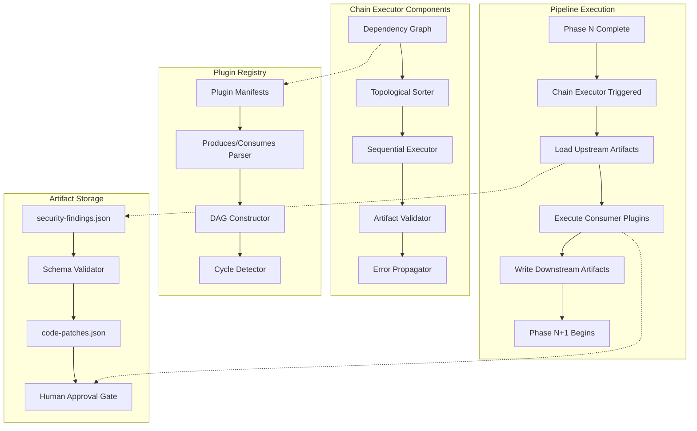
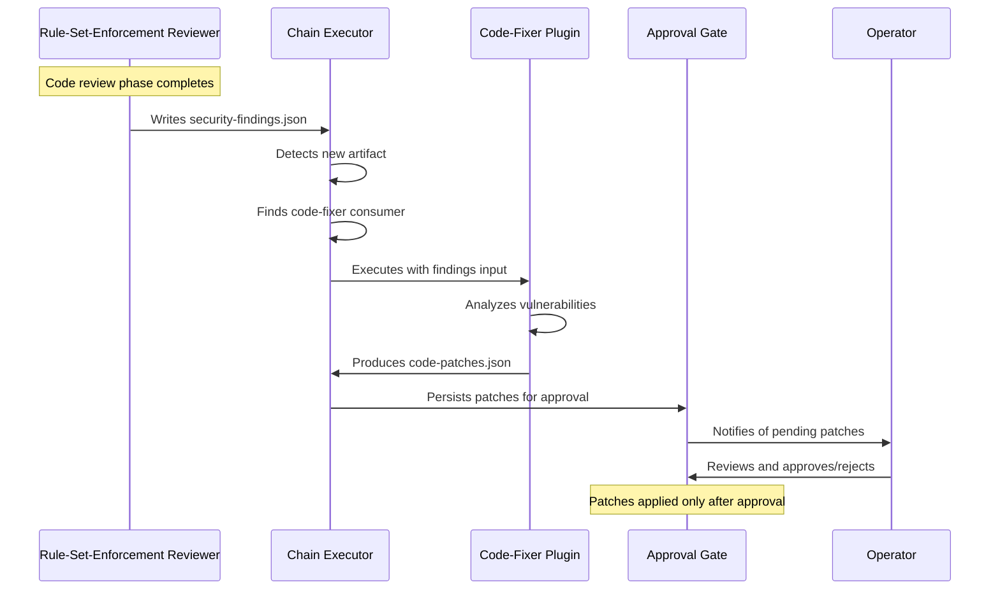
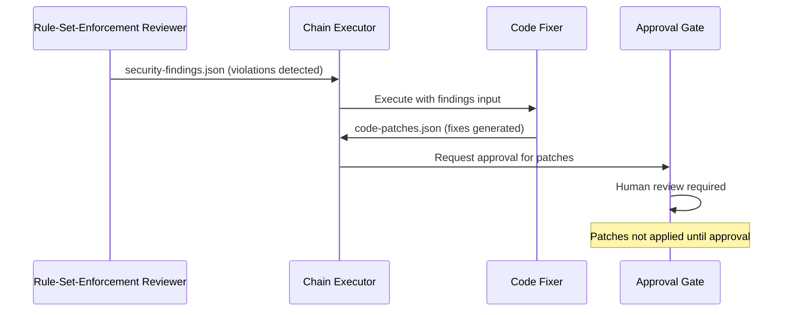

# TDD-022: Plugin Chaining Engine

| Field        | Value                                              |
|--------------|----------------------------------------------------|
| **Title**    | Plugin Chaining Engine                              |
| **TDD ID**   | TDD-022                                            |
| **Version**  | 1.0                                                |
| **Date**     | 2026-04-28                                         |
| **Status**   | Draft                                              |
| **Author**   | Patrick Watson                                     |
| **Parent PRD** | PRD-013: Engineering Standards & Plugin Chaining |
| **Plugin**   | autonomous-dev                                     |

## 1. Summary

The Plugin Chaining Engine enables autonomous workflows where plugins consume artifacts produced by other plugins, creating ordered execution chains for complex automation scenarios. The engine operates as a separate component that runs between pipeline phases, not within them, consuming file-based artifacts and orchestrating plugin execution in topological order.

The canonical use case demonstrates security-finding remediation: a `rule-set-enforcement-reviewer` (from TDD-020) detects security violations and produces structured `security-findings` artifacts, which trigger a `code-fixer` plugin to generate `code-patches` for human approval. This eliminates manual coordination while maintaining human control over code changes per PRD-013 FR-1335.

Key capabilities include:
- **Plugin manifest extensions** with `produces`/`consumes` declarations
- **Dependency graph construction** with cycle detection and topological sorting
- **Artifact persistence** via file-based storage with schema validation
- **Sequential execution** with error propagation and timeout enforcement
- **Standards integration** enabling automated fix workflows for rule violations
- **Resource limits** preventing chain abuse with configurable timeouts and size caps

The engine integrates with existing autonomous-dev infrastructure through the plugin manifest system and audit logging, while maintaining strict boundaries with TDD-019 extension hooks, which serve different use cases.

## 2. Goals & Non-Goals

| ID     | Goal                                                                                     | Priority |
|--------|------------------------------------------------------------------------------------------|----------|
| G-2201 | Enable declarative plugin chaining through `produces`/`consumes` manifest declarations | Critical |
| G-2202 | Implement file-based artifact persistence at `<request>/.autonomous-dev/artifacts/`     | Critical |
| G-2203 | Build dependency graph construction with cycle detection at daemon startup              | Critical |
| G-2204 | Provide topological execution order ensuring plugins run after dependencies complete    | Critical |
| G-2205 | Implement structured artifact schemas for security findings and code patches            | High     |
| G-2206 | Enable automated security workflow: findings → patches → human approval gate           | High     |
| G-2207 | Integrate with standards system for rule violation remediation workflows               | High     |
| G-2208 | Provide error propagation with upstream failure skipping dependent plugins             | High     |
| G-2209 | Implement resource limits: chain length, timeouts, artifact sizes                     | Medium   |
| G-2210 | Provide audit logging of all chain executions with detailed metrics                   | Medium   |
| G-2211 | Enable CLI commands for chain inspection and debugging                                | Low      |

| ID      | Non-Goal                                                                           | Rationale                     |
|---------|------------------------------------------------------------------------------------|-------------------------------|
| NG-2201 | Real-time plugin communication or streaming between plugins                       | File-based artifacts sufficient |
| NG-2202 | Parallel execution of plugins within the same chain level                        | Sequential execution simpler  |
| NG-2203 | Plugin hot-reloading or dynamic chain reconfiguration                           | Static configuration adequate |
| NG-2204 | Cross-request artifact sharing or persistent plugin state                       | Request isolation required    |
| NG-2205 | Integration with TDD-019 extension hooks within the same execution context      | Different mechanisms by design |
| NG-2206 | Automatic patch application without human approval                               | Security requirement per PRD-013 |
| NG-2207 | Complex branching or conditional execution within chains                         | Linear chains sufficient      |

## 3. Background

### Why Chains Exist Alongside Hooks

The autonomous-dev system requires two distinct extension mechanisms:

**Extension Hooks (TDD-019)**: Synchronous, in-phase extension points where a single plugin modifies the current request's context. Hooks operate within pipeline phases and cannot pass artifacts to other plugins. Examples include input validation, metadata enrichment, and custom scoring during review phases.

**Plugin Chains (this TDD)**: Asynchronous, cross-phase data flow where multiple plugins execute in dependency order, consuming artifacts produced by upstream plugins. Chains run between phases, not within them, enabling complex multi-step workflows that span phase boundaries.

Per PRD-011 §19.5, these mechanisms serve non-overlapping use cases and maintain strict boundaries. Hooks provide immediate pipeline customization; chains enable multi-step automation workflows.

### Canonical Use Case: Security Finding to Code Patch

The primary motivating scenario demonstrates automated security remediation:

1. **Standards Enforcement**: The `rule-set-enforcement-reviewer` (TDD-020) evaluates generated code against security standards
2. **Finding Generation**: Security violations produce structured `security-findings` artifacts with detailed vulnerability information
3. **Chain Execution**: The chain executor detects the `security-findings` artifact and triggers the `code-fixer` plugin
4. **Patch Generation**: The `code-fixer` plugin consumes findings and produces `code-patches` artifacts with fix recommendations
5. **Human Approval**: Code patches require explicit operator approval before application per PRD-013 FR-1335

This workflow eliminates manual coordination between security scanning and fix generation while maintaining human control over code changes. The chain executor orchestrates the workflow automatically but never applies patches without explicit approval.

Additional workflows include architecture analysis → cost estimation, documentation scanning → test generation, and performance analysis → optimization recommendations.

## 4. Architecture

The Plugin Chaining Engine operates as a standalone component that bridges pipeline phases through structured artifact handoffs:



**Execution Flow**:

1. **Daemon Startup**: Plugin manifests are scanned for `produces`/`consumes` declarations; dependency graph constructed with cycle detection
2. **Phase Completion**: When a pipeline phase completes, chain executor checks for new artifacts in `<request>/.autonomous-dev/artifacts/`
3. **Chain Discovery**: Available artifacts are matched against registered consumers; executable chains identified
4. **Topological Execution**: Consumer plugins execute in dependency order, each receiving upstream artifacts as initial context
5. **Artifact Handoff**: Each plugin's outputs are persisted to disk and validated against schemas before downstream consumption
6. **Error Handling**: Plugin failures propagate through the chain, skipping dependent plugins with detailed error context

**Component Locations**:
- Chain Executor: `/Users/pwatson/codebase/autonomous-dev/plugins/autonomous-dev/intake/core/chain_executor.ts`
- Plugin Registry Integration: Extends existing plugin manifest system
- Artifact Storage: Per-request directory at `<request>/.autonomous-dev/artifacts/`

## 5. Plugin Manifest Extensions

Plugin manifests are extended with `produces` and `consumes` declarations that define artifact flow contracts:

### Schema Extensions

```yaml
# plugin-manifest.yaml
name: "security-reviewer"
version: "1.2.0"
description: "Standards-aware security analyzer"

# New chaining declarations
produces:
  - artifact_type: "security-findings"
    schema_version: "1.0"
    description: "Structured security vulnerability reports"
    format: "json"
    max_size_mb: 5
    
consumes: []  # This plugin doesn't consume artifacts

# Existing manifest fields remain unchanged
commands: [...]
hooks: [...]
---

name: "code-fixer"
version: "1.0.0"
description: "Automated code fix generator"

consumes:
  - artifact_type: "security-findings"
    schema_version: "1.0"
    required: true
    min_confidence: 0.7
    
produces:
  - artifact_type: "code-patches"
    schema_version: "1.0"
    description: "Automated code fix recommendations"
    format: "json"
    requires_approval: true

commands: [...]
```

### Manifest Validation Rules

**Produces Declaration**:
```typescript
interface ProducesDeclaration {
  artifact_type: string;           // Must match registered schema
  schema_version: string;          // Semantic version string
  description: string;             // Human-readable purpose
  format: 'json' | 'yaml' | 'text'; // Artifact serialization format
  max_size_mb?: number;           // Optional size limit (default: 10MB)
  conditional?: boolean;           // Whether artifact production is conditional
}
```

**Consumes Declaration**:
```typescript
interface ConsumesDeclaration {
  artifact_type: string;           // Must match available producers
  schema_version: string;          // Compatible version range
  required: boolean;               // Whether artifact must be present
  min_confidence?: number;         // Minimum confidence threshold
  max_age_minutes?: number;       // Artifact freshness requirement
}
```

### Example: Standards Integration Manifest

```yaml
name: "rule-set-enforcement-reviewer"
version: "2.1.0"
description: "Standards-aware code review agent"

produces:
  - artifact_type: "security-findings"
    schema_version: "1.0"
    description: "Security violations detected during standards enforcement"
    format: "json"
    conditional: true  # Only produced if violations found
    
  - artifact_type: "architecture-findings"
    schema_version: "1.0"
    description: "Architecture pattern violations"
    format: "json"
    conditional: true

consumes: []

hooks:
  - hook_point: "code-review"
    handler: "standards_enforcer"
    blocking: true
```

This manifest declares that the standards reviewer can produce security findings when violations are detected, enabling downstream fix generation through plugin chains.

## 6. Artifact Schemas

### Security Findings Schema

Complete JSON Schema for security vulnerability reports:

```json
{
  "$schema": "https://json-schema.org/draft/2020-12/schema",
  "$id": "https://autonomous-dev.com/schemas/security-findings/1.0",
  "title": "Security Findings Artifact",
  "description": "Structured security vulnerability reports from automated scanning",
  "type": "object",
  "required": ["scan_id", "timestamp", "repository", "findings", "summary"],
  "additionalProperties": false,
  "properties": {
    "scan_id": {
      "type": "string",
      "pattern": "^scan-[0-9]{8}-[0-9]{3}$",
      "description": "Unique scan identifier: scan-YYYYMMDD-NNN"
    },
    "timestamp": {
      "type": "string",
      "format": "date-time",
      "description": "ISO 8601 timestamp of scan completion"
    },
    "repository": {
      "type": "string",
      "description": "Repository identifier (org/repo or absolute path)"
    },
    "scanner_version": {
      "type": "string",
      "description": "Version of security scanner that produced findings"
    },
    "standards_ruleset": {
      "type": "string",
      "description": "Standards ruleset identifier used for scanning"
    },
    "findings": {
      "type": "array",
      "description": "Array of security vulnerabilities found",
      "items": {
        "$ref": "#/$defs/SecurityFinding"
      }
    },
    "summary": {
      "$ref": "#/$defs/FindingsSummary"
    }
  },
  "$defs": {
    "SecurityFinding": {
      "type": "object",
      "required": ["id", "severity", "category", "title", "location", "confidence"],
      "properties": {
        "id": {
          "type": "string",
          "pattern": "^[a-z-]+-[0-9]{3}$",
          "description": "Finding identifier: category-NNN"
        },
        "severity": {
          "type": "string",
          "enum": ["critical", "high", "medium", "low", "info"],
          "description": "Vulnerability severity level"
        },
        "category": {
          "type": "string",
          "enum": [
            "injection",
            "broken-authentication", 
            "sensitive-data-exposure",
            "xml-external-entities",
            "broken-access-control",
            "security-misconfiguration",
            "cross-site-scripting",
            "insecure-deserialization",
            "known-vulnerabilities",
            "insufficient-logging"
          ],
          "description": "OWASP Top 10 vulnerability category"
        },
        "cwe_id": {
          "type": "string",
          "pattern": "^CWE-[0-9]+$",
          "description": "Common Weakness Enumeration identifier"
        },
        "title": {
          "type": "string",
          "maxLength": 100,
          "description": "Brief vulnerability title"
        },
        "description": {
          "type": "string",
          "maxLength": 1000,
          "description": "Detailed vulnerability explanation"
        },
        "location": {
          "$ref": "#/$defs/CodeLocation"
        },
        "evidence": {
          "$ref": "#/$defs/VulnerabilityEvidence"
        },
        "confidence": {
          "type": "number",
          "minimum": 0.0,
          "maximum": 1.0,
          "description": "Scanner confidence in finding accuracy"
        },
        "fix_available": {
          "type": "boolean",
          "description": "Whether automated fix generation is possible"
        },
        "standards_rule": {
          "type": "string",
          "description": "Standards rule that detected this violation"
        }
      }
    },
    "CodeLocation": {
      "type": "object",
      "required": ["file", "line"],
      "properties": {
        "file": {
          "type": "string",
          "description": "Relative path to file containing vulnerability"
        },
        "line": {
          "type": "integer",
          "minimum": 1,
          "description": "Line number of vulnerability"
        },
        "column": {
          "type": "integer",
          "minimum": 1,
          "description": "Column number of vulnerability (optional)"
        },
        "function": {
          "type": "string",
          "description": "Function or method name containing vulnerability"
        },
        "class": {
          "type": "string", 
          "description": "Class name containing vulnerability (if applicable)"
        }
      }
    },
    "VulnerabilityEvidence": {
      "type": "object",
      "properties": {
        "vulnerable_code": {
          "type": "string",
          "maxLength": 500,
          "description": "Snippet of vulnerable code"
        },
        "attack_vector": {
          "type": "string",
          "description": "How the vulnerability can be exploited"
        },
        "poc": {
          "type": "string",
          "description": "Proof-of-concept exploit (sanitized)"
        },
        "references": {
          "type": "array",
          "items": {"type": "string", "format": "uri"},
          "description": "External references (CVE, security advisories)"
        }
      }
    },
    "FindingsSummary": {
      "type": "object",
      "required": ["total_findings", "by_severity"],
      "properties": {
        "total_findings": {
          "type": "integer",
          "minimum": 0,
          "description": "Total number of findings"
        },
        "by_severity": {
          "type": "object",
          "properties": {
            "critical": {"type": "integer", "minimum": 0},
            "high": {"type": "integer", "minimum": 0},
            "medium": {"type": "integer", "minimum": 0},
            "low": {"type": "integer", "minimum": 0},
            "info": {"type": "integer", "minimum": 0}
          },
          "additionalProperties": false
        },
        "fixable_count": {
          "type": "integer",
          "minimum": 0,
          "description": "Number of findings with automated fixes available"
        }
      }
    }
  }
}
```

**Example Security Findings Artifact**:

```json
{
  "scan_id": "scan-20260428-001",
  "timestamp": "2026-04-28T10:30:00Z",
  "repository": "acme-corp/user-service",
  "scanner_version": "rule-set-enforcement-reviewer-2.1.0",
  "standards_ruleset": "org-security-v1.2",
  "findings": [
    {
      "id": "injection-001",
      "severity": "high",
      "category": "injection",
      "cwe_id": "CWE-89",
      "title": "SQL Injection in user lookup",
      "description": "User input concatenated directly into SQL query without parameterization",
      "location": {
        "file": "src/users/service.py",
        "line": 45,
        "column": 15,
        "function": "get_user_by_id",
        "class": "UserService"
      },
      "evidence": {
        "vulnerable_code": "query = \"SELECT * FROM users WHERE id = \" + user_id",
        "attack_vector": "user_id parameter allows SQL injection",
        "poc": "'; DROP TABLE users; --",
        "references": [
          "https://owasp.org/www-community/attacks/SQL_Injection"
        ]
      },
      "confidence": 0.9,
      "fix_available": true,
      "standards_rule": "sql-parameterized-queries"
    }
  ],
  "summary": {
    "total_findings": 1,
    "by_severity": {
      "critical": 0,
      "high": 1,
      "medium": 0,
      "low": 0,
      "info": 0
    },
    "fixable_count": 1
  }
}
```

### Code Patches Schema

Complete JSON Schema for code modification recommendations:

```json
{
  "$schema": "https://json-schema.org/draft/2020-12/schema",
  "$id": "https://autonomous-dev.com/schemas/code-patches/1.0",
  "title": "Code Patches Artifact",
  "description": "Automated code fix recommendations with approval workflow",
  "type": "object",
  "required": ["patch_id", "timestamp", "source_artifact_id", "repository", "patches", "summary"],
  "additionalProperties": false,
  "properties": {
    "patch_id": {
      "type": "string",
      "pattern": "^patch-[0-9]{8}-[0-9]{3}$",
      "description": "Unique patch set identifier: patch-YYYYMMDD-NNN"
    },
    "timestamp": {
      "type": "string",
      "format": "date-time",
      "description": "ISO 8601 timestamp of patch generation"
    },
    "source_artifact_id": {
      "type": "string",
      "description": "ID of upstream artifact that triggered patch generation"
    },
    "repository": {
      "type": "string",
      "description": "Repository identifier (org/repo or absolute path)"
    },
    "generator_version": {
      "type": "string",
      "description": "Version of code-fixer that generated patches"
    },
    "patches": {
      "type": "array",
      "description": "Array of individual code patches",
      "items": {
        "$ref": "#/$defs/CodePatch"
      }
    },
    "summary": {
      "$ref": "#/$defs/PatchSummary"
    }
  },
  "$defs": {
    "CodePatch": {
      "type": "object",
      "required": ["id", "description", "file", "changes", "confidence"],
      "properties": {
        "id": {
          "type": "string",
          "pattern": "^fix-[a-z-]+-[0-9]{3}$",
          "description": "Patch identifier: fix-category-NNN"
        },
        "finding_id": {
          "type": "string",
          "description": "ID of security finding this patch addresses"
        },
        "description": {
          "type": "string",
          "maxLength": 200,
          "description": "Brief description of the fix"
        },
        "file": {
          "type": "string",
          "description": "Relative path to file being modified"
        },
        "changes": {
          "type": "array",
          "description": "List of code changes to apply",
          "items": {
            "$ref": "#/$defs/CodeChange"
          }
        },
        "test_required": {
          "type": "boolean",
          "description": "Whether additional testing is recommended"
        },
        "dependencies": {
          "type": "array",
          "items": {"type": "string"},
          "description": "List of patch IDs that must be applied first"
        },
        "confidence": {
          "type": "number",
          "minimum": 0.0,
          "maximum": 1.0,
          "description": "Confidence in patch correctness"
        },
        "risk_level": {
          "type": "string",
          "enum": ["low", "medium", "high"],
          "description": "Estimated risk of applying this patch"
        }
      }
    },
    "CodeChange": {
      "type": "object",
      "required": ["type"],
      "properties": {
        "type": {
          "type": "string",
          "enum": ["replace", "insert", "delete", "modify_call", "add_import"],
          "description": "Type of code modification"
        },
        "line_start": {
          "type": "integer",
          "minimum": 1,
          "description": "Starting line number for change"
        },
        "line_end": {
          "type": "integer", 
          "minimum": 1,
          "description": "Ending line number for change (for multi-line)"
        },
        "original": {
          "type": "string",
          "description": "Original code being replaced"
        },
        "replacement": {
          "type": "string",
          "description": "New code to insert"
        },
        "import_statement": {
          "type": "string",
          "description": "Import to add (for add_import type)"
        },
        "justification": {
          "type": "string",
          "maxLength": 300,
          "description": "Explanation of why this change is needed"
        }
      }
    },
    "PatchSummary": {
      "type": "object",
      "required": ["total_patches"],
      "properties": {
        "total_patches": {
          "type": "integer",
          "minimum": 0,
          "description": "Total number of patches in this set"
        },
        "auto_applicable": {
          "type": "integer",
          "minimum": 0,
          "description": "Number of patches safe for automatic application"
        },
        "requires_review": {
          "type": "integer", 
          "minimum": 0,
          "description": "Number of patches requiring human review"
        },
        "files_modified": {
          "type": "array",
          "items": {"type": "string"},
          "description": "List of files that will be modified"
        },
        "estimated_effort": {
          "type": "string",
          "enum": ["minutes", "hours", "days"],
          "description": "Estimated effort to review and apply patches"
        }
      }
    }
  }
}
```

**Example Code Patches Artifact**:

```json
{
  "patch_id": "patch-20260428-001", 
  "timestamp": "2026-04-28T10:35:00Z",
  "source_artifact_id": "scan-20260428-001",
  "repository": "acme-corp/user-service",
  "generator_version": "code-fixer-1.0.0",
  "patches": [
    {
      "id": "fix-injection-001",
      "finding_id": "injection-001",
      "description": "Replace string concatenation with parameterized query",
      "file": "src/users/service.py",
      "changes": [
        {
          "type": "replace",
          "line_start": 45,
          "line_end": 45,
          "original": "query = \"SELECT * FROM users WHERE id = \" + user_id",
          "replacement": "query = \"SELECT * FROM users WHERE id = %s\"",
          "justification": "Use parameterized query to prevent SQL injection"
        },
        {
          "type": "modify_call",
          "line_start": 46,
          "line_end": 46,
          "original": "cursor.execute(query)",
          "replacement": "cursor.execute(query, (user_id,))",
          "justification": "Pass user_id as parameter instead of string concatenation"
        }
      ],
      "test_required": true,
      "dependencies": [],
      "confidence": 0.85,
      "risk_level": "low"
    }
  ],
  "summary": {
    "total_patches": 1,
    "auto_applicable": 0,
    "requires_review": 1,
    "files_modified": ["src/users/service.py"],
    "estimated_effort": "minutes"
  }
}
```

### Architecture Finding Schema

```json
{
  "$schema": "https://json-schema.org/draft/2020-12/schema",
  "$id": "https://autonomous-dev.com/schemas/architecture-findings/1.0",
  "title": "Architecture Findings Artifact",
  "type": "object",
  "required": ["analysis_id", "timestamp", "repository", "findings"],
  "properties": {
    "analysis_id": {"type": "string"},
    "timestamp": {"type": "string", "format": "date-time"},
    "repository": {"type": "string"},
    "findings": {
      "type": "array",
      "items": {
        "type": "object",
        "properties": {
          "pattern_violation": {"type": "string"},
          "recommendation": {"type": "string"},
          "impact": {"type": "string", "enum": ["low", "medium", "high"]},
          "effort": {"type": "string", "enum": ["small", "medium", "large"]}
        }
      }
    }
  }
}
```

### Cost Estimate Schema  

```json
{
  "$schema": "https://json-schema.org/draft/2020-12/schema",
  "$id": "https://autonomous-dev.com/schemas/cost-estimate/1.0", 
  "title": "Cost Estimate Artifact",
  "type": "object",
  "required": ["estimate_id", "timestamp", "repository", "estimates"],
  "properties": {
    "estimate_id": {"type": "string"},
    "timestamp": {"type": "string", "format": "date-time"},
    "repository": {"type": "string"},
    "estimates": {
      "type": "object",
      "properties": {
        "development_hours": {"type": "number"},
        "infrastructure_monthly_usd": {"type": "number"},
        "maintenance_annual_hours": {"type": "number"}
      }
    }
  }
}
```

## 7. Chain Executor Design

The chain executor orchestrates plugin execution through dependency graph analysis and sequential artifact handoff:

### Core Algorithm Pseudocode

```typescript
class ChainExecutor {
  private dependencyGraph: Map<string, PluginNode>;
  private artifactSchemas: Map<string, JSONSchema>;
  private executionLimits: ChainLimits;
  
  async initializeFromManifests(manifests: PluginManifest[]): Promise<void> {
    // Build dependency graph from plugin manifests
    this.dependencyGraph = this.constructDependencyGraph(manifests);
    
    // Detect and reject cycles
    const cycles = this.detectCycles(this.dependencyGraph);
    if (cycles.length > 0) {
      throw new ChainConfigurationError(`Cycles detected: ${cycles.join(', ')}`);
    }
    
    // Load and validate artifact schemas  
    this.artifactSchemas = await this.loadArtifactSchemas();
    
    // Set execution limits
    this.executionLimits = {
      maxChainLength: 5,
      maxChainTimeoutMinutes: 30,
      maxPluginTimeoutMinutes: 10,
      maxArtifactSizeMB: 10
    };
  }
  
  async executeChains(requestId: string, artifactPath: string): Promise<ChainResult[]> {
    const results: ChainResult[] = [];
    
    // Discover available artifacts in request directory
    const artifacts = await this.discoverArtifacts(artifactPath);
    
    // For each artifact, find consumer plugins
    for (const artifact of artifacts) {
      const consumers = this.findConsumers(artifact.type, artifact.schemaVersion);
      
      if (consumers.length === 0) continue;
      
      // Execute chain for this artifact
      const chainResult = await this.executeChain(requestId, artifact, consumers);
      results.push(chainResult);
    }
    
    return results;
  }
  
  private async executeChain(
    requestId: string, 
    sourceArtifact: Artifact,
    consumers: PluginNode[]
  ): Promise<ChainResult> {
    
    const chainId = `chain-${requestId}-${Date.now()}`;
    const executionOrder = this.topologicalSort(consumers);
    const chainStartTime = Date.now();
    
    // Validate chain length limit
    if (executionOrder.length > this.executionLimits.maxChainLength) {
      throw new ChainExecutionError(
        `Chain length ${executionOrder.length} exceeds limit ${this.executionLimits.maxChainLength}`
      );
    }
    
    const executionLog: PluginExecution[] = [];
    let currentArtifacts = [sourceArtifact];
    
    try {
      for (const plugin of executionOrder) {
        const pluginStartTime = Date.now();
        
        // Check chain timeout
        if (Date.now() - chainStartTime > this.executionLimits.maxChainTimeoutMinutes * 60000) {
          throw new ChainTimeoutError(`Chain execution exceeded ${this.executionLimits.maxChainTimeoutMinutes}m`);
        }
        
        // Load artifacts for this plugin
        const inputArtifacts = currentArtifacts.filter(artifact => 
          plugin.consumes.some(c => c.artifactType === artifact.type)
        );
        
        // Validate input artifacts against schema
        for (const artifact of inputArtifacts) {
          await this.validateArtifact(artifact);
        }
        
        // Execute plugin with timeout
        const pluginResult = await this.executePluginWithTimeout(
          plugin, 
          inputArtifacts,
          this.executionLimits.maxPluginTimeoutMinutes * 60000
        );
        
        // Validate and persist output artifacts
        const outputArtifacts: Artifact[] = [];
        for (const output of pluginResult.outputs) {
          await this.validateArtifact(output);
          await this.persistArtifact(output, requestId);
          outputArtifacts.push(output);
        }
        
        // Update current artifacts for next plugin
        currentArtifacts = outputArtifacts;
        
        // Log plugin execution
        executionLog.push({
          pluginName: plugin.name,
          startTime: pluginStartTime,
          duration: Date.now() - pluginStartTime,
          inputArtifacts: inputArtifacts.map(a => a.id),
          outputArtifacts: outputArtifacts.map(a => a.id),
          status: 'success'
        });
      }
      
      return {
        chainId,
        requestId,
        status: 'success',
        duration: Date.now() - chainStartTime,
        pluginExecutions: executionLog,
        finalArtifacts: currentArtifacts.map(a => a.id)
      };
      
    } catch (error) {
      // Error propagation: log failure and skip dependent plugins
      const failedPlugin = executionOrder[executionLog.length];
      
      executionLog.push({
        pluginName: failedPlugin?.name || 'unknown',
        startTime: Date.now(),
        duration: 0,
        inputArtifacts: [],
        outputArtifacts: [],
        status: 'failed',
        error: error.message
      });
      
      return {
        chainId,
        requestId,
        status: 'failed',
        duration: Date.now() - chainStartTime,
        pluginExecutions: executionLog,
        error: `Chain failed at plugin ${failedPlugin?.name}: ${error.message}`,
        finalArtifacts: []
      };
    }
  }
  
  private constructDependencyGraph(manifests: PluginManifest[]): Map<string, PluginNode> {
    const graph = new Map<string, PluginNode>();
    
    // First pass: create nodes for all plugins
    for (const manifest of manifests) {
      if (manifest.produces?.length > 0 || manifest.consumes?.length > 0) {
        graph.set(manifest.name, {
          name: manifest.name,
          version: manifest.version,
          produces: manifest.produces || [],
          consumes: manifest.consumes || [],
          dependencies: new Set<string>(),
          dependents: new Set<string>()
        });
      }
    }
    
    // Second pass: establish dependencies
    for (const [pluginName, node] of graph.entries()) {
      for (const consumes of node.consumes) {
        // Find plugins that produce this artifact type
        for (const [producerName, producerNode] of graph.entries()) {
          if (producerName === pluginName) continue;
          
          for (const produces of producerNode.produces) {
            if (produces.artifactType === consumes.artifactType && 
                this.isVersionCompatible(produces.schemaVersion, consumes.schemaVersion)) {
              
              node.dependencies.add(producerName);
              producerNode.dependents.add(pluginName);
            }
          }
        }
      }
    }
    
    return graph;
  }
}
```

### Dependency Resolution

```typescript
interface PluginNode {
  name: string;
  version: string;
  produces: ProducesDeclaration[];
  consumes: ConsumesDeclaration[];
  dependencies: Set<string>;    // Plugins this depends on
  dependents: Set<string>;      // Plugins that depend on this
}

interface ChainResult {
  chainId: string;
  requestId: string;
  status: 'success' | 'failed' | 'timeout';
  duration: number;
  pluginExecutions: PluginExecution[];
  finalArtifacts: string[];
  error?: string;
}

interface PluginExecution {
  pluginName: string;
  startTime: number;
  duration: number;
  inputArtifacts: string[];
  outputArtifacts: string[];
  status: 'success' | 'failed' | 'timeout';
  error?: string;
}
```

## 8. Cycle Detection Algorithm

Cycle detection ensures chain configurations are valid before execution:

### DFS-Based Cycle Detection

```typescript
class CycleDetector {
  detectCycles(graph: Map<string, PluginNode>): string[][] {
    const visited = new Set<string>();
    const recursionStack = new Set<string>();
    const cycles: string[][] = [];
    
    for (const [nodeName] of graph.entries()) {
      if (!visited.has(nodeName)) {
        const cycle = this.dfsDetectCycle(graph, nodeName, visited, recursionStack, []);
        if (cycle.length > 0) {
          cycles.push(cycle);
        }
      }
    }
    
    return cycles;
  }
  
  private dfsDetectCycle(
    graph: Map<string, PluginNode>,
    node: string,
    visited: Set<string>,
    recursionStack: Set<string>, 
    path: string[]
  ): string[] {
    
    visited.add(node);
    recursionStack.add(node);
    path.push(node);
    
    const nodeData = graph.get(node);
    if (!nodeData) return [];
    
    // Check all dependencies (outgoing edges)
    for (const dependency of nodeData.dependencies) {
      if (!visited.has(dependency)) {
        const cycle = this.dfsDetectCycle(graph, dependency, visited, recursionStack, [...path]);
        if (cycle.length > 0) return cycle;
        
      } else if (recursionStack.has(dependency)) {
        // Found a cycle - construct cycle path
        const cycleStart = path.indexOf(dependency);
        return path.slice(cycleStart).concat([dependency]);
      }
    }
    
    recursionStack.delete(node);
    return [];
  }
  
  formatCycleReport(cycles: string[][]): string {
    if (cycles.length === 0) {
      return "No cycles detected in plugin dependency graph.";
    }
    
    const report = ["Plugin dependency cycles detected:"];
    
    for (let i = 0; i < cycles.length; i++) {
      const cycle = cycles[i];
      report.push(`  Cycle ${i + 1}: ${cycle.join(' → ')}`);
      report.push(`    Plugins involved: ${new Set(cycle).size}`);
      report.push(`    Fix: Remove dependency from ${cycle[cycle.length - 2]} to ${cycle[cycle.length - 1]}`);
      report.push('');
    }
    
    report.push('Chain execution cannot proceed until cycles are resolved.');
    return report.join('\n');
  }
}
```

### Cycle Reporting Example

```
Plugin dependency cycles detected:

  Cycle 1: security-reviewer → code-fixer → test-generator → security-reviewer
    Plugins involved: 3
    Fix: Remove dependency from test-generator to security-reviewer

  Cycle 2: cost-estimator → performance-analyzer → cost-estimator  
    Plugins involved: 2
    Fix: Remove dependency from performance-analyzer to cost-estimator

Chain execution cannot proceed until cycles are resolved.
```

When cycles are detected, the chain executor refuses to start and provides clear guidance on which dependencies to remove to break the cycles.

## 9. Resource Limits

Resource limits prevent chain abuse and ensure system stability:

### Limit Configuration

```typescript
interface ChainLimits {
  maxChainLength: number;           // Maximum plugins per chain (default: 5)
  maxChainTimeoutMinutes: number;   // Maximum total chain execution time (default: 30)
  maxPluginTimeoutMinutes: number;  // Maximum per-plugin execution time (default: 10)
  maxArtifactSizeMB: number;       // Maximum artifact file size (default: 10MB)
  maxConcurrentChains: number;      // Maximum chains executing simultaneously (default: 3)
  maxArtifactsPerPlugin: number;   // Maximum artifacts one plugin can produce (default: 5)
}

const DEFAULT_LIMITS: ChainLimits = {
  maxChainLength: 5,
  maxChainTimeoutMinutes: 30,
  maxPluginTimeoutMinutes: 10,
  maxArtifactSizeMB: 10,
  maxConcurrentChains: 3,
  maxArtifactsPerPlugin: 5
};
```

### Limit Enforcement

**Chain Length Limits**:
```typescript
private validateChainLength(chain: PluginNode[]): void {
  if (chain.length > this.limits.maxChainLength) {
    throw new ChainConfigurationError(
      `Chain length ${chain.length} exceeds maximum ${this.limits.maxChainLength}. ` +
      `Consider splitting into multiple chains or removing intermediate plugins.`
    );
  }
}
```

**Timeout Enforcement**:
```typescript
private async executePluginWithTimeout(
  plugin: PluginNode, 
  artifacts: Artifact[], 
  timeoutMs: number
): Promise<PluginResult> {
  
  const timeoutPromise = new Promise<never>((_, reject) => {
    setTimeout(() => reject(new PluginTimeoutError(
      `Plugin ${plugin.name} exceeded ${timeoutMs}ms timeout`
    )), timeoutMs);
  });
  
  const executionPromise = this.executePlugin(plugin, artifacts);
  
  try {
    return await Promise.race([executionPromise, timeoutPromise]);
  } catch (error) {
    // Cleanup any partial execution state
    await this.cleanupPluginExecution(plugin);
    throw error;
  }
}
```

**Artifact Size Limits**:
```typescript
private async validateArtifactSize(artifact: Artifact): Promise<void> {
  const stats = await fs.stat(artifact.path);
  const sizeMB = stats.size / (1024 * 1024);
  
  if (sizeMB > this.limits.maxArtifactSizeMB) {
    throw new ArtifactValidationError(
      `Artifact ${artifact.id} size ${sizeMB.toFixed(1)}MB exceeds limit ${this.limits.maxArtifactSizeMB}MB`
    );
  }
}
```

### Limit Composition

When multiple limits apply simultaneously:

1. **Chain timeout** takes precedence over plugin timeout
2. **Plugin timeout** is the minimum of global limit and plugin-declared timeout
3. **Artifact size** is checked both at production and consumption
4. **Chain length** includes all plugins in the dependency path, not just direct sequence

```typescript
private calculateEffectiveTimeout(plugin: PluginNode, chainStartTime: number): number {
  const chainElapsed = Date.now() - chainStartTime;
  const chainRemaining = (this.limits.maxChainTimeoutMinutes * 60000) - chainElapsed;
  const pluginLimit = this.limits.maxPluginTimeoutMinutes * 60000;
  const pluginDeclared = (plugin.timeout || 600) * 1000; // Plugin declares timeout in seconds
  
  return Math.min(chainRemaining, pluginLimit, pluginDeclared);
}
```

## 10. Standards-to-Fix Flow

The complete sequence demonstrating automated security remediation workflow:

### Flow Overview



### Detailed Execution Steps

**Step 1: Standards Violation Detection**

The `rule-set-enforcement-reviewer` (TDD-020) evaluates generated code against security standards:

```typescript
// rule-set-enforcement-reviewer plugin execution
const violations = await evaluateSecurityStandards(generatedCode, securityRuleset);

if (violations.length > 0) {
  const securityFindings: SecurityFindings = {
    scan_id: `scan-${formatDate(new Date())}-${getSequence()}`,
    timestamp: new Date().toISOString(),
    repository: requestContext.repository,
    scanner_version: "rule-set-enforcement-reviewer-2.1.0",
    standards_ruleset: "org-security-v1.2",
    findings: violations.map(v => ({
      id: `${v.category}-${v.sequence}`,
      severity: v.severity,
      category: v.category,
      cwe_id: v.cweId,
      title: v.title,
      description: v.description,
      location: v.location,
      evidence: v.evidence,
      confidence: v.confidence,
      fix_available: v.autoFixable,
      standards_rule: v.ruleId
    })),
    summary: calculateSummary(violations)
  };
  
  await persistArtifact(securityFindings, 'security-findings');
}
```

**Step 2: Chain Execution Triggered**

The chain executor detects the new `security-findings.json` artifact:

```typescript
// Chain executor monitoring
const artifactWatcher = new ArtifactWatcher(`${requestDir}/.autonomous-dev/artifacts`);

artifactWatcher.on('new-artifact', async (artifact) => {
  const consumers = this.findConsumers(artifact.type, artifact.schemaVersion);
  
  if (consumers.length > 0) {
    logger.info(`Chain execution triggered by ${artifact.type} artifact`);
    await this.executeChains(artifact.requestId, artifact.path);
  }
});
```

**Step 3: Code-Fixer Plugin Execution**

The code-fixer plugin receives security findings and generates patches:

```typescript
// code-fixer plugin implementation
interface CodeFixerPlugin {
  async execute(context: PluginContext): Promise<PluginResult> {
    const securityFindings = await loadArtifact<SecurityFindings>(
      context.inputArtifacts.find(a => a.type === 'security-findings')
    );
    
    const patches: CodePatch[] = [];
    
    for (const finding of securityFindings.findings) {
      if (finding.fix_available && finding.confidence >= 0.7) {
        const patch = await this.generatePatch(finding);
        if (patch) patches.push(patch);
      }
    }
    
    const codePatches: CodePatches = {
      patch_id: `patch-${formatDate(new Date())}-${getSequence()}`,
      timestamp: new Date().toISOString(),
      source_artifact_id: securityFindings.scan_id,
      repository: securityFindings.repository,
      generator_version: "code-fixer-1.0.0",
      patches: patches,
      summary: {
        total_patches: patches.length,
        auto_applicable: patches.filter(p => p.risk_level === 'low').length,
        requires_review: patches.length,
        files_modified: [...new Set(patches.map(p => p.file))],
        estimated_effort: this.estimateEffort(patches)
      }
    };
    
    return {
      success: true,
      outputs: [{ type: 'code-patches', data: codePatches }],
      metadata: { 
        processing_time: Date.now() - context.startTime,
        findings_processed: securityFindings.findings.length
      }
    };
  }
  
  private async generatePatch(finding: SecurityFinding): Promise<CodePatch | null> {
    switch (finding.category) {
      case 'injection':
        return this.generateSQLInjectionPatch(finding);
      case 'cross-site-scripting':
        return this.generateXSSPatch(finding);
      case 'broken-authentication':
        return this.generateAuthPatch(finding);
      default:
        return null;
    }
  }
  
  private async generateSQLInjectionPatch(finding: SecurityFinding): Promise<CodePatch> {
    const vulnerableCode = finding.evidence.vulnerable_code;
    const location = finding.location;
    
    // Analyze code pattern and generate parameterized query fix
    const changes: CodeChange[] = [
      {
        type: 'replace',
        line_start: location.line,
        line_end: location.line,
        original: vulnerableCode,
        replacement: this.generateParameterizedQuery(vulnerableCode),
        justification: 'Replace string concatenation with parameterized query'
      }
    ];
    
    return {
      id: `fix-${finding.id}`,
      finding_id: finding.id,
      description: 'Replace string concatenation with parameterized query',
      file: location.file,
      changes: changes,
      test_required: true,
      dependencies: [],
      confidence: 0.85,
      risk_level: 'low'
    };
  }
}
```

**Step 4: Human Approval Gate**

Code patches are persisted and require explicit operator approval per PRD-013 FR-1335:

```typescript
// Approval gate implementation
class PatchApprovalGate {
  async processPatchArtifact(codePatches: CodePatches): Promise<void> {
    // Persist patches for human review
    const approvalRequest = {
      id: `approval-${codePatches.patch_id}`,
      timestamp: new Date().toISOString(),
      patches: codePatches,
      status: 'pending_review',
      reviewer: null,
      decision: null,
      decision_timestamp: null
    };
    
    await this.persistApprovalRequest(approvalRequest);
    
    // Notify operator of pending patches
    await this.notifyOperator({
      type: 'code_patches_ready',
      patch_id: codePatches.patch_id,
      summary: codePatches.summary,
      risk_assessment: this.assessRisk(codePatches),
      review_url: this.generateReviewUrl(approvalRequest.id)
    });
    
    // DO NOT auto-apply patches - wait for human approval
    logger.info(`Code patches ${codePatches.patch_id} require approval before application`);
  }
  
  async approvePatch(approvalId: string, reviewer: string): Promise<void> {
    const approval = await this.loadApprovalRequest(approvalId);
    approval.status = 'approved';
    approval.reviewer = reviewer;
    approval.decision = 'approve';
    approval.decision_timestamp = new Date().toISOString();
    
    await this.updateApprovalRequest(approval);
    
    // Now patches can be applied
    await this.applyApprovedPatches(approval.patches);
  }
}
```

**Step 5: Audit Integration**

Every chain execution is recorded for audit purposes:

```typescript
interface ChainAuditEntry {
  chain_id: string;
  request_id: string; 
  timestamp: string;
  trigger_artifact: string;
  plugins_executed: string[];
  total_duration_ms: number;
  status: 'success' | 'failed' | 'timeout';
  artifacts_produced: string[];
  approval_required: boolean;
  approval_status?: 'pending' | 'approved' | 'rejected';
}

await auditLogger.log({
  chain_id: chainResult.chainId,
  request_id: chainResult.requestId,
  timestamp: new Date().toISOString(),
  trigger_artifact: 'security-findings.json',
  plugins_executed: ['code-fixer'],
  total_duration_ms: chainResult.duration,
  status: chainResult.status,
  artifacts_produced: ['code-patches.json'],
  approval_required: true,
  approval_status: 'pending'
});
```

This complete workflow enables automated security remediation while maintaining human oversight and traceability.

## 11. Plugin Trust Integration

The chain executor integrates with the existing plugin trust system from TDD-019, applying the same security controls to chained plugins.

### Trust Model Integration

**Allowlist Enforcement**:
```typescript
class ChainTrustValidator {
  constructor(private trustEngine: TrustEngine) {}
  
  async validateChainPlugins(chain: PluginNode[]): Promise<void> {
    for (const plugin of chain) {
      // Use same allowlist from TDD-019 extension hooks
      const isAllowed = await this.trustEngine.isPluginAllowed(
        plugin.name, 
        plugin.version,
        'chain-execution'
      );
      
      if (!isAllowed) {
        throw new ChainSecurityError(
          `Plugin ${plugin.name}@${plugin.version} not in extensions.allowlist for chain execution`
        );
      }
      
      // Additional validation for code-touching plugins
      if (this.pluginTouchesCode(plugin)) {
        const metaReviewRequired = await this.trustEngine.requiresMetaReview(plugin.name);
        if (metaReviewRequired) {
          await this.scheduleMetaReview(plugin);
        }
      }
    }
  }
  
  private pluginTouchesCode(plugin: PluginNode): boolean {
    // Plugins that produce code-patches or modify files require extra scrutiny
    return plugin.produces.some(p => 
      p.artifactType === 'code-patches' || 
      p.artifactType === 'file-modifications' ||
      p.artifactType === 'code-generation'
    );
  }
}
```

**Trust Configuration**:
```json
{
  "extensions": {
    "allowlist": [
      "rule-set-enforcement-reviewer@2.1.0",
      "code-fixer@1.0.0", 
      "security-scanner@3.2.1",
      "test-generator@2.0.0"
    ],
    "chain_execution": {
      "enabled": true,
      "require_signature": true,
      "meta_review_threshold": "code-touching"
    },
    "meta_review": {
      "code-fixer": true,
      "security-scanner": false,
      "test-generator": true
    }
  }
}
```

**Agent Meta-Review Integration**:

When chain plugins touch code (produce `code-patches` or similar), they're subject to the same meta-review process as other code-modifying extensions:

```typescript
async scheduleMetaReview(plugin: PluginNode): Promise<void> {
  const metaReviewRequest = {
    plugin_name: plugin.name,
    plugin_version: plugin.version,
    review_type: 'chain-plugin-code-modification',
    artifacts_produced: plugin.produces.map(p => p.artifactType),
    security_scope: this.assessSecurityScope(plugin),
    priority: 'high' // Code-touching plugins get high priority review
  };
  
  await this.metaReviewQueue.enqueue(metaReviewRequest);
}

private assessSecurityScope(plugin: PluginNode): string[] {
  const scopes = [];
  
  if (plugin.produces.some(p => p.artifactType === 'code-patches')) {
    scopes.push('code-modification');
  }
  if (plugin.produces.some(p => p.artifactType === 'security-findings')) {
    scopes.push('security-analysis');
  }
  if (plugin.consumes.some(c => c.artifactType.includes('secrets'))) {
    scopes.push('secrets-access');
  }
  
  return scopes;
}
```

### Chain-Specific Security Measures

**Artifact Isolation**:
```typescript
class ArtifactSecurityManager {
  async validateArtifactAccess(
    plugin: PluginNode, 
    artifact: Artifact,
    operation: 'read' | 'write'
  ): Promise<void> {
    
    // Check plugin permissions for artifact type
    const hasPermission = this.checkArtifactPermission(plugin, artifact.type, operation);
    if (!hasPermission) {
      throw new SecurityError(
        `Plugin ${plugin.name} lacks ${operation} permission for ${artifact.type}`
      );
    }
    
    // Validate artifact content doesn't contain sensitive data
    if (operation === 'read') {
      await this.scanArtifactForSensitiveData(artifact);
    }
    
    // Ensure write operations don't overwrite protected artifacts
    if (operation === 'write') {
      await this.validateWriteTarget(artifact);
    }
  }
  
  private async scanArtifactForSensitiveData(artifact: Artifact): Promise<void> {
    const content = await fs.readFile(artifact.path, 'utf8');
    
    // Check for API keys, passwords, tokens
    const sensitivePatterns = [
      /api[_-]?key['"]?\s*[:=]\s*['"][^'"]+['"]/i,
      /password['"]?\s*[:=]\s*['"][^'"]+['"]/i,
      /token['"]?\s*[:=]\s*['"][^'"]+['"]/i,
      /secret['"]?\s*[:=]\s*['"][^'"]+['"]/i
    ];
    
    for (const pattern of sensitivePatterns) {
      if (pattern.test(content)) {
        throw new SecurityError(
          `Artifact ${artifact.id} contains potential sensitive data`
        );
      }
    }
  }
}
```

## 12. Inter-Plugin Data Flow Security

Security measures ensure artifact integrity and prevent malicious data flow between plugins:

### Artifact Schema Validation

**Strict Validation Between Plugins**:
```typescript
class ArtifactValidator {
  private schemas: Map<string, JSONSchema> = new Map();
  
  async validateArtifactHandoff(
    producer: PluginNode,
    consumer: PluginNode, 
    artifact: Artifact
  ): Promise<void> {
    
    // Validate artifact matches producer's declared schema
    const producerSchema = this.getProducerSchema(producer, artifact.type);
    await this.validateAgainstSchema(artifact, producerSchema);
    
    // Validate artifact meets consumer's requirements
    const consumerRequirements = this.getConsumerRequirements(consumer, artifact.type);
    await this.validateConsumerRequirements(artifact, consumerRequirements);
    
    // Check for schema compatibility
    this.validateSchemaCompatibility(
      producerSchema.version,
      consumerRequirements.schemaVersion
    );
    
    // Sanitize content for cross-plugin consumption
    await this.sanitizeArtifactContent(artifact);
  }
  
  private async validateAgainstSchema(
    artifact: Artifact, 
    schema: JSONSchema
  ): Promise<void> {
    
    const content = await fs.readFile(artifact.path, 'utf8');
    let data;
    
    try {
      data = JSON.parse(content);
    } catch (error) {
      throw new ArtifactValidationError(
        `Invalid JSON in artifact ${artifact.id}: ${error.message}`
      );
    }
    
    const validator = new Ajv();
    const validate = validator.compile(schema);
    
    if (!validate(data)) {
      throw new ArtifactValidationError(
        `Artifact ${artifact.id} fails schema validation: ${JSON.stringify(validate.errors)}`
      );
    }
  }
  
  private async sanitizeArtifactContent(artifact: Artifact): Promise<void> {
    const content = await fs.readFile(artifact.path, 'utf8');
    const data = JSON.parse(content);
    
    // Remove potentially dangerous fields
    const sanitized = this.deepSanitize(data, {
      removeFields: ['__proto__', 'constructor', 'eval', 'function'],
      maxStringLength: 10000,
      maxDepth: 10,
      maxArrayLength: 1000
    });
    
    // Validate size after sanitization
    const sanitizedContent = JSON.stringify(sanitized);
    if (sanitizedContent.length > 10 * 1024 * 1024) { // 10MB limit
      throw new ArtifactValidationError(
        `Artifact ${artifact.id} exceeds size limit after sanitization`
      );
    }
    
    // Write sanitized content back
    await fs.writeFile(artifact.path, sanitizedContent, 'utf8');
  }
  
  private deepSanitize(obj: any, options: SanitizeOptions, depth = 0): any {
    if (depth > options.maxDepth) {
      throw new ArtifactValidationError('Artifact nesting exceeds maximum depth');
    }
    
    if (Array.isArray(obj)) {
      if (obj.length > options.maxArrayLength) {
        throw new ArtifactValidationError('Array length exceeds maximum');
      }
      return obj.map(item => this.deepSanitize(item, options, depth + 1));
    }
    
    if (typeof obj === 'object' && obj !== null) {
      const sanitized: any = {};
      
      for (const [key, value] of Object.entries(obj)) {
        // Remove dangerous keys
        if (options.removeFields.includes(key)) {
          continue;
        }
        
        sanitized[key] = this.deepSanitize(value, options, depth + 1);
      }
      
      return sanitized;
    }
    
    if (typeof obj === 'string') {
      if (obj.length > options.maxStringLength) {
        throw new ArtifactValidationError('String length exceeds maximum');
      }
      // Remove potential code injection patterns
      return obj.replace(/<script\b[^<]*(?:(?!<\/script>)<[^<]*)*<\/script>/gi, '');
    }
    
    return obj;
  }
}
```

### Content Security Policy

**Artifact Content Restrictions**:
```typescript
interface ArtifactSecurityPolicy {
  allowedMimeTypes: string[];
  maxFileSizeMB: number;
  forbiddenPatterns: RegExp[];
  requiredFields: string[];
  sanitizationRules: SanitizationRule[];
}

const SECURITY_POLICIES: Map<string, ArtifactSecurityPolicy> = new Map([
  ['security-findings', {
    allowedMimeTypes: ['application/json'],
    maxFileSizeMB: 5,
    forbiddenPatterns: [
      /<script\b/i,                    // Script tags
      /javascript:/i,                  // JavaScript URLs
      /data:text\/html/i,             // HTML data URIs
      /\bon\w+\s*=/i,                 // Event handlers
      /\\u[0-9a-f]{4}/i               // Unicode escapes
    ],
    requiredFields: ['scan_id', 'timestamp', 'findings'],
    sanitizationRules: [
      { field: '**.evidence.vulnerable_code', maxLength: 500 },
      { field: '**.evidence.poc', action: 'sanitize_exploit' },
      { field: '**.location.file', pattern: '^[a-zA-Z0-9/._-]+$' }
    ]
  }],
  
  ['code-patches', {
    allowedMimeTypes: ['application/json'],
    maxFileSizeMB: 10,
    forbiddenPatterns: [
      /eval\s*\(/i,                   // Eval calls
      /Function\s*\(/i,               // Function constructor
      /import\s*\(/i,                 // Dynamic imports
      /require\s*\(/i,                // Require calls
      /process\./i,                   // Process access
      /global\./i                     // Global access
    ],
    requiredFields: ['patch_id', 'timestamp', 'patches'],
    sanitizationRules: [
      { field: '**.changes.*.replacement', action: 'validate_code_safety' },
      { field: '**.file', pattern: '^[a-zA-Z0-9/._-]+$' },
      { field: '**.changes.*.original', maxLength: 1000 }
    ]
  }]
]);
```

### Cross-Plugin Isolation

**Namespace Isolation**:
```typescript
class PluginNamespaceManager {
  private namespaces: Map<string, Set<string>> = new Map();
  
  async allocateNamespace(plugin: PluginNode, requestId: string): Promise<string> {
    const namespace = `${plugin.name}-${requestId}-${Date.now()}`;
    
    // Ensure namespace uniqueness
    if (this.namespaces.has(namespace)) {
      throw new SecurityError(`Namespace collision detected for plugin ${plugin.name}`);
    }
    
    this.namespaces.set(namespace, new Set());
    return namespace;
  }
  
  async validateArtifactAccess(
    pluginNamespace: string,
    artifactId: string,
    operation: 'read' | 'write'
  ): Promise<void> {
    
    const allowedArtifacts = this.namespaces.get(pluginNamespace);
    if (!allowedArtifacts) {
      throw new SecurityError(`Invalid namespace: ${pluginNamespace}`);
    }
    
    if (operation === 'write') {
      // Plugins can only write to their own namespace
      if (!artifactId.startsWith(pluginNamespace)) {
        throw new SecurityError(
          `Plugin cannot write outside its namespace: ${artifactId}`
        );
      }
      allowedArtifacts.add(artifactId);
      
    } else if (operation === 'read') {
      // Plugins can read artifacts they produced or explicitly allowed
      if (!allowedArtifacts.has(artifactId) && !this.isPublicArtifact(artifactId)) {
        throw new SecurityError(
          `Plugin cannot read artifact outside its namespace: ${artifactId}`
        );
      }
    }
  }
  
  private isPublicArtifact(artifactId: string): boolean {
    // Some artifacts are publicly readable (e.g., security findings)
    const publicTypes = ['security-findings', 'architecture-findings'];
    return publicTypes.some(type => artifactId.includes(type));
  }
}
```

## 13. Audit Log

Comprehensive audit logging provides full traceability for chain executions and security analysis:

### Audit Log Schema

```json
{
  "$schema": "https://json-schema.org/draft/2020-12/schema",
  "$id": "https://autonomous-dev.com/schemas/chain-audit-log/1.0",
  "title": "Chain Execution Audit Log",
  "type": "object",
  "required": ["entry_id", "timestamp", "chain_id", "request_id", "event_type"],
  "properties": {
    "entry_id": {
      "type": "string",
      "pattern": "^audit-[0-9]{8}-[0-9a-f]{8}$",
      "description": "Unique audit entry identifier"
    },
    "timestamp": {
      "type": "string",
      "format": "date-time",
      "description": "ISO 8601 timestamp of audit event"
    },
    "chain_id": {
      "type": "string", 
      "pattern": "^chain-REQ-[0-9]{8}-[0-9a-f]{4}-[0-9]+$",
      "description": "Chain execution identifier"
    },
    "request_id": {
      "type": "string",
      "pattern": "^REQ-[0-9]{8}-[0-9a-f]{4}$", 
      "description": "Associated autonomous-dev request"
    },
    "event_type": {
      "type": "string",
      "enum": [
        "chain_started",
        "plugin_executed", 
        "artifact_produced",
        "artifact_validated",
        "chain_completed",
        "chain_failed",
        "approval_requested",
        "approval_granted",
        "approval_denied"
      ]
    },
    "plugin_name": {
      "type": "string",
      "description": "Name of plugin being executed (for plugin events)"
    },
    "plugin_version": {
      "type": "string",
      "description": "Version of plugin being executed"
    },
    "artifact_id": {
      "type": "string",
      "description": "Artifact identifier (for artifact events)"
    },
    "artifact_type": {
      "type": "string",
      "description": "Type of artifact (security-findings, code-patches, etc.)"
    },
    "duration_ms": {
      "type": "integer",
      "minimum": 0,
      "description": "Duration of operation in milliseconds"
    },
    "status": {
      "type": "string",
      "enum": ["success", "failed", "timeout", "cancelled"],
      "description": "Status of the audited operation"
    },
    "error_message": {
      "type": "string",
      "description": "Error details if status is failed"
    },
    "metadata": {
      "type": "object",
      "description": "Additional context-specific information",
      "additionalProperties": true
    }
  }
}
```

### Chain ID Format

Chain IDs follow a structured format enabling correlation with requests:

```
chain-{REQUEST_ID}-{SEQUENCE}

Examples:
- chain-REQ-20260428-001a-1    (First chain for request REQ-20260428-001a)  
- chain-REQ-20260428-001a-2    (Second chain for same request)
- chain-REQ-20260429-002f-1    (First chain for different request)
```

### Audit Log Implementation

```typescript
class ChainAuditLogger {
  private auditLog: AuditLog;
  
  constructor(auditLog: AuditLog) {
    this.auditLog = auditLog;
  }
  
  async logChainStart(
    chainId: string, 
    requestId: string,
    triggerArtifact: Artifact,
    plannedPlugins: PluginNode[]
  ): Promise<void> {
    
    await this.auditLog.writeEntry({
      entry_id: this.generateAuditId(),
      timestamp: new Date().toISOString(),
      chain_id: chainId,
      request_id: requestId,
      event_type: 'chain_started',
      metadata: {
        trigger_artifact_id: triggerArtifact.id,
        trigger_artifact_type: triggerArtifact.type,
        planned_plugins: plannedPlugins.map(p => `${p.name}@${p.version}`),
        expected_chain_length: plannedPlugins.length
      }
    });
  }
  
  async logPluginExecution(
    chainId: string,
    requestId: string,
    plugin: PluginNode,
    inputArtifacts: Artifact[],
    outputArtifacts: Artifact[],
    duration: number,
    status: 'success' | 'failed' | 'timeout',
    error?: string
  ): Promise<void> {
    
    await this.auditLog.writeEntry({
      entry_id: this.generateAuditId(),
      timestamp: new Date().toISOString(),
      chain_id: chainId,
      request_id: requestId,
      event_type: 'plugin_executed',
      plugin_name: plugin.name,
      plugin_version: plugin.version,
      duration_ms: duration,
      status: status,
      error_message: error,
      metadata: {
        input_artifacts: inputArtifacts.map(a => ({
          id: a.id,
          type: a.type,
          size_bytes: a.sizeBytes
        })),
        output_artifacts: outputArtifacts.map(a => ({
          id: a.id,
          type: a.type,
          size_bytes: a.sizeBytes
        })),
        resource_usage: {
          cpu_time_ms: this.getCpuTime(),
          memory_peak_mb: this.getPeakMemory(),
          disk_io_bytes: this.getDiskIO()
        }
      }
    });
  }
  
  async logArtifactValidation(
    chainId: string,
    requestId: string, 
    artifact: Artifact,
    validationResult: ValidationResult
  ): Promise<void> {
    
    await this.auditLog.writeEntry({
      entry_id: this.generateAuditId(),
      timestamp: new Date().toISOString(),
      chain_id: chainId,
      request_id: requestId,
      event_type: 'artifact_validated',
      artifact_id: artifact.id,
      artifact_type: artifact.type,
      status: validationResult.valid ? 'success' : 'failed',
      error_message: validationResult.error,
      metadata: {
        schema_version: artifact.schemaVersion,
        validation_rules_applied: validationResult.rulesApplied,
        sanitization_applied: validationResult.sanitized,
        size_before_bytes: validationResult.sizeBefore,
        size_after_bytes: validationResult.sizeAfter
      }
    });
  }
  
  async logApprovalRequest(
    chainId: string,
    requestId: string,
    patchArtifact: Artifact,
    approvalId: string
  ): Promise<void> {
    
    await this.auditLog.writeEntry({
      entry_id: this.generateAuditId(),
      timestamp: new Date().toISOString(),
      chain_id: chainId,
      request_id: requestId,
      event_type: 'approval_requested',
      artifact_id: patchArtifact.id,
      artifact_type: patchArtifact.type,
      metadata: {
        approval_id: approvalId,
        patch_count: this.getPatchCount(patchArtifact),
        files_affected: this.getAffectedFiles(patchArtifact),
        risk_level: this.assessRiskLevel(patchArtifact)
      }
    });
  }
  
  private generateAuditId(): string {
    const date = new Date().toISOString().slice(0, 10).replace(/-/g, '');
    const random = Math.random().toString(16).slice(2, 10);
    return `audit-${date}-${random}`;
  }
}
```

### Integration with PRD-009 Audit Log

Chain audit entries integrate with the existing audit log system from PRD-009:

```typescript
// Extend PRD-009 audit log with chain events
interface ExtendedAuditEntry extends BaseAuditEntry {
  chain_context?: {
    chain_id: string;
    plugin_sequence: number;
    artifacts_handoff: string[];
    approval_workflow: boolean;
  };
}

class UnifiedAuditLogger {
  async logChainEvent(
    baseEntry: BaseAuditEntry,
    chainContext: ChainContext
  ): Promise<void> {
    
    const extendedEntry: ExtendedAuditEntry = {
      ...baseEntry,
      chain_context: {
        chain_id: chainContext.chainId,
        plugin_sequence: chainContext.pluginIndex,
        artifacts_handoff: chainContext.artifacts.map(a => a.id),
        approval_workflow: chainContext.requiresApproval
      }
    };
    
    // Write to unified audit log
    await this.baseAuditLogger.writeEntry(extendedEntry);
    
    // Also write to chain-specific log for detailed analysis
    await this.chainAuditLogger.writeEntry(this.extractChainEntry(extendedEntry));
  }
}
```

This integration ensures chain events appear in both the general audit trail and specialized chain analytics.

## 14. Test Strategy

### Chain DAG Construction Tests

**Graph Building Tests**:
```typescript
describe('Chain Dependency Graph Construction', () => {
  let chainExecutor: ChainExecutor;
  
  beforeEach(() => {
    chainExecutor = new ChainExecutor();
  });
  
  test('builds valid DAG from simple producer-consumer relationship', async () => {
    const manifests = [
      {
        name: 'security-reviewer',
        produces: [{ artifactType: 'security-findings', schemaVersion: '1.0' }],
        consumes: []
      },
      {
        name: 'code-fixer', 
        produces: [{ artifactType: 'code-patches', schemaVersion: '1.0' }],
        consumes: [{ artifactType: 'security-findings', schemaVersion: '1.0' }]
      }
    ];
    
    await chainExecutor.initializeFromManifests(manifests);
    const graph = chainExecutor.getDependencyGraph();
    
    expect(graph.get('security-reviewer').dependents).toContain('code-fixer');
    expect(graph.get('code-fixer').dependencies).toContain('security-reviewer');
  });
  
  test('handles complex multi-plugin chains', async () => {
    const manifests = [
      {
        name: 'security-scanner',
        produces: [{ artifactType: 'security-findings', schemaVersion: '1.0' }],
        consumes: []
      },
      {
        name: 'architecture-analyzer',
        produces: [{ artifactType: 'architecture-findings', schemaVersion: '1.0' }],
        consumes: [{ artifactType: 'security-findings', schemaVersion: '1.0' }]
      },
      {
        name: 'cost-estimator',
        produces: [{ artifactType: 'cost-estimate', schemaVersion: '1.0' }],
        consumes: [
          { artifactType: 'security-findings', schemaVersion: '1.0' },
          { artifactType: 'architecture-findings', schemaVersion: '1.0' }
        ]
      }
    ];
    
    await chainExecutor.initializeFromManifests(manifests);
    const executionOrder = chainExecutor.getTopologicalOrder(['cost-estimator']);
    
    expect(executionOrder[0].name).toBe('security-scanner');
    expect(executionOrder[1].name).toBe('architecture-analyzer');
    expect(executionOrder[2].name).toBe('cost-estimator');
  });
  
  test('ignores plugins without produces/consumes declarations', async () => {
    const manifests = [
      {
        name: 'regular-plugin',  // No produces/consumes
        commands: ['submit', 'status']
      },
      {
        name: 'chain-plugin',
        produces: [{ artifactType: 'test-results', schemaVersion: '1.0' }],
        consumes: []
      }
    ];
    
    await chainExecutor.initializeFromManifests(manifests);
    const graph = chainExecutor.getDependencyGraph();
    
    expect(graph.has('regular-plugin')).toBe(false);
    expect(graph.has('chain-plugin')).toBe(true);
  });
});
```

### Cycle Detection Tests

**Adversarial Cycle Tests**:
```typescript
describe('Cycle Detection', () => {
  test('detects simple two-plugin cycle', async () => {
    const manifests = [
      {
        name: 'plugin-a',
        produces: [{ artifactType: 'type-a', schemaVersion: '1.0' }],
        consumes: [{ artifactType: 'type-b', schemaVersion: '1.0' }]
      },
      {
        name: 'plugin-b',
        produces: [{ artifactType: 'type-b', schemaVersion: '1.0' }],
        consumes: [{ artifactType: 'type-a', schemaVersion: '1.0' }]
      }
    ];
    
    await expect(chainExecutor.initializeFromManifests(manifests))
      .rejects.toThrow('Cycles detected: plugin-a → plugin-b → plugin-a');
  });
  
  test('detects complex multi-plugin cycle', async () => {
    const manifests = [
      {
        name: 'security-reviewer',
        produces: [{ artifactType: 'security-findings', schemaVersion: '1.0' }],
        consumes: [{ artifactType: 'test-results', schemaVersion: '1.0' }]
      },
      {
        name: 'code-fixer',
        produces: [{ artifactType: 'code-patches', schemaVersion: '1.0' }],
        consumes: [{ artifactType: 'security-findings', schemaVersion: '1.0' }]
      },
      {
        name: 'test-generator',
        produces: [{ artifactType: 'test-results', schemaVersion: '1.0' }],
        consumes: [{ artifactType: 'code-patches', schemaVersion: '1.0' }]
      }
    ];
    
    await expect(chainExecutor.initializeFromManifests(manifests))
      .rejects.toThrow('Cycles detected: security-reviewer → code-fixer → test-generator → security-reviewer');
  });
  
  test('accepts valid DAG with complex dependencies', async () => {
    const manifests = [
      {
        name: 'scanner',
        produces: [{ artifactType: 'findings', schemaVersion: '1.0' }],
        consumes: []
      },
      {
        name: 'analyzer-1',
        produces: [{ artifactType: 'analysis-1', schemaVersion: '1.0' }],
        consumes: [{ artifactType: 'findings', schemaVersion: '1.0' }]
      },
      {
        name: 'analyzer-2',
        produces: [{ artifactType: 'analysis-2', schemaVersion: '1.0' }],
        consumes: [{ artifactType: 'findings', schemaVersion: '1.0' }]
      },
      {
        name: 'aggregator',
        produces: [{ artifactType: 'final-report', schemaVersion: '1.0' }],
        consumes: [
          { artifactType: 'analysis-1', schemaVersion: '1.0' },
          { artifactType: 'analysis-2', schemaVersion: '1.0' }
        ]
      }
    ];
    
    await expect(chainExecutor.initializeFromManifests(manifests))
      .resolves.not.toThrow();
  });
});
```

### Artifact Validation Tests

**Schema Validation Tests**:
```typescript
describe('Artifact Validation', () => {
  let validator: ArtifactValidator;
  
  beforeEach(() => {
    validator = new ArtifactValidator();
  });
  
  test('validates correct security-findings artifact', async () => {
    const validFindings = {
      scan_id: 'scan-20260428-001',
      timestamp: '2026-04-28T10:30:00Z',
      repository: 'test/repo',
      findings: [
        {
          id: 'injection-001',
          severity: 'high',
          category: 'injection',
          title: 'SQL Injection vulnerability',
          location: { file: 'src/db.py', line: 45 },
          confidence: 0.9,
          fix_available: true
        }
      ],
      summary: {
        total_findings: 1,
        by_severity: { high: 1, medium: 0, low: 0 }
      }
    };
    
    const artifact = await this.createTestArtifact('security-findings', validFindings);
    await expect(validator.validateArtifact(artifact)).resolves.not.toThrow();
  });
  
  test('rejects security-findings with missing required fields', async () => {
    const invalidFindings = {
      scan_id: 'scan-20260428-001',
      // Missing timestamp and other required fields
      findings: []
    };
    
    const artifact = await this.createTestArtifact('security-findings', invalidFindings);
    await expect(validator.validateArtifact(artifact))
      .rejects.toThrow('missing required properties: timestamp, repository, summary');
  });
  
  test('sanitizes potentially dangerous content', async () => {
    const maliciousFindings = {
      scan_id: 'scan-20260428-001',
      timestamp: '2026-04-28T10:30:00Z',
      repository: 'test/repo',
      findings: [
        {
          id: 'xss-001',
          severity: 'medium',
          category: 'cross-site-scripting',
          title: 'XSS vulnerability',
          location: { file: 'src/web.py', line: 25 },
          evidence: {
            vulnerable_code: '<script>alert("xss")</script>',
            poc: '<script>steal_cookies()</script>'
          },
          confidence: 0.8,
          fix_available: true
        }
      ],
      summary: {
        total_findings: 1,
        by_severity: { medium: 1, high: 0, low: 0 }
      }
    };
    
    const artifact = await this.createTestArtifact('security-findings', maliciousFindings);
    await validator.validateArtifact(artifact);
    
    const sanitizedContent = await fs.readFile(artifact.path, 'utf8');
    const sanitizedData = JSON.parse(sanitizedContent);
    
    expect(sanitizedData.findings[0].evidence.vulnerable_code).not.toContain('<script>');
    expect(sanitizedData.findings[0].evidence.poc).not.toContain('<script>');
  });
  
  test('enforces artifact size limits', async () => {
    const hugeFindings = {
      scan_id: 'scan-20260428-001',
      timestamp: '2026-04-28T10:30:00Z',
      repository: 'test/repo',
      findings: Array(10000).fill({
        id: 'test-001',
        severity: 'low',
        category: 'misconfiguration',
        title: 'Test finding',
        location: { file: 'test.py', line: 1 },
        evidence: { vulnerable_code: 'x'.repeat(1000) },
        confidence: 0.5,
        fix_available: false
      }),
      summary: { total_findings: 10000, by_severity: { low: 10000 } }
    };
    
    const artifact = await this.createTestArtifact('security-findings', hugeFindings);
    await expect(validator.validateArtifact(artifact))
      .rejects.toThrow('exceeds size limit');
  });
});
```

### Error Propagation Tests

**Chain Failure Handling**:
```typescript
describe('Error Propagation', () => {
  test('halts chain execution on plugin failure', async () => {
    const mockPlugins = [
      createMockPlugin('scanner', [], ['findings']),
      createMockPlugin('failing-analyzer', ['findings'], ['analysis']),
      createMockPlugin('downstream-consumer', ['analysis'], ['report'])
    ];
    
    // Configure failing-analyzer to throw error
    mockPlugins[1].execute = jest.fn().mockRejectedValue(new Error('Plugin crashed'));
    
    const chainResult = await chainExecutor.executeChain('test-request', mockArtifact, mockPlugins);
    
    expect(chainResult.status).toBe('failed');
    expect(chainResult.error).toContain('failing-analyzer');
    expect(chainResult.pluginExecutions).toHaveLength(2); // scanner + failing-analyzer
    expect(mockPlugins[2].execute).not.toHaveBeenCalled(); // downstream not executed
  });
  
  test('provides detailed error context', async () => {
    const failingPlugin = createMockPlugin('code-fixer', ['security-findings'], ['code-patches']);
    failingPlugin.execute = jest.fn().mockRejectedValue(new Error('Cannot parse vulnerability data'));
    
    const chainResult = await chainExecutor.executeChain('test-request', mockArtifact, [failingPlugin]);
    
    expect(chainResult.error).toMatch(/code-fixer.*Cannot parse vulnerability data/);
    expect(chainResult.pluginExecutions[0].status).toBe('failed');
    expect(chainResult.pluginExecutions[0].error).toBe('Cannot parse vulnerability data');
  });
  
  test('handles plugin timeouts gracefully', async () => {
    const slowPlugin = createMockPlugin('slow-analyzer', ['findings'], ['analysis']);
    slowPlugin.execute = jest.fn().mockImplementation(() => 
      new Promise(resolve => setTimeout(resolve, 15000)) // 15 second delay
    );
    
    // Set short timeout for test
    chainExecutor.setPluginTimeout(1000); // 1 second
    
    const chainResult = await chainExecutor.executeChain('test-request', mockArtifact, [slowPlugin]);
    
    expect(chainResult.status).toBe('failed');
    expect(chainResult.error).toContain('timeout');
    expect(chainResult.pluginExecutions[0].status).toBe('timeout');
  });
});
```

### End-to-End Chain Tests

**Full Workflow Tests**:
```typescript
describe('End-to-End Chain Execution', () => {
  test('executes complete security-finding to code-patch workflow', async () => {
    // Create test security findings artifact
    const securityFindings = createSecurityFindingsArtifact([
      {
        id: 'sql-injection-001',
        severity: 'high',
        category: 'injection',
        location: { file: 'src/db.py', line: 45 },
        evidence: { 
          vulnerable_code: 'query = "SELECT * FROM users WHERE id = " + user_id' 
        },
        fix_available: true
      }
    ]);
    
    // Configure real plugins
    const codeFixerPlugin = new CodeFixerPlugin();
    const manifestRegistry = new ManifestRegistry([
      securityReviewerManifest,
      codeFixerManifest
    ]);
    
    // Execute chain
    await chainExecutor.initializeFromManifests(manifestRegistry.getAllManifests());
    const results = await chainExecutor.executeChains('REQ-20260428-001a', securityFindings.path);
    
    // Verify results
    expect(results).toHaveLength(1);
    expect(results[0].status).toBe('success');
    expect(results[0].finalArtifacts).toHaveLength(1);
    
    // Check produced code patches
    const patchArtifact = await loadArtifact(results[0].finalArtifacts[0]);
    expect(patchArtifact.type).toBe('code-patches');
    expect(patchArtifact.data.patches).toHaveLength(1);
    expect(patchArtifact.data.patches[0].finding_id).toBe('sql-injection-001');
    expect(patchArtifact.data.patches[0].changes[0].replacement).toContain('parameterized');
  });
  
  test('handles approval workflow integration', async () => {
    const mockApprovalGate = jest.mocked(ApprovalGate);
    
    // Execute chain that produces patches requiring approval
    const results = await chainExecutor.executeChains('REQ-20260428-001b', securityFindingsPath);
    
    // Verify approval was requested
    expect(mockApprovalGate.requestApproval).toHaveBeenCalledWith(
      expect.objectContaining({
        patch_id: expect.stringMatching(/^patch-\d{8}-\d{3}$/),
        requires_review: 1
      })
    );
    
    // Verify patches not automatically applied
    expect(mockApprovalGate.applyPatches).not.toHaveBeenCalled();
  });
});
```

## 15. Performance

### Chain Execution Latency Budget

**Performance Targets**:
```typescript
interface PerformanceBudget {
  chainDiscovery: number;      // Max 100ms to discover executable chains
  dependencyResolution: number; // Max 50ms to resolve plugin dependencies  
  artifactLoading: number;     // Max 200ms to load input artifacts
  pluginExecution: number;     // Variable based on plugin timeout
  artifactPersistence: number; // Max 100ms to persist output artifacts
  totalChainOverhead: number;  // Max 500ms for non-plugin time
}

const PERFORMANCE_BUDGET: PerformanceBudget = {
  chainDiscovery: 100,
  dependencyResolution: 50,
  artifactLoading: 200,
  pluginExecution: 0, // Variable - up to plugin timeout
  artifactPersistence: 100,
  totalChainOverhead: 500
};
```

**Performance Monitoring**:
```typescript
class ChainPerformanceMonitor {
  private metrics: Map<string, PerformanceMetric> = new Map();
  
  async measureChainExecution<T>(
    operation: string,
    budget: number,
    fn: () => Promise<T>
  ): Promise<T> {
    
    const startTime = performance.now();
    const startMemory = process.memoryUsage();
    
    try {
      const result = await fn();
      const duration = performance.now() - startTime;
      const memoryDelta = this.calculateMemoryDelta(startMemory, process.memoryUsage());
      
      this.recordMetric(operation, {
        duration,
        memory_delta_mb: memoryDelta,
        success: true,
        budget_exceeded: duration > budget
      });
      
      if (duration > budget) {
        logger.warn(`Performance budget exceeded for ${operation}: ${duration}ms > ${budget}ms`);
      }
      
      return result;
      
    } catch (error) {
      const duration = performance.now() - startTime;
      this.recordMetric(operation, {
        duration,
        memory_delta_mb: 0,
        success: false,
        budget_exceeded: duration > budget,
        error: error.message
      });
      throw error;
    }
  }
  
  private recordMetric(operation: string, metric: PerformanceMetric): void {
    const existing = this.metrics.get(operation);
    if (existing) {
      // Update rolling averages
      existing.avg_duration = (existing.avg_duration + metric.duration) / 2;
      existing.total_executions++;
      existing.budget_violations += metric.budget_exceeded ? 1 : 0;
    } else {
      this.metrics.set(operation, {
        ...metric,
        avg_duration: metric.duration,
        total_executions: 1,
        budget_violations: metric.budget_exceeded ? 1 : 0
      });
    }
  }
  
  getPerformanceReport(): PerformanceReport {
    const report: PerformanceReport = {
      timestamp: new Date().toISOString(),
      operations: [],
      overall_health: 'good'
    };
    
    for (const [operation, metrics] of this.metrics.entries()) {
      const violationRate = metrics.budget_violations / metrics.total_executions;
      
      report.operations.push({
        operation,
        avg_duration_ms: Math.round(metrics.avg_duration),
        total_executions: metrics.total_executions,
        budget_violation_rate: violationRate,
        health: violationRate > 0.1 ? 'poor' : violationRate > 0.05 ? 'fair' : 'good'
      });
      
      if (violationRate > 0.1) {
        report.overall_health = 'poor';
      } else if (violationRate > 0.05 && report.overall_health === 'good') {
        report.overall_health = 'fair';
      }
    }
    
    return report;
  }
}
```

### Per-Plugin Overhead

**Overhead Measurement**:
```typescript
interface PluginOverhead {
  initialization_ms: number;   // Time to load and validate plugin
  artifact_loading_ms: number; // Time to load input artifacts
  execution_ms: number;        // Actual plugin execution time
  artifact_saving_ms: number;  // Time to persist output artifacts
  cleanup_ms: number;          // Time to cleanup plugin resources
  total_overhead_ms: number;   // Sum of non-execution time
}

class PluginOverheadTracker {
  async executePluginWithOverheadTracking(
    plugin: PluginNode,
    artifacts: Artifact[]
  ): Promise<{ result: PluginResult; overhead: PluginOverhead }> {
    
    const overhead: PluginOverhead = {
      initialization_ms: 0,
      artifact_loading_ms: 0,
      execution_ms: 0,
      artifact_saving_ms: 0,
      cleanup_ms: 0,
      total_overhead_ms: 0
    };
    
    // Measure initialization
    const initStart = performance.now();
    await this.initializePlugin(plugin);
    overhead.initialization_ms = performance.now() - initStart;
    
    // Measure artifact loading
    const loadStart = performance.now();
    const loadedArtifacts = await this.loadArtifactsForPlugin(artifacts);
    overhead.artifact_loading_ms = performance.now() - loadStart;
    
    // Measure execution (this is not overhead)
    const execStart = performance.now();
    const result = await plugin.execute({ artifacts: loadedArtifacts });
    overhead.execution_ms = performance.now() - execStart;
    
    // Measure artifact saving
    const saveStart = performance.now();
    await this.savePluginOutputs(result.outputs);
    overhead.artifact_saving_ms = performance.now() - saveStart;
    
    // Measure cleanup
    const cleanStart = performance.now();
    await this.cleanupPlugin(plugin);
    overhead.cleanup_ms = performance.now() - cleanStart;
    
    overhead.total_overhead_ms = 
      overhead.initialization_ms +
      overhead.artifact_loading_ms + 
      overhead.artifact_saving_ms +
      overhead.cleanup_ms;
    
    return { result, overhead };
  }
}
```

**Overhead Optimization**:

Per-plugin overhead is minimized through:

1. **Plugin Initialization Caching**: Plugins are initialized once at daemon startup and reused across executions
2. **Artifact Lazy Loading**: Only artifacts required by the plugin are loaded into memory
3. **Streaming Artifact Persistence**: Large artifacts are written to disk using streams to avoid memory pressure
4. **Resource Pooling**: Common resources (JSON parsers, validators) are pooled and reused

Target per-plugin overhead budget: **< 100ms** for initialization + artifact handling + cleanup.

### Artifact Load Cost

**Loading Performance**:
```typescript
class OptimizedArtifactLoader {
  private cache: Map<string, CachedArtifact> = new Map();
  
  async loadArtifact(artifactPath: string): Promise<Artifact> {
    const stats = await fs.stat(artifactPath);
    const cacheKey = `${artifactPath}-${stats.mtime.getTime()}`;
    
    // Check cache first
    const cached = this.cache.get(cacheKey);
    if (cached && cached.timestamp > Date.now() - 300000) { // 5 min cache
      return cached.artifact;
    }
    
    // Load based on size
    if (stats.size > 1024 * 1024) { // > 1MB
      return this.loadLargeArtifact(artifactPath);
    } else {
      return this.loadSmallArtifact(artifactPath);
    }
  }
  
  private async loadSmallArtifact(path: string): Promise<Artifact> {
    // Load entirely into memory for small files
    const content = await fs.readFile(path, 'utf8');
    const data = JSON.parse(content);
    
    return {
      id: this.extractIdFromPath(path),
      type: this.extractTypeFromPath(path),
      path: path,
      data: data,
      sizeBytes: Buffer.byteLength(content)
    };
  }
  
  private async loadLargeArtifact(path: string): Promise<Artifact> {
    // Use streaming parser for large files
    const stream = fs.createReadStream(path);
    const data = await this.parseJsonStream(stream);
    
    return {
      id: this.extractIdFromPath(path),
      type: this.extractTypeFromPath(path),
      path: path,
      data: data,
      sizeBytes: (await fs.stat(path)).size
    };
  }
  
  private async parseJsonStream(stream: NodeJS.ReadableStream): Promise<any> {
    // Implement streaming JSON parser to avoid loading entire file into memory
    // This is especially important for large security-findings artifacts
    return new Promise((resolve, reject) => {
      const parser = new JSONPath({ resultType: 'value' });
      let result = {};
      
      stream.on('data', chunk => {
        parser.write(chunk);
      });
      
      stream.on('end', () => {
        resolve(parser.finish());
      });
      
      stream.on('error', reject);
    });
  }
}
```

**Cost Targets**:
- **Small artifacts** (< 1MB): < 10ms load time
- **Medium artifacts** (1-5MB): < 50ms load time  
- **Large artifacts** (5-10MB): < 200ms load time
- **Memory efficiency**: Peak memory usage should not exceed 2x artifact size during loading

## 16. Migration & Rollout

### Phase 1: Chain Executor + Simple Chains (Weeks 1-4)

**Week 1-2: Foundation Infrastructure**

```typescript
// Core chain executor implementation
interface Phase1Deliverables {
  chainExecutor: ChainExecutor;          // Basic chain orchestration
  manifestParser: ManifestParser;       // Produces/consumes parsing
  dependencyGraph: DependencyGraph;     // DAG construction
  cycleDetector: CycleDetector;         // Cycle validation
  artifactValidator: ArtifactValidator; // Schema validation
}

// Week 1: Core Infrastructure
const week1Tasks = [
  'Implement ChainExecutor class with basic execution flow',
  'Create PluginManifest schema extensions for produces/consumes',
  'Build DependencyGraph constructor from manifest scanning',
  'Implement DFS-based cycle detection algorithm',
  'Create file-based artifact persistence layer'
];

// Week 2: Basic Integration  
const week2Tasks = [
  'Integrate chain executor with existing plugin system',
  'Implement artifact schema validation using JSON Schema',
  'Create basic security-findings and code-patches schemas',
  'Add chain execution triggers to pipeline phase completion',
  'Build unit tests for graph construction and cycle detection'
];
```

**Acceptance Criteria for Phase 1**:
- Chain executor can construct valid dependency graphs from plugin manifests
- Cycle detection prevents invalid configurations from executing
- Simple two-plugin chains (producer → consumer) execute successfully  
- Artifact validation ensures schema compliance between plugins
- No integration with existing autonomous-dev workflows required yet

**Phase 1 Example**:
```yaml
# Simple test chain for Phase 1
name: "test-scanner"
produces:
  - artifact_type: "test-findings"
    schema_version: "1.0"
    
---
name: "test-fixer" 
consumes:
  - artifact_type: "test-findings"
    schema_version: "1.0"
produces:
  - artifact_type: "test-patches"
    schema_version: "1.0"
```

### Phase 2: Standards Integration (Weeks 5-8)

**Week 5-6: Standards System Integration**

```typescript
interface Phase2Deliverables {
  standardsIntegration: StandardsChainBridge;  // Bridge to TDD-021
  securityWorkflow: SecurityRemediationChain;  // Complete security flow
  approvalGate: PatchApprovalSystem;           // Human approval workflow  
  auditIntegration: ChainAuditLogger;         // Audit log integration
}

// Week 5: Standards Bridge
const week5Tasks = [
  'Integrate with rule-set-enforcement-reviewer from TDD-020',
  'Implement production security-findings schema with real vulnerability data',
  'Create code-fixer plugin skeleton with SQL injection fix generation',
  'Build artifact handoff from standards reviewer to chain executor',
  'Add chain execution to post-review pipeline phase'
];

// Week 6: Approval Workflow
const week6Tasks = [
  'Implement human approval gate for code patches per PRD-013 FR-1335',
  'Create approval request persistence and notification system',
  'Build patch application engine with rollback capability',
  'Integrate with audit logging for approval decision tracking',
  'Test complete security-finding → patch → approval workflow'
];
```

**Standards Integration Flow**:


**Phase 2 Success Criteria**:
- Rule-set-enforcement-reviewer produces valid security-findings artifacts
- Code-fixer plugin generates syntactically correct patches for SQL injection
- Human approval workflow prevents automatic patch application
- Complete audit trail from violation detection through patch approval
- Integration doesn't break existing code review or deployment workflows

### Phase 3: Advanced Features (Weeks 9-12)

**Week 9-10: Resource Management**

```typescript
interface Phase3Deliverables {
  resourceLimits: ChainResourceManager;     // Timeout and size enforcement
  performanceMonitoring: ChainMetrics;      // Execution performance tracking
  errorRecovery: ChainErrorHandler;         // Robust error handling
  pluginTrust: ChainTrustIntegration;      // Security control integration
}

// Week 9: Resource Controls
const week9Tasks = [
  'Implement chain length limits (max 5 plugins)',
  'Add per-plugin and total chain timeout enforcement',
  'Create artifact size validation and storage limits',
  'Build resource usage monitoring and alerting',
  'Add circuit breaker patterns for failing plugins'
];

// Week 10: Trust Integration  
const week10Tasks = [
  'Integrate with TDD-019 plugin trust system',
  'Apply allowlist enforcement to chain plugins',
  'Implement meta-review workflow for code-touching chain plugins',
  'Add cryptographic signature verification for chain manifests',
  'Create security isolation between chain plugins'
];
```

**Week 11-12: Advanced Chain Features**

```typescript
// Week 11: Multi-Chain Support
const week11Tasks = [
  'Support multiple concurrent chain executions per request',
  'Implement chain priority and resource allocation',
  'Add conditional artifact production (only if findings exist)',
  'Create chain debugging tools and execution visualization',
  'Build performance optimization for large artifact handling'
];

// Week 12: Production Readiness
const week12Tasks = [
  'Complete comprehensive test suite (unit, integration, e2e)',
  'Add production monitoring and alerting integration',
  'Create operator documentation and troubleshooting guides',
  'Implement chain configuration validation and deployment checks',
  'Performance tuning and load testing'
];
```

### Rollout Strategy

**Internal Testing (Week 13)**:
```bash
# Limited deployment to development environment
autonomous-dev config set chains.enabled=true
autonomous-dev config set chains.plugins_allowlist="rule-set-enforcement-reviewer,code-fixer"

# Test single chain execution
autonomous-dev chains test --plugin=code-fixer --input=sample-findings.json

# Monitor performance and error rates  
autonomous-dev chains audit --since=1d --format=summary
```

**Gradual Production Rollout (Weeks 14-16)**:

```typescript
interface RolloutPhase {
  week: number;
  scope: string;
  chains_enabled: string[];
  success_criteria: string[];
}

const rolloutSchedule: RolloutPhase[] = [
  {
    week: 14,
    scope: "Single team - security-focused workflows only",
    chains_enabled: ["security-findings → code-patches"],
    success_criteria: [
      "Zero chain execution failures",
      "100% approval workflow compliance", 
      "< 500ms chain execution overhead"
    ]
  },
  {
    week: 15, 
    scope: "Engineering teams with security requirements",
    chains_enabled: [
      "security-findings → code-patches",
      "architecture-findings → cost-estimates"
    ],
    success_criteria: [
      "< 1% chain execution failure rate",
      "90% developer satisfaction with automated fixes",
      "50% reduction in security-related code review time"
    ]
  },
  {
    week: 16,
    scope: "All development teams",
    chains_enabled: ["all approved chains"],
    success_criteria: [
      "< 0.5% chain execution failure rate",
      "Organization-wide chain configuration deployed",
      "Complete audit trail for all chain executions"
    ]
  }
];
```

**Rollback Plan**:
```typescript
// Emergency rollback if issues arise
const rollbackProcedure = [
  'Set chains.enabled=false in daemon configuration',
  'Existing requests continue without chain execution',
  'New requests fall back to manual fix workflows',
  'Chain artifacts preserved for post-mortem analysis',
  'Gradual re-enablement after issue resolution'
];
```

### Success Metrics

**Adoption Metrics** (measured at 3 months post-deployment):
- 80% of security violations trigger automatic fix generation
- 70% of generated patches approved and applied without modification
- 50% reduction in time from violation detection to fix deployment

**Performance Metrics**:
- Chain execution overhead < 500ms for 95% of executions
- Plugin timeout violations < 1% of all executions
- Artifact loading time < 200ms for 99% of artifacts

**Quality Metrics**:
- 95% of generated security patches compile and pass tests
- 0% false positive approvals (patches that introduce new security issues)
- 100% audit trail completeness for all chain executions

These metrics ensure the Plugin Chaining Engine delivers measurable value while maintaining system reliability and security standards.

## 17. Open Questions

**OQ-2201: Parallel Plugin Execution Within Chain Levels**

Current design executes plugins sequentially even when they could run in parallel (e.g., two plugins both consuming the same artifact type). Should the system support parallel execution of plugins at the same dependency level to improve performance?

*Trade-offs*: Parallel execution would reduce chain completion time but increases complexity for error handling, resource management, and artifact consistency. Sequential execution is simpler to reason about and debug.

*Decision Needed*: Define execution model for plugins at same dependency level, resource sharing policies, and error propagation in parallel scenarios.

**OQ-2202: Cross-Request Artifact Sharing**

Should plugins be able to reference artifacts from other requests for comparative analysis or learning? For example, a security scanner that improves its detection by analyzing patterns across multiple codebases.

*Security Implications*: Cross-request sharing could leak sensitive information between projects. Requires careful isolation and access control design.

*Decision Needed*: Define artifact visibility scope, cross-request access controls, and data retention policies for shared learning scenarios.

**OQ-2203: Plugin Chain Versioning and Compatibility**

How should the system handle version compatibility when plugin dependencies have breaking changes? Should old chain configurations continue working with newer plugin versions?

*Migration Complexity*: Maintaining backward compatibility requires version translation layers and dual-mode operation during transitions.

*Decision Needed*: Define plugin versioning strategy, migration path for breaking changes, and compatibility matrix management between plugin versions.

**OQ-2204: Dynamic Chain Reconfiguration**

Should chains be configurable per-request through request metadata, or should they remain static per repository? Dynamic configuration could enable experimentation but complicates validation.

*Use Cases*: Enabling different chain configurations for feature branches vs. production branches, or allowing urgent fixes to bypass certain chain steps.

*Decision Needed*: Define configuration scope granularity, validation requirements for dynamic chains, and security controls for chain override permissions.

**OQ-2205: Plugin Chain Cost Accounting**

How should compute costs for chain execution be attributed and tracked? Should costs be allocated to the triggering request, the chain itself, or split across plugins?

*Billing Implications*: Organizations need accurate cost attribution for budgeting and chargeback to development teams.

*Decision Needed*: Define cost attribution model, integration with existing cost tracking systems, and reporting granularity for chain execution costs.

## 18. References

**Primary Requirements Documents**:
- **PRD-013**: Engineering Standards & Plugin Chaining - Parent requirement document defining plugin chaining functional requirements and canonical use cases
- **PRD-011**: Pipeline Variants Extension Hooks §19.5 - Defines boundary between extension hooks and plugin chains, ensuring non-overlapping mechanisms
- **PRD-009**: Advanced Code Quality - Establishes audit logging framework that chain executor integrates with for execution tracking

**Sibling Technical Design Documents**:
- **TDD-019**: Extension Hook System - Independent mechanism for in-phase plugin execution; chains operate between phases, not within them
- **TDD-020**: Rule-Set-Enforcement Reviewer - Producer of security-findings artifacts that trigger the canonical security remediation chain workflow  
- **TDD-021**: Standards DSL Auto-Detection - Provides fix-recipe schema that chains consume and standards ruleset context for violation remediation

**Technical Standards References**:
- **JSON Schema Draft 2020-12**: Schema definition language for artifact validation and cross-plugin contract enforcement
- **OWASP Top 10 2021**: Security vulnerability classification system referenced in security-findings artifact schema design
- **CWE (Common Weakness Enumeration)**: Standardized weakness classification for vulnerability identification and mapping
- **Semantic Versioning 2.0**: Version compatibility rules for plugin manifest version matching and dependency resolution

**Security and Trust References**:
- **NIST Cybersecurity Framework**: Risk management methodology for plugin trust boundaries and artifact isolation design
- **OWASP Secure Coding Practices**: Security principles for artifact sanitization and cross-plugin data validation
- **Container Security Best Practices**: Isolation techniques applied to plugin execution sandboxing and resource limitation

**Integration Architecture References**:
- **autonomous-dev Plugin Manifest Schema**: Existing plugin registration format extended with produces/consumes declarations
- **autonomous-dev State Schema v1**: Request state format that chain execution integrates with for artifact persistence and lifecycle management
- **autonomous-dev Audit Log Format**: Existing audit trail structure extended with chain execution events and plugin performance metrics

These references provide the technical foundation and organizational context required for implementing the Plugin Chaining Engine within the broader autonomous-dev ecosystem.